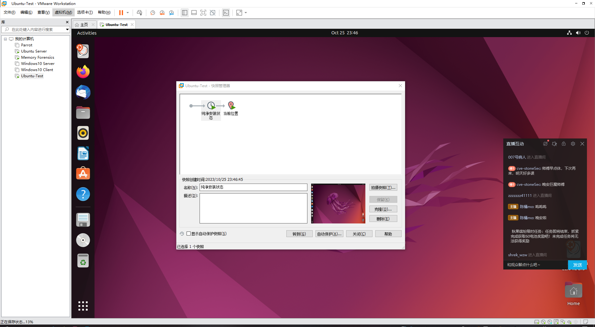

新建虚拟机，使用 `ubuntu-22.04.2-desktop-amd64.iso` 作为安装镜像，正常完成安装，选择最小化安装，并且安装过程中不进行自动更新


等待安装完成后，为纯净状态制作快照



然后安装必要的软件包：

- openssh-server
- make
- gcc
- net-tools

```shell
randark@randark-test:~$ sudo mv /etc/apt/sources.list /etc/apt/sources.list.bak
randark@randark-test:~$ sudo nano /etc/apt/sources.list
# 将 apt 的源仓库地址换为 ustc 中科大源
randark@randark-test:~$ sudo apt update
......
randark@randark-test:~$ sudo apt install openssh-server gcc make net-tools
......
randark@randark-test:~$ sudo systemctl enable ssh
Synchronizing state of ssh.service with SysV service script with /lib/systemd/systemd-sysv-install.
Executing: /lib/systemd/systemd-sysv-install enable ssh
randark@randark-test:~$ sudo systemctl start ssh
```

然后，通过 ssh 与 sftp 进行操作：首先，将 [AVML](https://github.com/microsoft/avml) 的二进制文件传输到测试机上，并授予执行权限，然后开始制作镜像

```shell
randark@randark-test:~$ chmod +x avml
randark@randark-test:~$ sudo ./avml out.lime
randark@randark-test:~$ ls -lh
total 4.1G
-rwxrwxr-x 1 randark randark 6.4M 10 月 26 00:01 avml
-rw------- 1 root    root    4.0G 10 月 26 00:02 out.lime
drwx------ 3 randark randark 4.0K 10 月 25 23:52 snap
```

成功得到 `out.lime` 内存镜像文件

接下来，开始构建 `dwarf` 内核调试文件，与获取 `System.map` 内存表文件

首先，确定 Linux Kernel 的版本

```shell
randark@randark-test:~$ uname -a
Linux randark-test 6.2.0-35-generic #35~22.04.1-Ubuntu SMP PREEMPT_DYNAMIC Fri Oct  6 10:23:26 UTC 2 x86_64 x86_64 x86_64 GNU/Linux
```

然后传输 dwarf 内核调试文件的编译文件：[volatility/tools/linux](https://github.com/volatilityfoundation/volatility/tree/master/tools/linux)，并尝试进行编译

```shell
randark@randark-test:~/linux$ ls -lh
total 32K
drwxrwxr-x 2 randark randark 4.0K 10 月 24 23:54 kcore
-rw-rw-r-- 1 randark randark  384 10 月 24 23:54 Makefile
-rw-rw-r-- 1 randark randark  314 10 月 24 23:54 Makefile.enterprise
-rw-rw-r-- 1 randark randark  18K 10 月 24 23:54 module.c
randark@randark-test:~/linux$ make
make -C //lib/modules/6.2.0-35-generic/build CONFIG_DEBUG_INFO=y M="/home/randark/linux" modules
make[1]: Entering directory '/usr/src/linux-headers-6.2.0-35-generic'
warning: the compiler differs from the one used to build the kernel
  The kernel was built by: x86_64-linux-gnu-gcc-11 (Ubuntu 11.4.0-1ubuntu1~22.04) 11.4.0
  You are using:           gcc-11 (Ubuntu 11.4.0-1ubuntu1~22.04) 11.4.0
  CC [M]  /home/randark/linux/module.o
/home/randark/linux/module.c:136: warning: "__rcu" redefined
  136 | #define __rcu
      |
In file included from <command-line>:
././include/linux/compiler_types.h:52: note: this is the location of the previous definition
   52 | # define __rcu          BTF_TYPE_TAG(rcu)
      |
  MODPOST /home/randark/linux/Module.symvers
ERROR: modpost: missing MODULE_LICENSE() in /home/randark/linux/module.o
make[2]: *** [scripts/Makefile.modpost:138: /home/randark/linux/Module.symvers] Error 1
make[1]: *** [Makefile:1978: modpost] Error 2
make[1]: Leaving directory '/usr/src/linux-headers-6.2.0-35-generic'
make: *** [Makefile:10: dwarf] Error 2
```

可以发现编译过程中存在致命错误：`modpost: missing MODULE_LICENSE() in /home/randark/linux/module.o`

在 `module.c` 的文件末尾加上以下语句：

```c
MODULE_LICENSE("GPL");
```

或者执行：

```shell
echo 'MODULE_LICENSE("GPL");' >> module.c
```

继续尝试编译：

```shell
randark@randark-test:~/linux$ make
make -C //lib/modules/6.2.0-35-generic/build CONFIG_DEBUG_INFO=y M="/home/randark/linux" modules
make[1]: Entering directory '/usr/src/linux-headers-6.2.0-35-generic'
warning: the compiler differs from the one used to build the kernel
  The kernel was built by: x86_64-linux-gnu-gcc-11 (Ubuntu 11.4.0-1ubuntu1~22.04) 11.4.0
  You are using:           gcc-11 (Ubuntu 11.4.0-1ubuntu1~22.04) 11.4.0
  CC [M]  /home/randark/linux/module.o
/home/randark/linux/module.c:136: warning: "__rcu" redefined
  136 | #define __rcu
      |
In file included from <command-line>:
././include/linux/compiler_types.h:52: note: this is the location of the previous definition
   52 | # define __rcu          BTF_TYPE_TAG(rcu)
      |
  MODPOST /home/randark/linux/Module.symvers
  CC [M]  /home/randark/linux/module.mod.o
  LD [M]  /home/randark/linux/module.ko
  BTF [M] /home/randark/linux/module.ko
Skipping BTF generation for /home/randark/linux/module.ko due to unavailability of vmlinux
make[1]: Leaving directory '/usr/src/linux-headers-6.2.0-35-generic'
dwarfdump -di module.ko > module.dwarf
/bin/sh: 1: dwarfdump: not found
```

继续发现存在致命错误：`/bin/sh: 1: dwarfdump: not found`

查阅相关文档 [Creating a new profile](https://github.com/volatilityfoundation/volatility/wiki/Linux#creating-a-new-profile) 后，得知需要安装以下工具：

- dwarfdump

继续尝试编译：

```shell
randark@randark-test:~/linux$ make
make -C //lib/modules/6.2.0-35-generic/build CONFIG_DEBUG_INFO=y M="/home/randark/linux" modules
make[1]: Entering directory '/usr/src/linux-headers-6.2.0-35-generic'
warning: the compiler differs from the one used to build the kernel
  The kernel was built by: x86_64-linux-gnu-gcc-11 (Ubuntu 11.4.0-1ubuntu1~22.04) 11.4.0
  You are using:           gcc-11 (Ubuntu 11.4.0-1ubuntu1~22.04) 11.4.0
  CC [M]  /home/randark/linux/module.o
/home/randark/linux/module.c:136: warning: "__rcu" redefined
  136 | #define __rcu
      |
In file included from <command-line>:
././include/linux/compiler_types.h:52: note: this is the location of the previous definition
   52 | # define __rcu          BTF_TYPE_TAG(rcu)
      |
  MODPOST /home/randark/linux/Module.symvers
  CC [M]  /home/randark/linux/module.mod.o
  LD [M]  /home/randark/linux/module.ko
  BTF [M] /home/randark/linux/module.ko
Skipping BTF generation for /home/randark/linux/module.ko due to unavailability of vmlinux
make[1]: Leaving directory '/usr/src/linux-headers-6.2.0-35-generic'
dwarfdump -di module.ko > module.dwarf
make -C //lib/modules/6.2.0-35-generic/build M="/home/randark/linux" clean
make[1]: Entering directory '/usr/src/linux-headers-6.2.0-35-generic'
  CLEAN   /home/randark/linux/Module.symvers
make[1]: Leaving directory '/usr/src/linux-headers-6.2.0-35-generic'
randark@randark-test:~/linux$ ls -lh
total 3.0M
drwxrwxr-x 2 randark randark 4.0K 10 月 24 23:54 kcore
-rw-rw-r-- 1 randark randark  384 10 月 24 23:54 Makefile
-rw-rw-r-- 1 randark randark  314 10 月 24 23:54 Makefile.enterprise
-rw-rw-r-- 1 randark randark  18K 10 月 26 00:14 module.c
-rw-rw-r-- 1 randark randark 2.9M 10 月 26 00:19 module.dwarf
```

成功得到了 dwarf 内核调试文件。接下来获取 `System.map` 内存表文件

```shell
randark@randark-test:~/linux$ ls -lh /boot/System.map-$(uname -r)
-rw------- 1 root root 7.7M 10 月  6 17:29 /boot/System.map-6.2.0-35-generic
```

确定 `System.map` 内存表文件的路径之后，就可以开始打包适用于 Volatility2 的配置文件：

```shell
randark@randark-test:~/linux$ sudo zip $(lsb_release -i -s)_$(uname -r)_profile.zip module.dwarf /boot/System.map-$(uname -r)
  adding: module.dwarf (deflated 91%)
  adding: boot/System.map-6.2.0-35-generic (deflated 82%)
```

成功得到适用于 Volatility2 的配置文件，以及内存镜像之后，就可以使用 Volatility2 进行分析。首先，将制作好的配置文件加入到 Volatility2 的配置文件文件夹

```shell
randark@memory-forensic:~$ mv Ubuntu_6.2.0-35-generic_profile.zip ./volatility2/volatility/plugins/overlays/linux/
randark@memory-forensic:~$ python2 ./volatility2/vol.py --info | grep Profile
Volatility Foundation Volatility Framework 2.6.1
Profiles
LinuxUbuntu_6_2_0-35-generic_profilex64 - A Profile for Linux Ubuntu_6.2.0-35-generic_profile x64
......
```

然后使用 profile 进行内存镜像的解析

```bash
randark@memory-forensic:~$ python2 ./volatility2/vol.py -f ~/out.lime linux_banner --profile=LinuxUbuntu_6_2_0-35-generic_profilex64
Volatility Foundation Volatility Framework 2.6.1
Traceback (most recent call last):
  File "./volatility2/vol.py", line 192, in <module>
    main()
  File "./volatility2/vol.py", line 183, in main
    command.execute()
  File "/home/randark/volatility2/volatility/plugins/linux/common.py", line 67, in execute
    commands.Command.execute(self, *args, **kwargs)
  File "/home/randark/volatility2/volatility/commands.py", line 116, in execute
    if not self.is_valid_profile(profs[self._config.PROFILE]()):
  File "/home/randark/volatility2/volatility/plugins/overlays/linux/linux.py", line 218, in __init__
    obj.Profile.__init__(self, *args, **kwargs)
  File "/home/randark/volatility2/volatility/obj.py", line 862, in __init__
    self.reset()
  File "/home/randark/volatility2/volatility/plugins/overlays/linux/linux.py", line 232, in reset
    self.load_vtypes()
  File "/home/randark/volatility2/volatility/plugins/overlays/linux/linux.py", line 269, in load_vtypes
    vtypesvar = dwarf.DWARFParser(dwarfdata).finalize()
  File "/home/randark/volatility2/volatility/dwarf.py", line 72, in __init__
    self.feed_line(line)
  File "/home/randark/volatility2/volatility/dwarf.py", line 163, in feed_line
    self.process_statement(**parsed) #pylint: disable-msg=W0142
  File "/home/randark/volatility2/volatility/dwarf.py", line 267, in process_statement
    d = data['DW_AT_data_member_location']
KeyError: 'DW_AT_data_member_location'
```

经过对这个报错的跟踪，发现已有人提出了相关 issue：[Linux Profile Error - KeyError: 'DW_AT_data_member_location' #828](https://github.com/volatilityfoundation/volatility/issues/828)

根据 issue 的发展历史，可以定位到问题的起因是 Volatility2 对于新版 dwarfdump 生成的 dwarf 文件的支持性不加所导致的。将前辈所制作的新版 `dwarf.py` [volatility/dwarf.py](https://github.com/volatilityfoundation/volatility/blob/7113c441d74a8fa1b8d5c056e77900e500453287/volatility/dwarf.py) 替换掉原版 Volatility2 的 `dwarf.py` 文件

```shell
randark@memory-forensic:~/volatility2/volatility$ ls -lh | grep dwarf
-rw-rw-r-- 1 randark randark  15K 10月 24 23:54 dwarf.py
randark@memory-forensic:~/volatility2/volatility$ mv dwarf.py dwarf.py.bak
randark@memory-forensic:~/volatility2/volatility$ nano dwarf.py
randark@memory-forensic:~/volatility2/volatility$ ls -lh | grep dwarf
-rw-rw-r-- 1 randark randark  16K 10月 26 00:48 dwarf.py
-rw-rw-r-- 1 randark randark  15K 10月 24 23:54 dwarf.py.bak
```

再次尝试分析：

```shell
randark@memory-forensic:~$ python2 ./volatility2/vol.py -f ~/out.lime --profile=LinuxUbuntu_6_2_0-35-generic_profilex64 linux_banner
Volatility Foundation Volatility Framework 2.6.1
WARNING : volatility.debug    : Overlay structure cpuinfo_x86 not present in vtypes
WARNING : volatility.debug    : Overlay structure cpuinfo_x86 not present in vtypes
No suitable address space mapping found
Tried to open image as:
 MachOAddressSpace: mac: need base
 LimeAddressSpace: lime: need base
 WindowsHiberFileSpace32: No base Address Space
 WindowsCrashDumpSpace64BitMap: No base Address Space
 WindowsCrashDumpSpace64: No base Address Space
 HPAKAddressSpace: No base Address Space
 VMWareMetaAddressSpace: No base Address Space
 VirtualBoxCoreDumpElf64: No base Address Space
 VMWareAddressSpace: No base Address Space
 QemuCoreDumpElf: No base Address Space
 WindowsCrashDumpSpace32: No base Address Space
 SkipDuplicatesAMD64PagedMemory: No base Address Space
 WindowsAMD64PagedMemory: No base Address Space
 LinuxAMD64PagedMemory: No base Address Space
 AMD64PagedMemory: No base Address Space
 IA32PagedMemoryPae: No base Address Space
 IA32PagedMemory: No base Address Space
 OSXPmemELF: No base Address Space
 MachOAddressSpace: MachO Header signature invalid
 MachOAddressSpace: MachO Header signature invalid
 LimeAddressSpace: Invalid Lime header signature
 WindowsHiberFileSpace32: PO_MEMORY_IMAGE is not available in profile
 WindowsCrashDumpSpace64BitMap: Header signature invalid
 WindowsCrashDumpSpace64: Header signature invalid
 HPAKAddressSpace: Invalid magic found
 VMWareMetaAddressSpace: VMware metadata file is not available
 VirtualBoxCoreDumpElf64: ELF Header signature invalid
 VMWareAddressSpace: Invalid VMware signature: -
 QemuCoreDumpElf: ELF Header signature invalid
 WindowsCrashDumpSpace32: Header signature invalid
 SkipDuplicatesAMD64PagedMemory: Incompatible profile LinuxUbuntu_6_2_0-35-generic_profilex64 selected
 WindowsAMD64PagedMemory: Incompatible profile LinuxUbuntu_6_2_0-35-generic_profilex64 selected
 LinuxAMD64PagedMemory - EXCEPTION: 'state'
 AMD64PagedMemory - EXCEPTION: 'state'
 IA32PagedMemoryPae: Incompatible profile LinuxUbuntu_6_2_0-35-generic_profilex64 selected
 IA32PagedMemory: Incompatible profile LinuxUbuntu_6_2_0-35-generic_profilex64 selected
 OSXPmemELF: ELF Header signature invalid
 FileAddressSpace: Must be first Address Space
 ArmAddressSpace - EXCEPTION: 'state'
```

很不幸，依然存在问题。根据问题细节，可以追踪到这个issue：[Update Linux DTB scanner to handle newer Linux kernel versions (>= 5.14-rc1) #852](https://github.com/volatilityfoundation/volatility/pull/852)

根据issue中前辈们给出的方案，将这两个PR做出的更改加入到本地的Volatility2源码中

- [Update Linux DTB scanner to handle newer Linux kernel versions (>= 5.14-rc1) #852](https://github.com/volatilityfoundation/volatility/pull/852/commits/9ff9e9bb9103d63cbb278e991209aa11cffc61ce)


- [Update Linux DTB scanner to handle newer Linux kernel versions (>= 5.14-rc1) #852](https://github.com/volatilityfoundation/volatility/pull/852/commits/d07c69a7811d8e18ab186c9fbdf5b050529d06d2)


继续尝试分析：

```shell
randark@memory-forensic:~$ python2 ./volatility2/vol.py -f ~/out.lime --profile=LinuxUbuntu_6_2_0-35-generic_profilex64 linux_banner
Volatility Foundation Volatility Framework 2.6.1
WARNING : volatility.debug    : Overlay structure cpuinfo_x86 not present in vtypes
WARNING : volatility.debug    : Overlay structure cpuinfo_x86 not present in vtypes
Linux version 6.2.0-35-generic (buildd@bos03-amd64-016) (x86_64-linux-gnu-gcc-11 (Ubuntu 11.4.0-1ubuntu1~22.04) 11.4.0, GNU ld (GNU Binutils for Ubuntu) 2.38) #35~22.04.1-Ubuntu SMP PREEMPT_DYNAMIC Fri Oct  6 10:23:26 UTC 2 (Ubuntu 6.2.0-35.35~22.04.1-gene
```

成功基于配置文件，实现对内存镜像的读取分析

---

### 参考资料

[How to generate a Volatility profile for a Linux system](https://andreafortuna.org/2019/08/22/how-to-generate-a-volatility-profile-for-a-linux-system/)