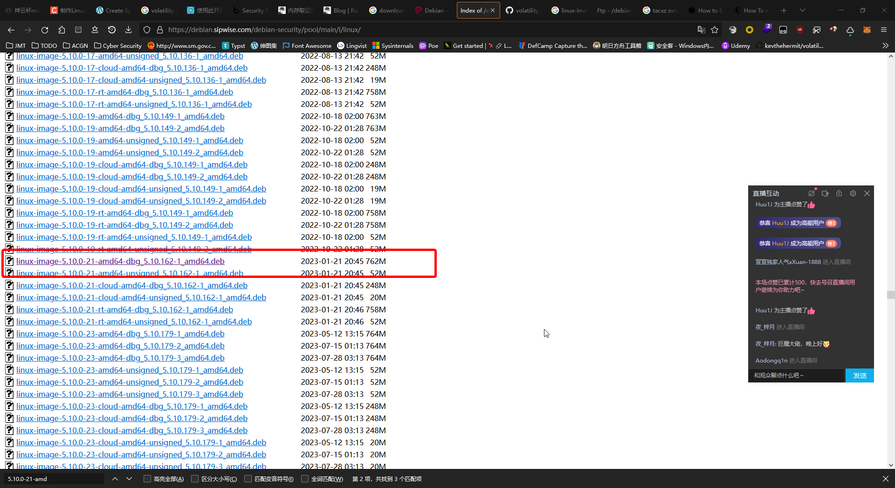

首先，先分析镜像的内核信息：

```shell
randark@memory-forensic:~$ vol -f oh-my-linux.mem banner
Volatility 3 Framework 2.0.1
Progress:  100.00               PDB scanning finished
Offset  Banner

0x4f000200      Linux version 5.10.0-21-amd64 (debian-kernel@lists.debian.org) (gcc-10 (Debian 10.2.1-6) 10.2.1 20210110, GNU ld (GNU Binutils for Debian) 2.35.2) #1 SMP Debian 5.10.162-1 (2023-01-21)
0x58ecc240      Linux version 5.10.0-21-amd64 (debian-kernel@lists.debian.org) (gcc-10 (Debian 10.2.1-6) 10.2.1 20210110, GNU ld (GNU Binutils for Debian) 2.35.2) #1 SMP Debian 5.10.162-1 (2023-01-21)
```

通过内核信息，可以定位到 `Debian 5.10.0-21-amd64` 的 deb 发行包文件：

[Index of /debian-security/pool/main/l/linux](https://debian.sipwise.com/debian-security/pool/main/l/linux/)



下载下来后，将其作为 `tar.xz` 文件进行解压缩，得到 `data.tar` 文件，解压缩制作符号表需要的文件：

```shell
randark@memory-forensic:~/linux-image$ tar -xvf data.tar ./usr/lib/debug/boot/
./usr/lib/debug/boot/
./usr/lib/debug/boot/System.map-5.10.0-21-amd64
./usr/lib/debug/boot/vmlinux-5.10.0-21-amd64
```

然后开始制作符号表文件

```shell
randark@memory-forensic:~$  ./dwarf2json linux --system-map ~/linux-image/usr/lib/debug/boot/System.map-5.10.0-21-amd64 --elf ~/linux-image/usr/lib/debug/boot/vmlinux-5.10.0-21-amd64  >  linux-image-5.10.0-21-amd64-dbg_5.10.162-1_amd64.json
randark@memory-forensic:~$ sudo mv linux-image-5.10.0-21-amd64-dbg_5.10.162-1_amd64.json /usr/local/lib/python3.10/dist-packages/volatility3/symbols/linux/
```

尝试使用符号表进行分析：

```shell
randark@memory-forensic:~$ vol -f oh-my-linux.mem linux.pslist
Volatility 3 Framework 2.0.1
Progress:  100.00               Stacking attempts finished
PID     PPID    COMM

1       0       systemd
2       0       kthreadd
3       2       rcu_gp
4       2       rcu_par_gp
6       2       kworker/0:0H
8       2       mm_percpu_wq
9       2       rcu_tasks_rude_
10      2       rcu_tasks_trace
11      2       ksoftirqd/0
12      2       rcu_sched
13      2       migration/0
14      2       kworker/0:1
15      2       cpuhp/0
17      2       kdevtmpfs
18      2       netns
19      2       kauditd
20      2       khungtaskd
21      2       oom_reaper
22      2       writeback
23      2       kcompactd0
24      2       ksmd
25      2       khugepaged
43      2       kintegrityd
44      2       kblockd
45      2       blkcg_punt_bio
46      2       edac-poller
47      2       devfreq_wq
48      2       kworker/0:1H
49      2       kswapd0
50      2       kthrotld
......
```

成功实现 Volatility3 加载符号表，并分析镜像

如果要使用 Volatility2 进行分析的话，需要使用 linux-header,linux-image 等相关软件包进行编译，为了不影响主机环境，以及懒得开虚拟机的话，可以使用 docker 进行编译：

[CTF-Archives / profile-builder](https://github.com/CTF-Archives/profile-builder)

编译后，应该会在 `./docker/data` 目录下得到编译好的 dwarf 文件，即可开始组装适用于 Volatility2 的配置文件

```shell
# 这里用的 System.map 文件，为上面拆 deb 包得到的
randark@memory-forensic:~$ zip Debian_5.10.0-21-amd64_profile.zip module.dwarf ~/linux-image/usr/lib/debug/boot/System.map-5.10.0-21-amd64
randark@memory-forensic:~$ mv Debian_5.10.0-21-amd64_profile.zip ./volatility2/volatility/plugins/overlays/linux/
randark@memory-forensic:~$ python2 ./volatility2/vol.py --info | grep Profile | grep Linux
Volatility Foundation Volatility Framework 2.6.1
LinuxDebian_5_10_0-21-amd64_profilex64  - A Profile for Linux Debian_5.10.0-21-amd64_profile x64
LinuxUbuntu_6_2_0-35-generic_profilex64 - A Profile for Linux Ubuntu_6.2.0-35-generic_profile x64
```

成功制作并在 Volatility2 中加载了配置文件，并工作正常

```shell
randark@memory-forensic:~$ python2 ./volatility2/vol.py -f oh-my-linux.mem --profile=LinuxDebian_5_10_0-21-amd64_profilex64 linux_bash
Volatility Foundation Volatility Framework 2.6.1
WARNING : volatility.debug    : Overlay structure cpuinfo_x86 not present in vtypes
WARNING : volatility.debug    : Overlay structure cpuinfo_x86 not present in vtypes
Pid      Name                 Command Time                   Command
-------- -------------------- ------------------------------ -------
    1014 bash                 2023-02-25 15:45:08 UTC+0000   echo $SHELL
    1014 bash                 2023-02-25 15:45:23 UTC+0000   echo "Bash doesn't feel as good as zsh"
    1014 bash                 2023-02-25 15:45:27 UTC+0000   echo "lol"
    1014 bash                 2023-02-25 15:45:29 UTC+0000   zsh
```

读取 zsh 的历史记录，就能知道怎么解题了

```shell
randark@memory-forensic:~$ cat a1
: 1677339944:0;echo $SHELL
: 1677339951:0;sudo apt install curl
: 1677340139:0;sh -c "$(curl -fsSL https://gitee.com/mirrors/oh-my-zsh/raw/master/tools/install.sh)"
: 1677340199:0;echo $SHELL
: 1677340205:0;echo "nice"
: 1677340215:0;mv mysecretflag1.zsh-theme ~/.oh-my-zsh/themes
: 1677340217:0;ls
: 1677340222:0;vim ~/.zshrc
: 1677340268:0;source ~/.zshrc
: 1677340271:0;ls
: 1677340299:0;zip -o flag2.zip flag2.txt -P $SHELL
: 1677340311:0;rm -rf flag2.txt
: 1677340315:0;ls
: 1677340324:0;G1v3m3F14ggg3
: 1677340335:0;echo "lol"
: 1677340354:0;sudo ./avml oh-my-linux.mem
```