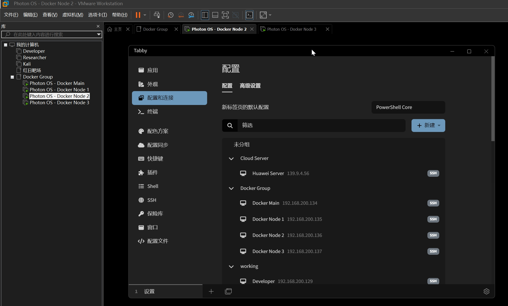
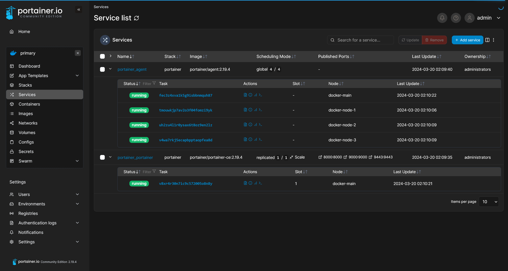

> 文章内容为我个人的 Docker 实验集群，带有个人习惯，故并没有放在知识库正文

在文章开始之前，已经基于 Photon OS 部署了四台虚拟机，其中一台主节点，三台作为子节点



|   hostname    |   ip address    |
| :-----------: | :-------------: |
|  docker-main  | 192.168.200.134 |
| docker-node-1 | 192.168.200.135 |
| docker-node-2 | 192.168.200.136 |
| docker-node-3 | 192.168.200.137 |

做好了前期工作

- 更改每一台节点的 hostname
- 在每个节点上部署 clash 代理
- 每个节点的 Docker 均设置了 Daemon Proxy

## 关闭防火墙

由于此集群用于测试，所以在这个集群上不需要防火墙的保护措施

```shell
systemctl stop iptables
systemctl disable iptables
```

## 为 `tdnf` 设置镜像，加快软件包下载速度

```shell
vim /etc/tdnf/tdnf.conf
```

在其中进行更改

```plaintext
[main]
gpgcheck=1
installonly_limit=3
clean_requirements_on_remove=0
repodir=/etc/yum.repos.d
cachedir=/var/cache/tdnf
proxy=http://127.0.0.1:7890
```

代理配置完毕之后，执行 `tdnf update`

最终，四台虚拟机的软件包版本应该都是统一的最新版本

## 部署 Docker Swarm

首先，现在主节点初始化 swarm

```shell
root@docker-main [~]# docker swarm init --advertise-addr 192.168.200.134
Swarm initialized: current node (pq6gku0fv2rfad9tt9np2bvzy) is now a manager.

To add a worker to this swarm, run the following command:

    docker swarm join --token SWMTKN-1-2i38jri5twojygrsm3b0dvvreshdt6yy1g7nwa1ocf3c15isu4-da9ylfballkeghd04o1trcimh 192.168.200.134:2377

To add a manager to this swarm, run 'docker swarm join-token manager' and follow the instructions.
```

为了节点间通信的

然后将三台子节点加入到 swarm

```shell
root@docker-node-1 [~]# docker swarm join --token SWMTKN-1-2i38jri5twojygrsm3b0dvvreshdt6yy1g7nwa1ocf3c15isu4-da9ylfballkeghd04o1trcimh 192.168.200.134:2377
This node joined a swarm as a worker.

root@docker-node-2 [~]# docker swarm join --token SWMTKN-1-2i38jri5twojygrsm3b0dvvreshdt6yy1g7nwa1ocf3c15isu4-da9ylfballkeghd04o1trcimh 192.168.200.134:2377
This node joined a swarm as a worker.

root@docker-node-3 [~]# docker swarm join --token SWMTKN-1-2i38jri5twojygrsm3b0dvvreshdt6yy1g7nwa1ocf3c15isu4-da9ylfballkeghd04o1trcimh 192.168.200.134:2377
This node joined a swarm as a worker.
```

在 `docker-main` 节点上查询整个 swarm 状态

```shell
root@docker-main [~]# docker node ls
ID                            HOSTNAME        STATUS    AVAILABILITY   MANAGER STATUS   ENGINE VERSION
pq6gku0fv2rfad9tt9np2bvzy *   docker-main     Ready     Active         Leader           24.0.5
n00jzhnp2ttlkdxw53t0o7yf9     docker-node-1   Ready     Active                          24.0.5
suk0amyclojgcm0ykt9ah3l8t     docker-node-2   Ready     Active                          24.0.5
gh480lkdg3f447zu26m7xl2y9     docker-node-3   Ready     Active                          24.0.5
```

## 部署 Portainer

首先，下载堆栈配置文件

```shell
curl -L https://downloads.portainer.io/ce2-19/portainer-agent-stack.yml -o portainer-agent-stack.yml
```

文件内容为

```yml title="portainer-agent-stack.yml"
version: '3.2'

services:
  agent:
    image: portainer/agent:2.19.4
    volumes:
      - /var/run/docker.sock:/var/run/docker.sock
      - /var/lib/docker/volumes:/var/lib/docker/volumes
    networks:
      - agent_network
    deploy:
      mode: global
      placement:
        constraints: [node.platform.os == linux]

  portainer:
    image: portainer/portainer-ce:2.19.4
    command: -H tcp://tasks.agent:9001 --tlsskipverify
    ports:
      - "9443:9443"
      - "9000:9000"
      - "8000:8000"
    volumes:
      - portainer_data:/data
    networks:
      - agent_network
    deploy:
      mode: replicated
      replicas: 1
      placement:
        constraints: [node.role == manager]

networks:
  agent_network:
    driver: overlay
    attachable: true

volumes:
  portainer_data:
```

然后部署堆栈

```shell
root@docker-main [~]# docker stack deploy -c portainer-agent-stack.yml portainer
Creating network portainer_agent_network
Creating service portainer_portainer
Creating service portainer_agent
```

查看服务状态

```shell
root@docker-main [~]# docker stack ls
NAME        SERVICES
portainer   2
root@docker-main [~]# docker service ls
ID             NAME                  MODE         REPLICAS   IMAGE                           PORTS
0u1bzfeo2gir   portainer_agent       global       4/4        portainer/agent:2.19.4
ywjdr6qpsbjw   portainer_portainer   replicated   1/1        portainer/portainer-ce:2.19.4   *:8000->8000/tcp, *:9000->9000/tcp, *:9443->9443/tcp
```

Portainer 服务已经成功启动，访问 `https://192.168.200.134:9443` 之后进行初始化配置，随后即可看到 Portainer 环境状态

