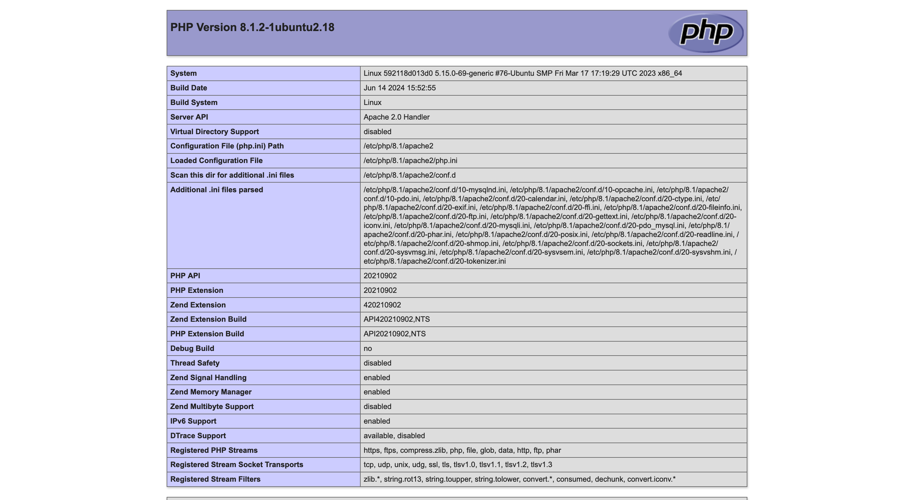

探究 Dockerfile 中的各个操作究竟对最终的镜像大小有多大的影响，并给出减小镜像体积的技巧

<!-- truncate -->

## 基础镜像

这里采用  [ctf-docker-template/web-lnmp-php73 at main · CTF-Archives/ctf-docker-template](https://github.com/CTF-Archives/ctf-docker-template/tree/main/web-lnmp-php73)  作为研究对象

原始的 Dockerfile 为

```dockerfile
FROM ubuntu:22.04

ARG DEBIAN_FRONTEND=noninteractive

RUN sed -i 's@//.*archive.ubuntu.com@//mirrors.ustc.edu.cn@g' /etc/apt/sources.list

RUN sed -i 's@//.*security.ubuntu.com@//mirrors.ustc.edu.cn@g' /etc/apt/sources.list

RUN apt-get update

# install apache2

RUN apt-get install -y apache2 libcap2-bin

RUN setcap 'cap_net_bind_service=+ep' /usr/sbin/apache2

# install php

RUN apt-get install -y php libapache2-mod-php

# As apache is never run as root, change dir ownership

RUN a2disconf other-vhosts-access-log
RUN chown -Rh www-data:www-data /var/run/apache2
RUN chown -Rh www-data:www-data /var/log/apache2

# Setup Apache2

RUN a2enmod rewrite headers expires ext_filter
COPY ./config/apache2.conf /etc/apache2/apache2.conf

# Copy source page code

COPY ./src/a.php /var/www/html/a.php

RUN echo "root:yourpassword" | chpasswd

EXPOSE 80
USER www-data

ENTRYPOINT ["apache2ctl", "-D", "FOREGROUND"]
```

其中唯一的外部文件为 `a.php`

```php title="a.php"
<?php
    phpinfo();
?>
```



可以看到服务正常运行，正常显示了 `phpinfo`

此时 docker 编译出来的镜像大小为 `268MB`

## 对 apt 操作进行优化

首先，现将所有的 `apt-get install` 操作优化为一步执行，优化后的镜像大小为 `267MB`

然后，在执行 `apt-get install` 阶段，制定最小化安装，也就是不安装推荐的软件包，即 `--no-install-recommends` 参数，优化后的镜像大小为 `264MB`

其次，在执行完 `apt-get install` 操作之后，就可以删除 apt 包缓存和包索引了，即 `apt clean` 和 `rm -rf /var/lib/apt/lists/*` 命令，优化之后的镜像大小为 `264MB`

此时的 Dockerfile 为

```dockerfile
FROM ubuntu:22.04

ARG DEBIAN_FRONTEND=noninteractive

RUN sed -i 's@//.*archive.ubuntu.com@//mirrors.ustc.edu.cn@g' /etc/apt/sources.list

RUN sed -i 's@//.*security.ubuntu.com@//mirrors.ustc.edu.cn@g' /etc/apt/sources.list

RUN apt-get update

# install apache2

RUN apt-get install -y --no-install-recommends apache2 libcap2-bin php libapache2-mod-php

RUN apt clean

RUN rm -rf /var/lib/apt/lists/*

RUN setcap 'cap_net_bind_service=+ep' /usr/sbin/apache2

# As apache is never run as root, change dir ownership

RUN a2disconf other-vhosts-access-log
RUN chown -Rh www-data:www-data /var/run/apache2
RUN chown -Rh www-data:www-data /var/log/apache2

# Setup Apache2

RUN a2enmod rewrite headers expires ext_filter
COPY ./config/apache2.conf /etc/apache2/apache2.conf

# Copy source page code

COPY ./src/a.php /var/www/html/a.php

RUN echo "root:yourpassword" | chpasswd

EXPOSE 80
USER www-data

ENTRYPOINT ["apache2ctl", "-D", "FOREGROUND"]
```

## 对 RUN 多步操作进行压缩

由于每一个操作关键词 `RUN`, `COPY` 等都会在 image 中增加一个 layer 记录，带来额外的空间占用，所以可以对多个 `RUN` 语句进行整合

优化后的 Dockerfile 为

```dockerfile
FROM ubuntu:22.04

ARG DEBIAN_FRONTEND=noninteractive

RUN sed -i 's@//.*archive.ubuntu.com@//mirrors.ustc.edu.cn@g' /etc/apt/sources.list && \
    sed -i 's@//.*security.ubuntu.com@//mirrors.ustc.edu.cn@g' /etc/apt/sources.list && \
    apt-get update && \
    apt-get install -y --no-install-recommends apache2 libcap2-bin php libapache2-mod-php && \
    apt clean && \
    rm -rf /var/lib/apt/lists/* && \
    setcap 'cap_net_bind_service=+ep' /usr/sbin/apache2 && \
    # As apache is never run as root, change dir ownership
    a2disconf other-vhosts-access-log && \
    chown -Rh www-data:www-data /var/run/apache2 && \
    chown -Rh www-data:www-data /var/log/apache2 && \
    # Setup Apache2
    a2enmod rewrite headers expires ext_filter

COPY ./config/apache2.conf /etc/apache2/apache2.conf

# Copy source page code and configure user

COPY ./src/a.php /var/www/html/a.php
RUN echo "root:yourpassword" | chpasswd
EXPOSE 80
USER www-data

ENTRYPOINT ["apache2ctl", "-D", "FOREGROUND"]
```

优化之后的镜像大小为 `209MB`
