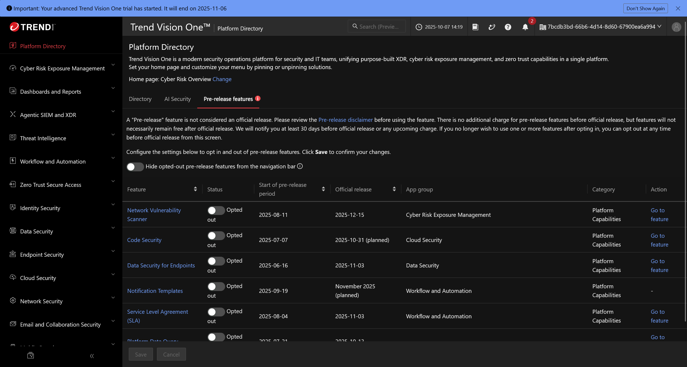
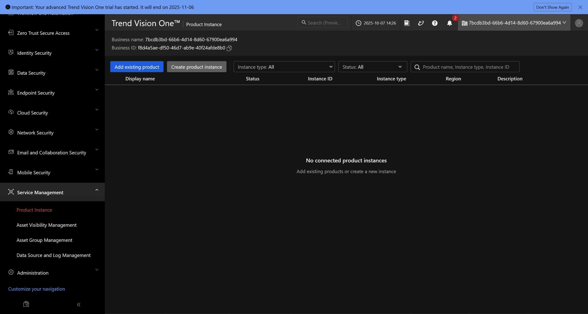
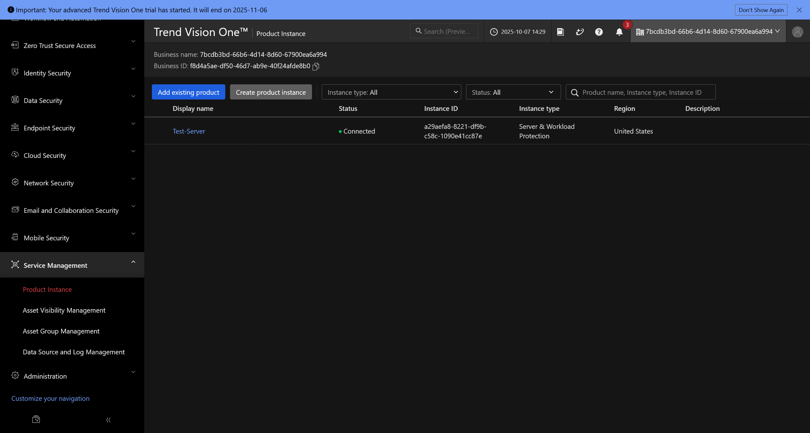
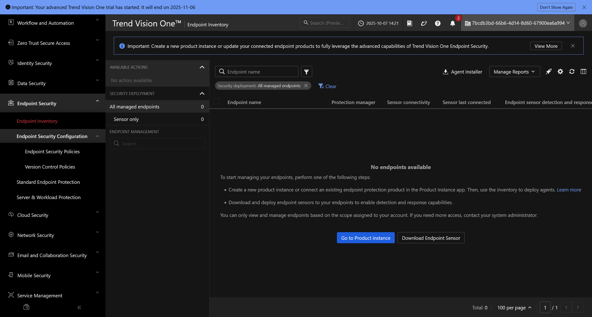
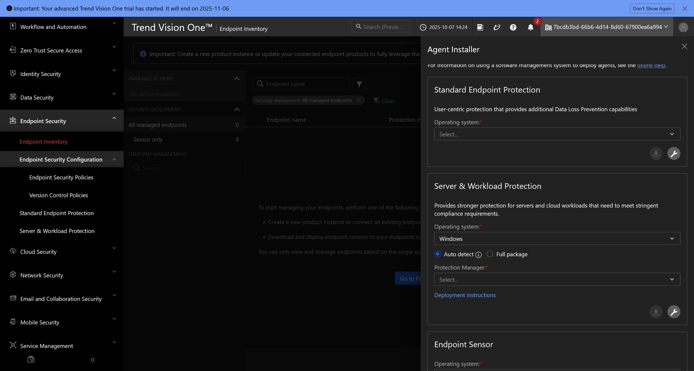
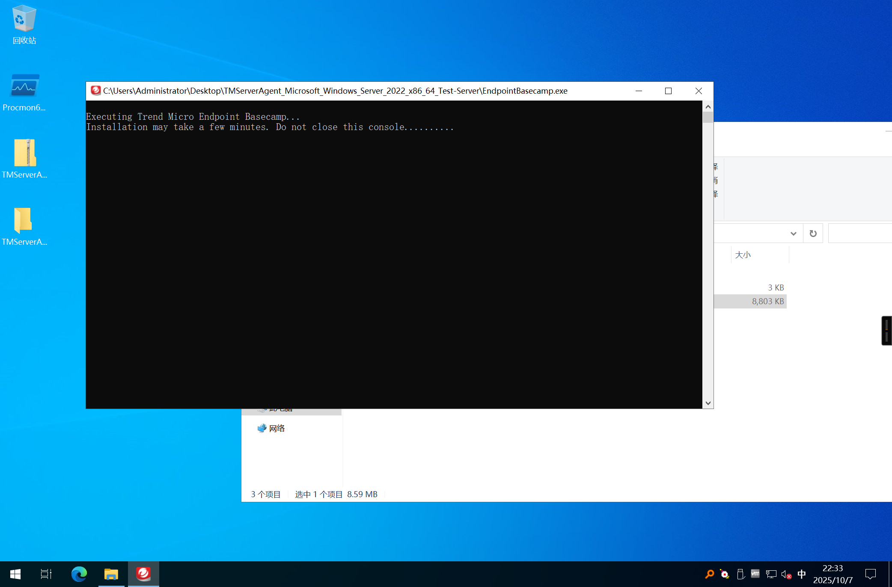

本文章介绍趋势科技 (Trend Micro) Vision One 平台的基本使用

<!-- truncate -->

## Vision One 主界面

## 部署产品实例

点击左侧侧边栏的 `Service Management` -> `Product Instance` 菜单

由于是测试用的试用环境，所以点击上方的 `Create product instance` 按钮

部署成功之后应该看到

## 添加资产到 Vision One

点击左侧侧边栏的 `Endpoint Security` -> `Endpoint Inventory` 菜单

点击右上方的 `Agent Installer` 即可获取 Agent 部署程序

根据资产类型选择即可

## 部署 Agent 到资产

解压得到的 zip 档，双击其中的 `EndpointBasecamp.exe` 可执行文件

稍等片刻之后，即可完成 Vision One Agent 的部署
