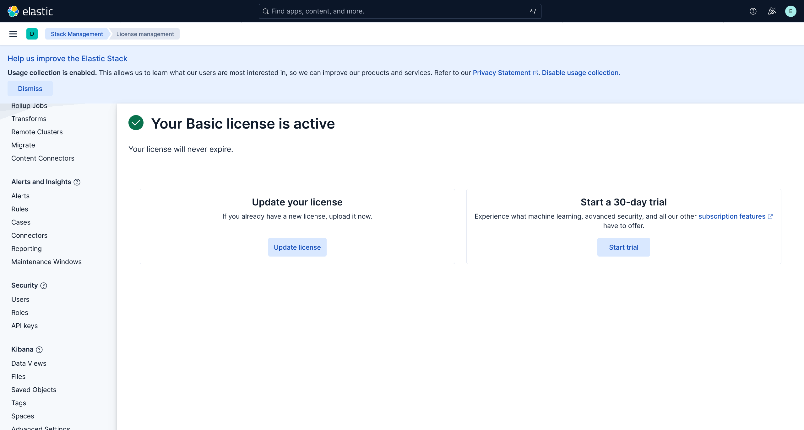

本文章介绍 Elastic SIEM 平台部署与使用

<!-- truncate -->

本文基于 `Ubuntu Server 24.04.3` 进行部署，性能为 `4h4g`

```shell
randark@elastic-server:~$ lsb_release -a
No LSB modules are available.
Distributor ID: Ubuntu
Description:    Ubuntu 24.04.3 LTS
Release:        24.04
Codename:       noble
randark@elastic-server:~$ ifconfig 
ens33: flags=4163<UP,BROADCAST,RUNNING,MULTICAST>  mtu 1500
        inet 192.168.200.200  netmask 255.255.255.0  broadcast 192.168.200.255
        inet6 fe80::20c:29ff:fee5:696e  prefixlen 64  scopeid 0x20<link>
        ether 00:0c:29:e5:69:6e  txqueuelen 1000  (Ethernet)
        RX packets 956  bytes 615902 (615.9 KB)
        RX errors 0  dropped 0  overruns 0  frame 0
        TX packets 517  bytes 106942 (106.9 KB)
        TX errors 0  dropped 0 overruns 0  carrier 0  collisions 0

lo: flags=73<UP,LOOPBACK,RUNNING>  mtu 65536
        inet 127.0.0.1  netmask 255.0.0.0
        inet6 ::1  prefixlen 128  scopeid 0x10<host>
        loop  txqueuelen 1000  (Local Loopback)
        RX packets 106  bytes 9093 (9.0 KB)
        RX errors 0  dropped 0  overruns 0  frame 0
        TX packets 106  bytes 9093 (9.0 KB)
        TX errors 0  dropped 0 overruns 0  carrier 0  collisions 0
```

## 安装 Elasticsearch

使用 `apt` 进行安装，首先是导入 Elastic 的 PGP 公钥

```shell
wget -qO - https://artifacts.elastic.co/GPG-KEY-elasticsearch | sudo gpg --dearmor -o /usr/share/keyrings/elasticsearch-keyring.gpg
```

然后安装 Elasticsearch APT 储存库

```shell
sudo apt-get install apt-transport-https
echo "deb [signed-by=/usr/share/keyrings/elasticsearch-keyring.gpg] https://artifacts.elastic.co/packages/9.x/apt stable main" | sudo tee /etc/apt/sources.list.d/elastic-9.x.list
```

随后执行安装

```shell
sudo apt-get update && sudo apt-get install elasticsearch
```

安装成功之后，应该能够看到以下提示

```plaintext
--------------------------- Security autoconfiguration information ------------------------------

Authentication and authorization are enabled.
TLS for the transport and HTTP layers is enabled and configured.

The generated password for the elastic built-in superuser is : BPhrFCKVYI19oksc1igb

If this node should join an existing cluster, you can reconfigure this with
'/usr/share/elasticsearch/bin/elasticsearch-reconfigure-node --enrollment-token <token-here>'
after creating an enrollment token on your existing cluster.

You can complete the following actions at any time:

Reset the password of the elastic built-in superuser with 
'/usr/share/elasticsearch/bin/elasticsearch-reset-password -u elastic'.

Generate an enrollment token for Kibana instances with 
 '/usr/share/elasticsearch/bin/elasticsearch-create-enrollment-token -s kibana'.

Generate an enrollment token for Elasticsearch nodes with 
'/usr/share/elasticsearch/bin/elasticsearch-create-enrollment-token -s node'.

-------------------------------------------------------------------------------------------------
### NOT starting on installation, please execute the following statements to configure elasticsearch service to start automatically using systemd
 sudo systemctl daemon-reload
 sudo systemctl enable elasticsearch.service
### You can start elasticsearch service by executing
 sudo systemctl start elasticsearch.service
```

:::warning

需要妥善保存以上信息，尤其是默认的 elastic 超级用户的密码

:::

本文章配置的是测试用的单机节点，所以不需要进一步修改，但是如果需要部署多节点集群的话，需要按照 [Install Elasticsearch with a Debian package | Elastic Docs - Step 3: Set up the node for connectivity](https://www.elastic.co/docs/deploy-manage/deploy/self-managed/install-elasticsearch-with-debian-package#step-3-set-up-the-node-for-connectivity) 中的说明，修改对应参数

## 启动 Elasticsearch 服务

```shell
sudo systemctl daemon-reload
sudo systemctl enable elasticsearch.service
sudo systemctl start elasticsearch.service
```

当服务启动完毕之后，测试服务

```shell
curl -k -u elastic:BPhrFCKVYI19oksc1igb https://localhost:9200/
```

:::warning

这里使用的密码，就是安装之后，在提示信息中显示的初始密码

:::

没有问题的话，应当能够看到

```json title="curl -k -u elastic:BPhrFCKVYI19oksc1igb https://localhost:9200/"
{
    "name" : "elastic-server",
    "cluster_name" : "elasticsearch",
    "cluster_uuid" : "MxT9jeipSSe_vc1EPQq2yg",
    "version" : {
        "number" : "9.1.5",
        "build_flavor" : "default",
        "build_type" : "deb",
        "build_hash" : "90ee222e7e0136dd8ddbb34015538f3a00c129b7",
        "build_date" : "2025-10-02T22:07:12.966975992Z",
        "build_snapshot" : false,
        "lucene_version" : "10.2.2",
        "minimum_wire_compatibility_version" : "8.19.0",
        "minimum_index_compatibility_version" : "8.0.0"
    },
    "tagline" : "You Know, for Search"
}
```

## 安装 Kibana

执行

```shell
sudo apt-get update && sudo apt-get install kibana
```

为了让外部网络可以访问 Kibana 需要更改 `/etc/kibana/kibana.yml` 文件，在其中编辑

```yml
server.host: 0.0.0.0
```

由于是单机测试集群，可以直接启动 Kibana

```shell
sudo systemctl daemon-reload
sudo systemctl enable kibana.service
sudo systemctl start kibana.service
```

稍等片刻，访问 `http://192.168.200.200:5601/` 应当能够看到


## 连接 Kibana 与 Elasticsearch

看到 Kibana 初始化界面之后，根据引导，执行

```shell
sudo /usr/share/elasticsearch/bin/elasticsearch-create-enrollment-token --scope kibana
```

服务没有问题的话，应当能够看到类似

```shell
randark@elastic-server:~$ sudo /usr/share/elasticsearch/bin/elasticsearch-create-enrollment-token --scope kibana
eyJ2ZXIiOiI4LjE0LjAiLCJhZHIiOlsiMTkyLjE2OC4yMDAuMjAwOjkyMDAiXSwiZmdyIjoiZmE0NWZkNWU0OTg1MzY1MjkzYjU1Yjc2MWViZDkzYjZjM2M3NDYzMTEyMzE0NDFiMjc0NzY4ZmI0MWRmMmY3NyIsImtleSI6Ikw3NE5ESm9COWU5b1EtRWJPRkZnOi1QOWNLT2hVZ2diTWZvdTcwQVZxcWcifQ==
```

将获得的 token 输入，应当能够看到


执行 `sudo /usr/share/kibana/bin/kibana-verification-code` 就能得到验证码

输入之后，即可进入自动配置阶段


待自动化配置成功之后，即可看到


输入先前使用的 Elastic 超级用户的凭据，即可访问 Kibana


## 破解 Elasticsearch

使用项目 [Qwermit/ELKrack: Elasticsearch crack 7.X-9.X](https://github.com/Qwermit/ELKrack)

执行

```shell
git clone https://github.com/Qwermit/ELKrack
cd ELKrack/
chmod +x build_crack_jar.sh
```

然后根据对应的版本号，设置环境变量后执行 `build_crack_jar.sh` 文件

```shell
# 查看版本信息
curl -fsSL -k -u elastic:BPhrFCKVYI19oksc1igb https://localhost:9200/ | grep number
# 设定版本环境变量
export VERSION=9.1.5
# 停止服务
sudo systemctl stop elasticsearch.service
sudo systemctl stop kibana.service
# 执行
./build_crack_jar.sh
```

执行完毕后，复制 patch 之后的文件

```shell
sudo cp /usr/share/elasticsearch/modules/x-pack-core/x-pack-core-9.1.5.jar /usr/share/elasticsearch/modules/x-pack-core/x-pack-core-9.1.5.jar.bak
sudo cp ./output/x-pack-core-9.1.5.crack.jar /usr/share/elasticsearch/modules/x-pack-core/x-pack-core-9.1.5.jar
```

重启服务

```shell
sudo systemctl restart elasticsearch.service
sudo systemctl restart kibana.service
```

继续访问 `http://192.168.200.200:5601/` 应当能够看到


左上角，进入 space 设置


进入许可证管理




在 `Update your license` 选项中，上传在 [Qwermit/ELKrack: Elasticsearch crack 7.X-9.X](https://github.com/Qwermit/ELKrack) 项目的 `licenses` 文件夹中的许可文件，两个都可以，但是更建议使用 `platinum_license.json` 以获得完整 Elastic 能力

操作没有问题的话，上传之后应该能够看到


## 部署 Fleet 服务器

如果需要部署 Elastic Agent 与端点进行通信的话，需要使用 Fleet 进行统一管理与通信

访问侧边栏的 `Fleet` 选项


正常情况下，会看到

```plaintext
Agent binary source needs encrypted saved object api key to be set
```


这个时候需要从命令行中生成 `encrypted saved object api key`

```shell
sudo /usr/share/kibana/bin/kibana-encryption-keys generate
```

理想情况下，能够看到

```shell
randark@elastic-server:~$ sudo /usr/share/kibana/bin/kibana-encryption-keys generate
## Kibana Encryption Key Generation Utility

The 'generate' command guides you through the process of setting encryption keys for:

xpack.encryptedSavedObjects.encryptionKey
    Used to encrypt stored objects such as dashboards and visualizations
    https://www.elastic.co/guide/en/kibana/current/xpack-security-secure-saved-objects.html#xpack-security-secure-saved-objects

xpack.reporting.encryptionKey
    Used to encrypt saved reports
    https://www.elastic.co/guide/en/kibana/current/reporting-settings-kb.html#general-reporting-settings

xpack.security.encryptionKey
    Used to encrypt session information
    https://www.elastic.co/guide/en/kibana/current/security-settings-kb.html#security-session-and-cookie-settings


Already defined settings are ignored and can be regenerated using the --force flag.  Check the documentation links for instructions on how to rotate encryption keys.
Definitions should be set in the kibana.yml used configure Kibana.

Settings:
xpack.encryptedSavedObjects.encryptionKey: 23a8bab7d7b2bf66385ac8b4301b48cf
xpack.reporting.encryptionKey: d75d9b71d5e3fa7822c96ffe3d7d8315
xpack.security.encryptionKey: 879e92fcfa0782faa40fb0c10f4d7c82
```

将下方三行配置参数复制到 `/etc/kibana/kibana.yml` 文件的末尾

然后重启 Kibana 服务

```shell
sudo systemctl restart kibana.service
```

随后就可以正常部署 Fleet 服务器


由于是单机测试服务，所以直接将 FLeet 与 Elasticsearch 和 Kibana 部署在同一台服务器上


根据指引进行安装即可，成功的话应该能够看到


至此，Elastic SIEM 基础设施部署完毕
