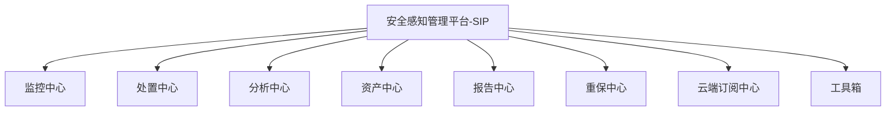
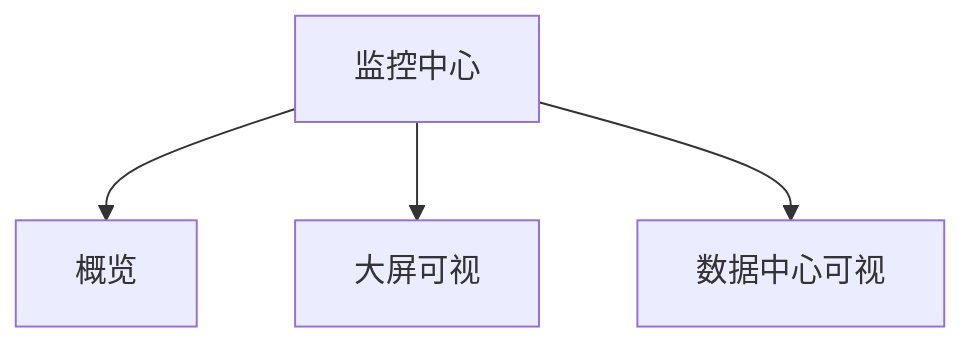
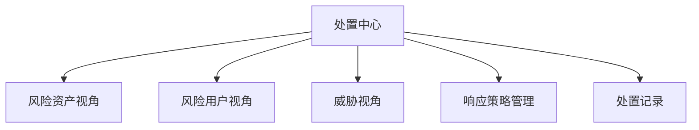
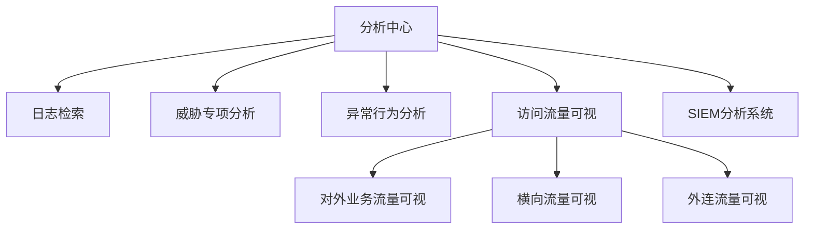
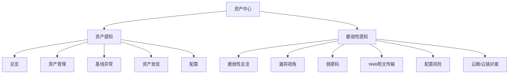
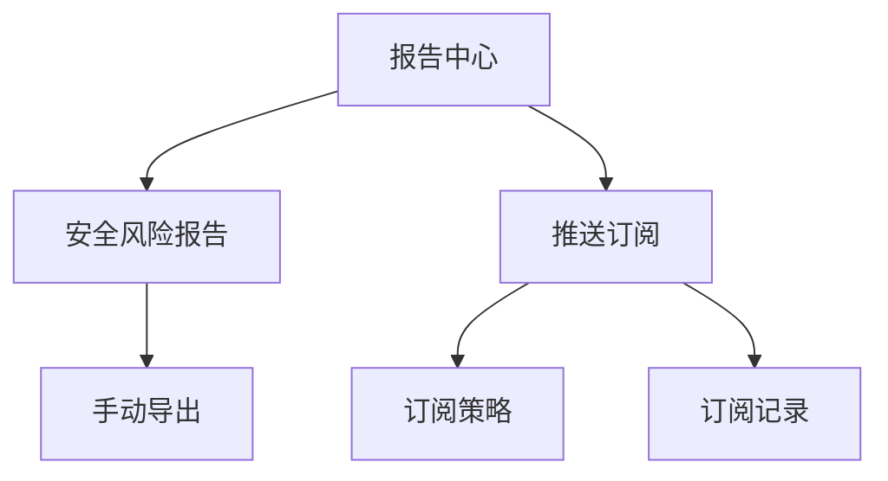
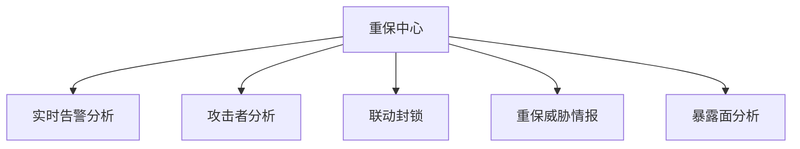
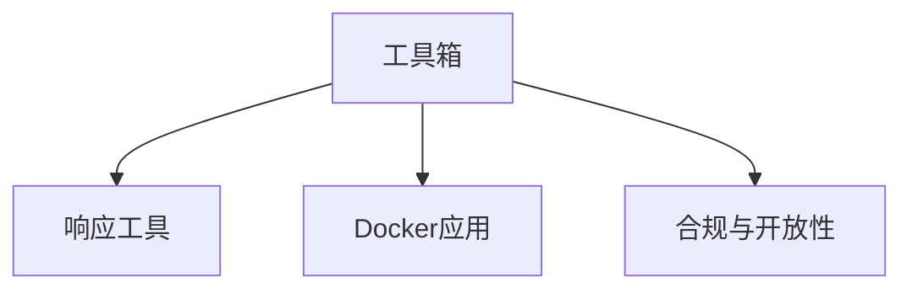

# 安全感知管理平台 - SIP

## 菜单结构

```mermaid
graph TD;
    安全感知管理平台-SIP-->监控中心;
    安全感知管理平台-SIP-->处置中心;
    安全感知管理平台-SIP-->分析中心;
    安全感知管理平台-SIP-->资产中心;
    安全感知管理平台-SIP-->报告中心;
    安全感知管理平台-SIP-->重保中心;
    安全感知管理平台-SIP-->云端订阅中心;
    安全感知管理平台-SIP-->工具箱;
```

```mermaid
graph TD;
    监控中心-->概览;
    监控中心-->大屏可视;
    监控中心-->数据中心可视;
```

```mermaid
graph TD;
    处置中心-->风险资产视角
    处置中心-->风险用户视角
    处置中心-->威胁视角
    处置中心-->响应策略管理
    处置中心-->处置记录
```

```mermaid
graph TD;
    分析中心-->日志检索;
    分析中心-->威胁专项分析;
    分析中心-->异常行为分析;
    分析中心-->访问流量可视;
    访问流量可视-->对外业务流量可视;
    访问流量可视-->横向流量可视;
    访问流量可视-->外连流量可视;
    分析中心-->SIEM分析系统;
```

```mermaid
graph TD;
    资产中心-->资产感知;
    资产感知-->总览;
    资产感知-->资产管理;
    资产感知-->基线异常;
    资产感知-->资产发现;
    资产感知-->配置;
    资产中心-->脆弱性感知;
    脆弱性感知-->脆弱性总览;
    脆弱性感知-->漏洞视角;
    脆弱性感知-->弱密码;
    脆弱性感知-->Web明文传输;
    脆弱性感知-->配置风险;
    脆弱性感知-->云眼/云镜对接;
```

```mermaid
graph TD;
    报告中心-->安全风险报告;
    安全风险报告-->手动导出;
    报告中心-->推送订阅;
    推送订阅-->订阅策略;
    推送订阅-->订阅记录;
```

```mermaid
graph TD;
    重保中心-->实时告警分析;
    重保中心-->攻击者分析;
    重保中心-->联动封锁;
    重保中心-->重保威胁情报;
    重保中心-->暴露面分析;
```

```mermaid
graph TD;
    工具箱-->响应工具;
    工具箱-->Docker应用;
    工具箱-->合规与开放性;
```

## 处置中心 - 威胁视角 - 安全告警
