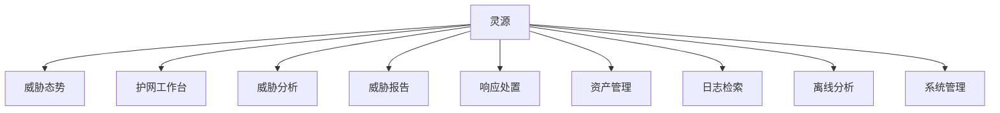

# 幻阵 - 高级威胁狩猎与溯源系统

## 菜单结构

```mermaid
graph TD;
    灵源 --> 威胁态势;
    灵源 --> 护网工作台;
    灵源 --> 威胁分析;
    灵源 --> 威胁报告;
    灵源 --> 响应处置;
    灵源 --> 资产管理;
    灵源 --> 日志检索;
    灵源 --> 离线分析;
    灵源 --> 系统管理;
```
