# 安全感知管理平台 - SIP

> 基于 SIP V3.0.77 进行说明

## 菜单结构

```mermaid
graph TD;
    安全感知管理平台 - SIP--> 监控中心;
    安全感知管理平台 - SIP--> 处置中心;
    安全感知管理平台 - SIP--> 分析中心;
    安全感知管理平台 - SIP--> 资产中心;
    安全感知管理平台 - SIP--> 报告中心;
    安全感知管理平台 - SIP--> 重保中心;
    安全感知管理平台 - SIP--> 云端订阅中心;
    安全感知管理平台 - SIP--> 工具箱;
```

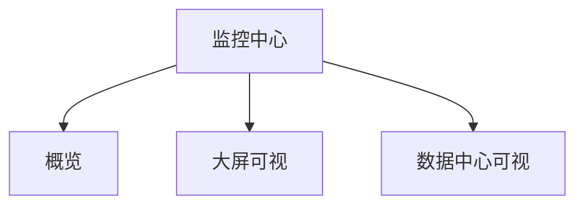

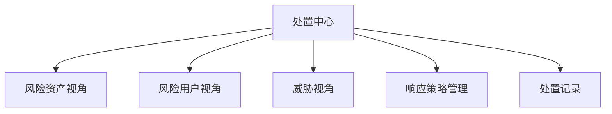

```mermaid
graph TD;
    分析中心 --> 日志检索;
    分析中心 --> 威胁专项分析;
    分析中心 --> 异常行为分析;
    分析中心 --> 访问流量可视;
    访问流量可视 --> 对外业务流量可视;
    访问流量可视 --> 横向流量可视;
    访问流量可视 --> 外连流量可视;
    分析中心 -->SIEM 分析系统;
```

```mermaid
graph TD;
    资产中心 --> 资产感知;
    资产感知 --> 总览;
    资产感知 --> 资产管理;
    资产感知 --> 基线异常;
    资产感知 --> 资产发现;
    资产感知 --> 配置;
    资产中心 --> 脆弱性感知;
    脆弱性感知 --> 脆弱性总览;
    脆弱性感知 --> 漏洞视角;
    脆弱性感知 --> 弱密码;
    脆弱性感知 -->Web 明文传输;
    脆弱性感知 --> 配置风险;
    脆弱性感知 --> 云眼 / 云镜对接;
```

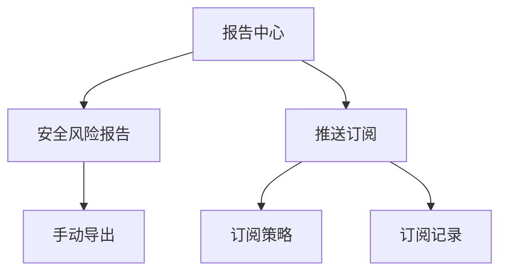

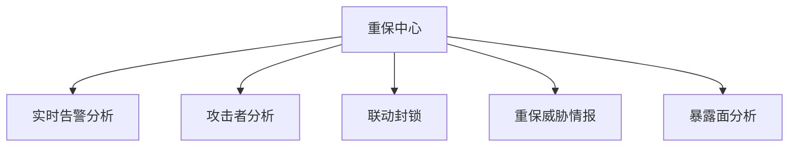

```mermaid
graph TD;
    工具箱 --> 响应工具;
    工具箱 -->Docker 应用;
    工具箱 --> 合规与开放性;
```

## 告警监控

告警信息位于：处置中心 - 威胁视角 - 安全告警

这个基本就是鼠标猴子的工作核心了 - 看告警

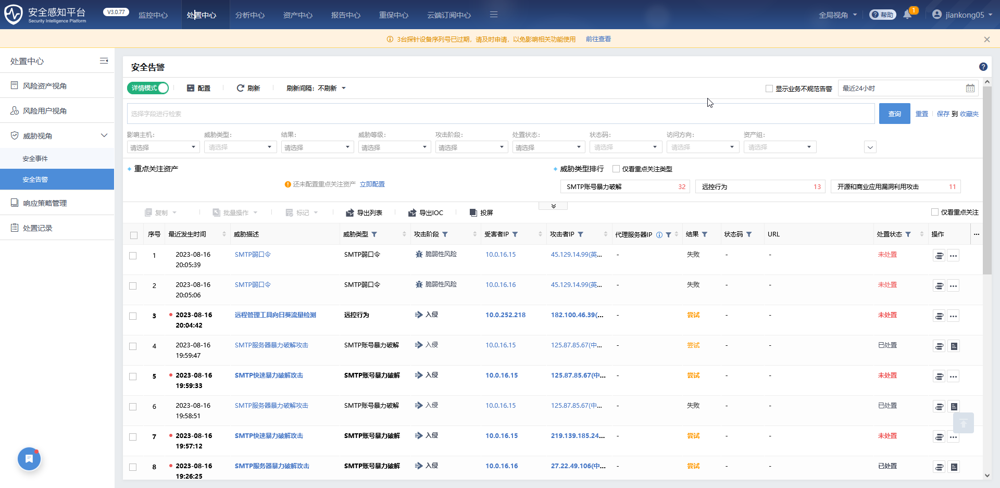

在上方的搜索框可以搜索以下数据：

- 威胁描述
- 主机 IP
- 受害者 IP
- 攻击者 IP
- 代理服务器 IP
- URL

同时，对于一条告警 / 一个攻击者 IP，可以做以下处置：

- 已处置
- 处置中
- 挂起
- 加白

> 加白可以直接忽略掉相关事件的所有告警事件，属于高危操作，需要取得研判组与相关同事的一致无害化认定，才可以加白名单

单击威胁描述，可以打开告警详情：

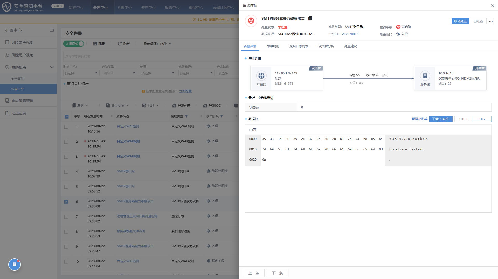

## 白名单控制

在告警监控界面，就可以直接对特定事件进行加白操作：

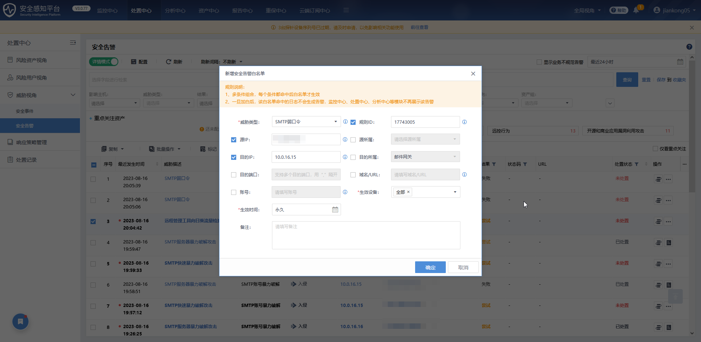

白名单可以根据以下规则来制定：

- 威胁类型
- 规则 ID（根据规则库来指定）
- 源 IP
- 源所属（态感内事先划分好的资源组）
- 目的 IP
- 目的所属（态感内事先划分好的资源组）
- 目的端口
- 域名 / URL
- 账号
- 生效设备（与态感已经建立联动的相关设备，如 WAF）
- 生效时间

如果需要修改白名单数据，则打开：系统设置 - 安全能力配置 - 白名单

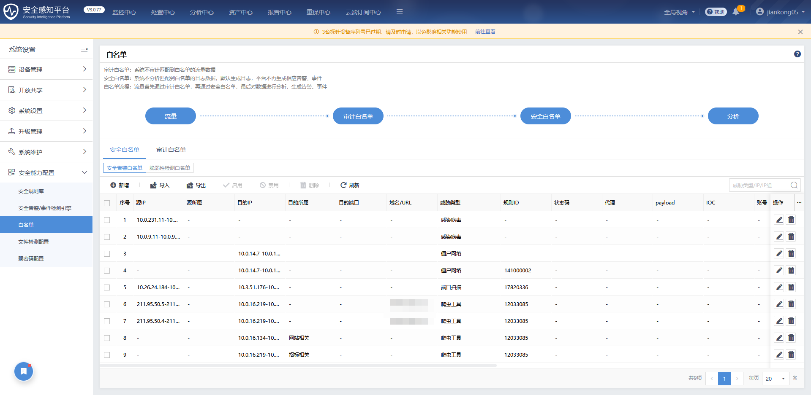

在这里可以对已设置的白名单进行控制与修改

## 日志检索

日志检索位于：分析中心 - 日志检索

常用的搜索字段有：

- src_ip - 源 IP
- src_port - 源端口
- dst_ip - 目的 IP
- dst_port - 目的端口
- url - 域名 / url
- status_code - http 状态码
- userAgent - http 访问头 - agent

例如最常用的，查看某个 IP 地址的所有会话流量日志，就可以使用以下语句：

```plaintext
src_ip:139.9.4.56 OR dst_ip:139.9.4.56
```

## 潜伏威胁黄金眼

潜伏威胁黄金眼位于：左下角的快捷菜单

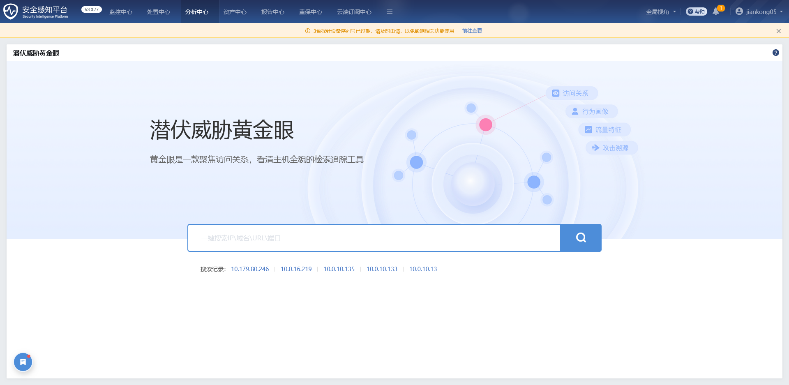

算是深信服 SIP 的特色功能，可以根据给定的 IP \ 域名 \ URL \ 端口 进行威胁分析（基于设备本地日志和深信服威胁情报）

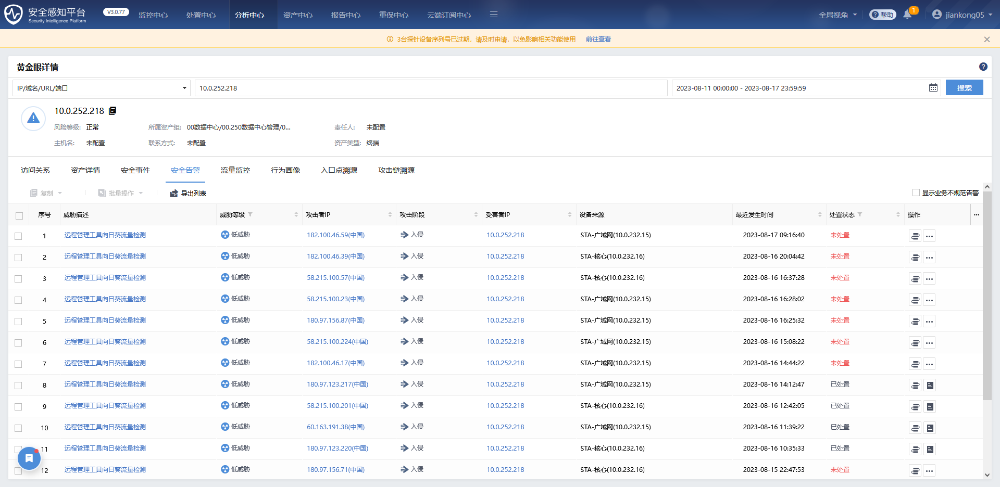

## 快捷菜单

SIP 有的时候需要同时打开多个窗口，便于快速反应研判，这个时候就可以使用深信服 SIP 自带的快捷菜单功能：

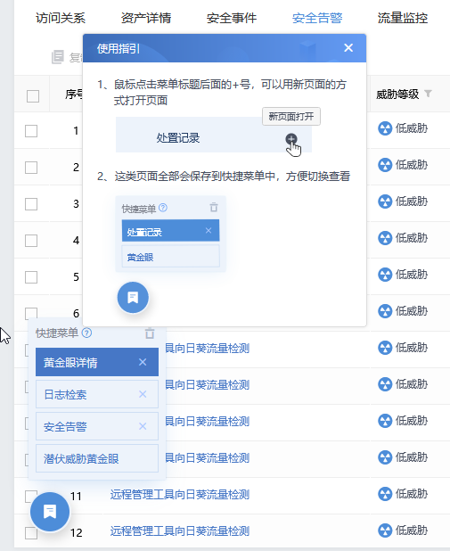

通过快捷菜单便可以标记多个页面，并且能保存页面状态信息，而无需在浏览器中打开多个页面
