# 灵源 · 高级威胁检测与分析系统

## 菜单结构

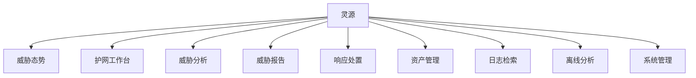

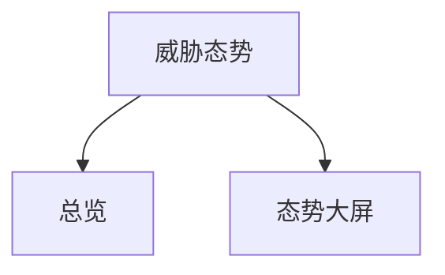

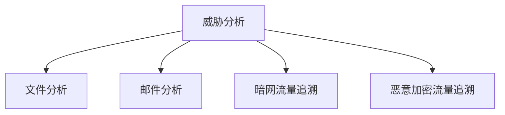

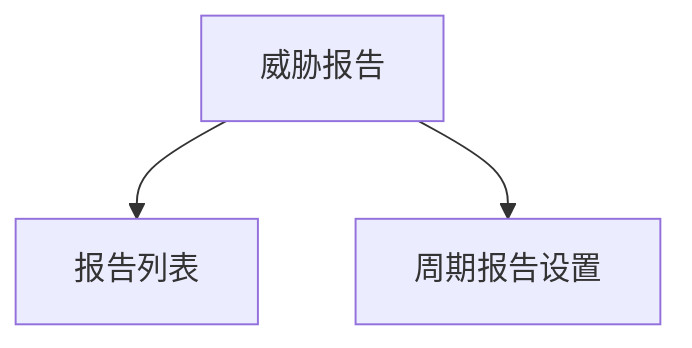

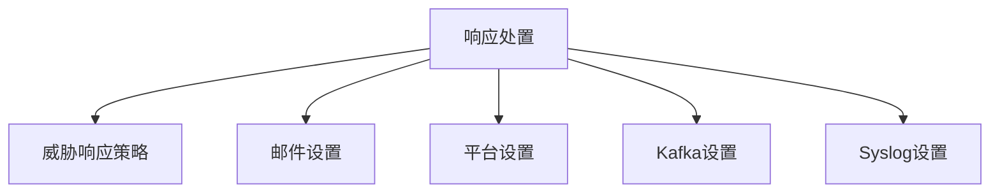

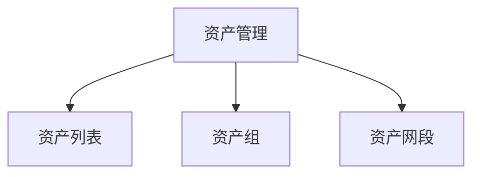

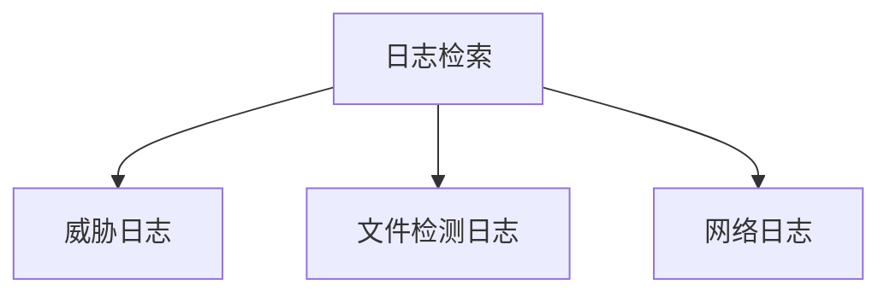

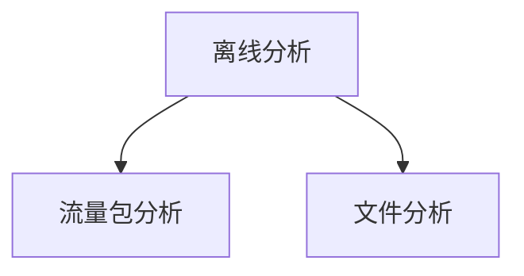

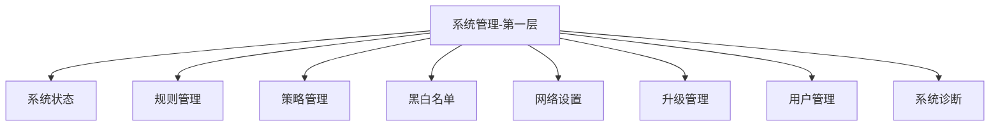

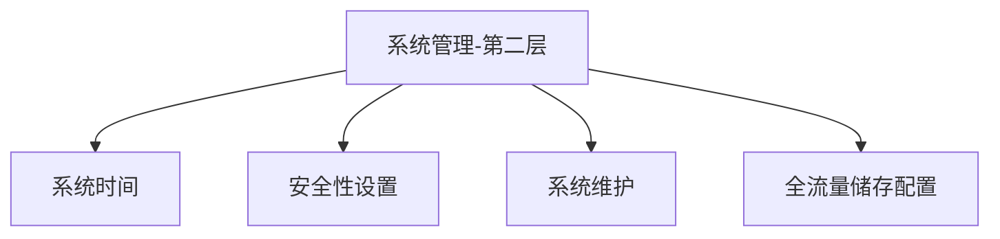

## 护网工作台

监控 && 研判的工作核心，看日志就好了：

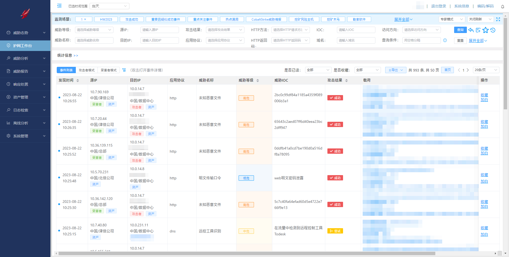

在上方的检测场景已经内置了许多常用筛选条件，其实就为筛选条件的集合，如

- 攻击成功
- 重要且疑似成功事件
- 重点关注事件
- 热点漏洞
- CobaltStrike威胁情报
- 挖矿风险主机
- 挖矿木马
- 勒索软件
- 恶意软件
- Log4j漏洞
- OA漏洞
- Web攻击
- 注入攻击
- 代码执行
- WebShell
- 恶意外联
- 钓鱼邮件
- 黑客工具
- 网络和路由设备漏洞
- 异常登录
- 信息泄露
- 扫描探测
- 人工智能引擎事件
- 僵木蠕威胁情报

可以在查询区域，手动添加检测场景：

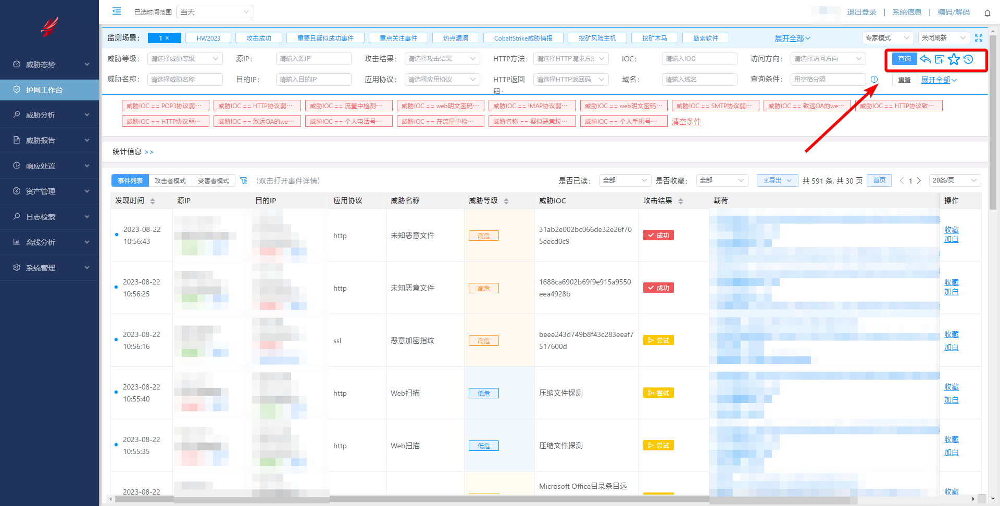

如我本人常用的检测场景（查询条件）

```plaintext
NOT target : "POP3协议弱口令登录" AND NOT target : "HTTP协议弱口令登录" AND NOT target : "Remote control tool Sunlogin is found in traffic" AND NOT target : "web明文密码泄露" AND NOT target : "IMAP协议弱口令登录" AND NOT target : "web明文密码泄露(管理员账号)" AND NOT target : "SMTP协议弱口令登录" AND NOT target : "致远OA的web明文密码泄露" AND NOT target : "HTTP协议致远OA弱口令登录" AND NOT target : "HTTP协议弱口令登录(管理员账号)" AND NOT target : "致远OA的web明文密码泄露(管理员账号)" AND NOT target : "Phone number leaked" AND NOT target : "Remote control tool Todesk is found in traffic" AND NOT category : "maybe-mal-spam-mail" AND NOT target : "Phone number leaked successfully"
```

双击告警，即可查看告警详情：

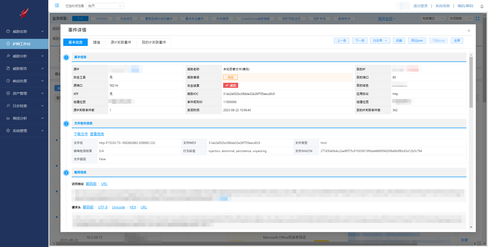

## 资产管理

资产管理位于：资产管理 - 资产列表

在这里，可以给具体的ip段和ip地址打上标签，便于在告警工作台上分辨出来具体的资产归属

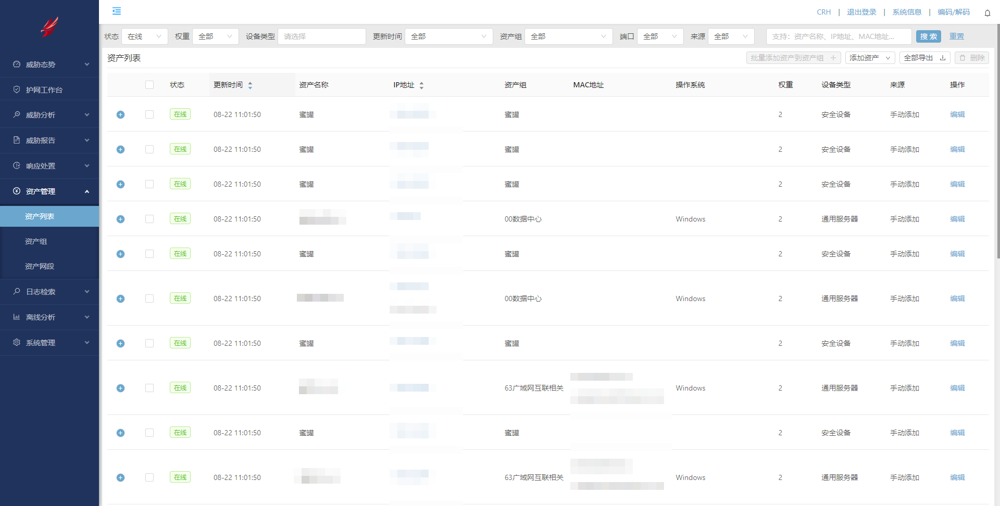
