# Windows 账户控制

在 Windows 账户控制中，会涉及到账户增添删改，修改密码，修改密码安全性策略等需求

:::note 关于命令提示符

在 Windows 的命令提示符中，指令的大小写是不影响执行效果的，如

```powershell
net user username /DELETE
```

和以下指令

```powershell
net user username /DELETE
```

是具有等价效果的

:::

## 查询系统内已存在的用户

```posershell
net user
```

:::note 关于隐藏账户

如用户名的后缀为 `$`，例如：`test$`，则会被系统识别为系统账户（隐藏账户），从而不能在 `net user` 的结果中出现。面对隐藏账户，可以从注册表内进行搜索，或者看一下控制面板的用户账户管理页面

:::

:::info 关于命令行操作

通过命令行操作用户账户，需要管理员账户权限。在 `Windows 7` 系统中，可以在开始菜单中找到 ` 命令提示符 `，右键，选择 ` 以管理员身份运行 `，即可获得管理员账户权限；在 `Windows 10` 中，可以直接右键开始菜单按钮，选择 `Windows Powershell (管理员)`，也可获得管理员账户权限

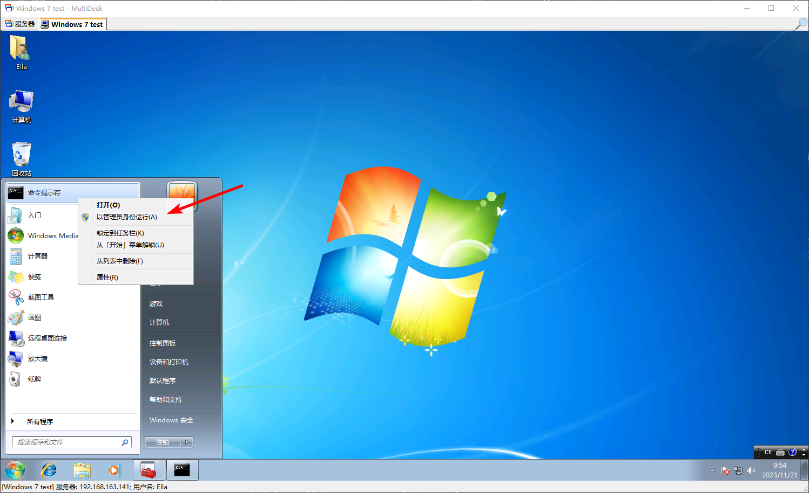


:::

## 禁用账户

在安全加固中，往往会遇到一些系统和服务自动创建的来宾账户（`Guest` 账户），这类账户往往没有身份验证机制，或者存在弱身份验证机制，会给系统带来未授权访问的风险。为了杜绝此类风险，可以将账户直接禁用，以下以 `Guest` 账户举例

首先，可以通过 `net user guest` 指令，查看当前 `Guest` 账户的状态，其效果应该如下

```posershell
C:\Users\admin>net user Guest
用户名                 Guest
全名
注释                   供来宾访问计算机或访问域的内置帐户
用户的注释
国家 / 地区代码          000 (系统默认值)
帐户启用               No
帐户到期               从不

上次设置密码           2023/11/21 0:09:26
密码到期               从不
密码可更改             2023/11/21 0:09:26
需要密码               No
用户可以更改密码       No

允许的工作站           All
登录脚本
用户配置文件
主目录
上次登录               从不

可允许的登录小时数     All

本地组成员             *Guests
全局组成员             *None
命令成功完成。
```

可以看到，当前 `Guest` 账户的启用状态为：`No`。如果发现 `Guest` 账户为启用状态，则存在攻击者利用 `Guest` 账户进行未授权登陆的可能性。

为了禁用 `Guest` 账户，可执行以下指令：

```powershell
net user Guest /ACTIVE:NO
```

即可禁用 `Guest` 账户

## 修改用户密码

直接使用 `net user` 指令即可

```powershell
net user username password
```

## 删除账户

### 使用控制面板来删除用户

在控制面板中，直接进入账户的信息界面，即可直接点击 ` 删除账户 `。

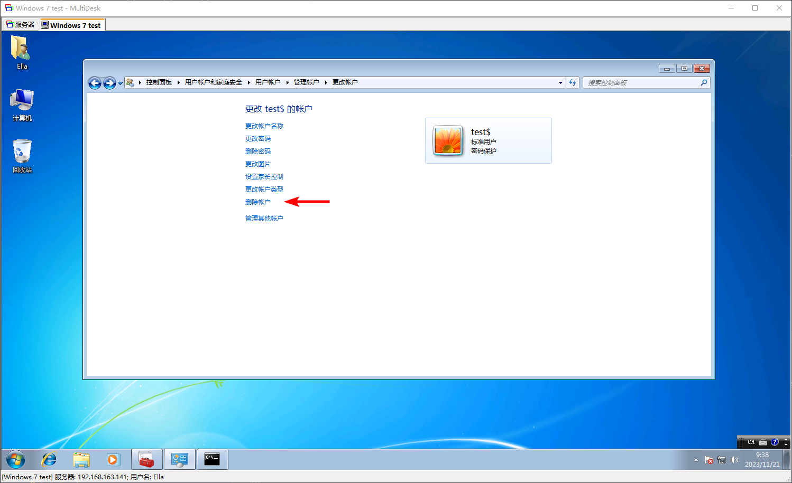

后续还可以选择是否将这个用户的个人数据进行清除（即删除个人文件夹，包括桌面、下载目录等等）

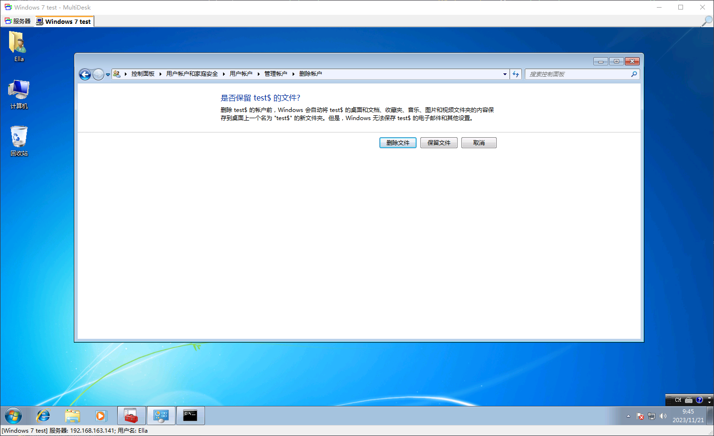

### 使用命令行来删除账户

通过以下指令来实现（以 `test` 账户为例）：

```powershell
net user test /DELETE
```

即可删除掉 `test` 账户

## 排查影子账户

需要注意的是，普通的影子账户，虽然在 `net user` 的结果中不可见，但是仍然可以在控制面板的用户账户管理页面看到。如下图中的 `test$` 账户，虽然在 `net user` 的结果中不可见，但是仍然可以在控制面板中看到。


:::note

需要注意的是，这种效果还只是最普通的影子账户，因为这种手法创建的影子账户，在控制面板中还是可见的，隐蔽性并不是很强

:::

对于更高级的影子账户，相关原理可以参考：[渗透测试 / 权限维持 / Windows](/docs/Penetration/Privilege-Persistence/Windows)

由于注册表是 Windows 储存配置数据的核心，所以可以直接通过注册表数据来对系统所有的账户进行排查

`Win`+`R`，执行 `regedit`，打开注册表编辑器，进入 `HKEY_LOCAL_MACHINE\SAM\SAM` 分支

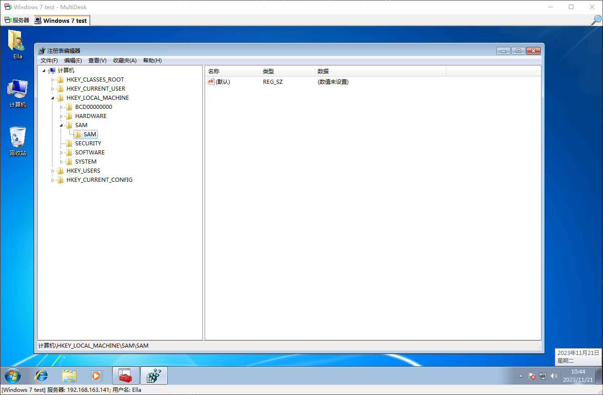

由于 SAM 区的数据涉及敏感信息，所以 Windows 的默认权限设置下是没有办法直接查看的，但是可以手动更改权限设置，将 Administrators 加入到权限组中，并给予所有权限

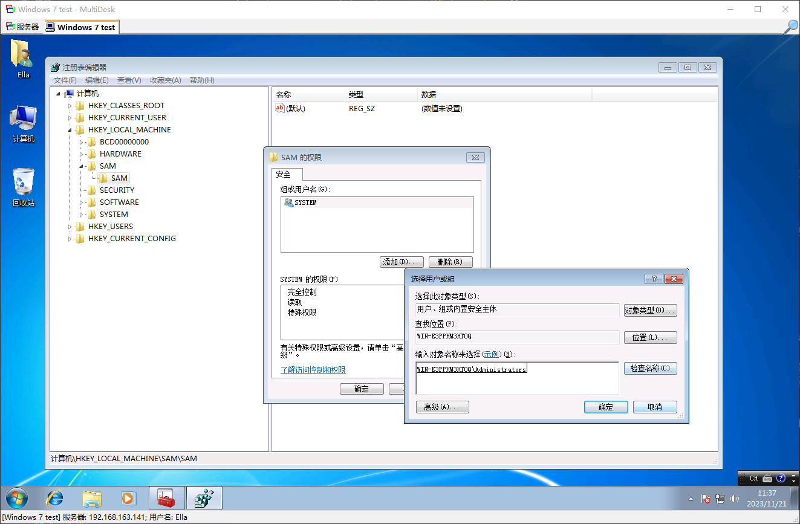

然后重新启动注册表编辑器，即可访问到 SAM 区域内的用户数据

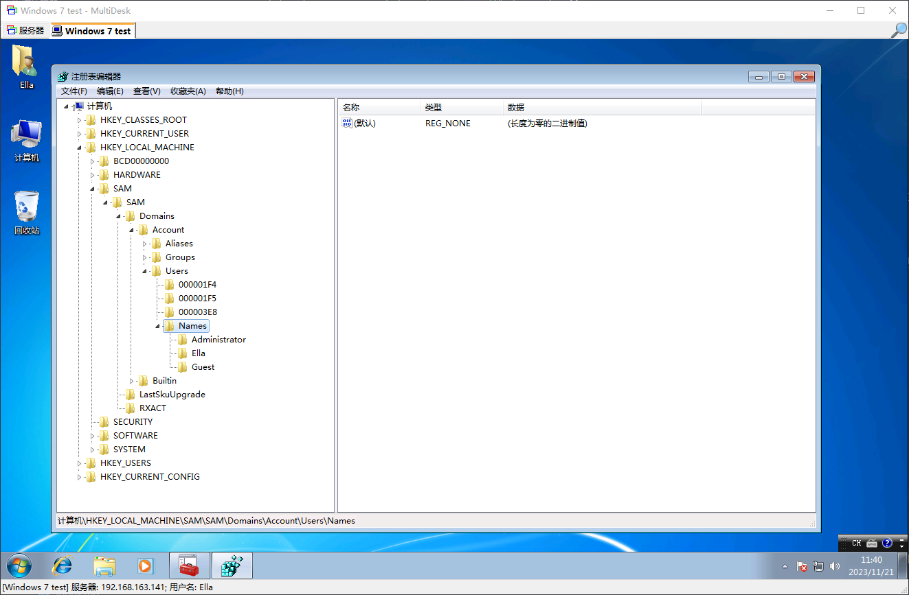

所有账户的账户数据保存在：`HKEY_LOCAL_MACHINE\SAM\SAM\Domains\Account\Users\Names`，可以在此处看到所有的用户账户

## 密码策略

修改密码的相关安全策略，可以通过 Windows 的组策略来实现。组策略编辑器启动方式：`Win`+`r` , `gpedit.msc`

密码策略，适用于对用户的密码安全性做出要求，如对用户密码的复杂度进行要求，或者限制密码的有效时间

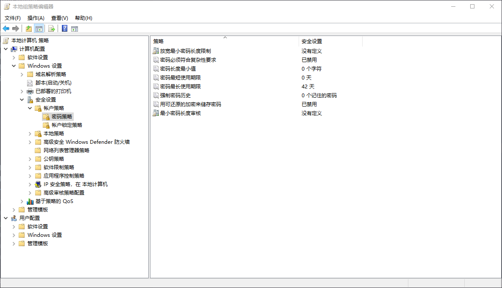


### 密码最长有效期

可以通过组策略的进行配置，路径为：计算机配置 - Windows 设置 - 安全设置 - 账户策略 - 密码策略 - 密码最长使用期限

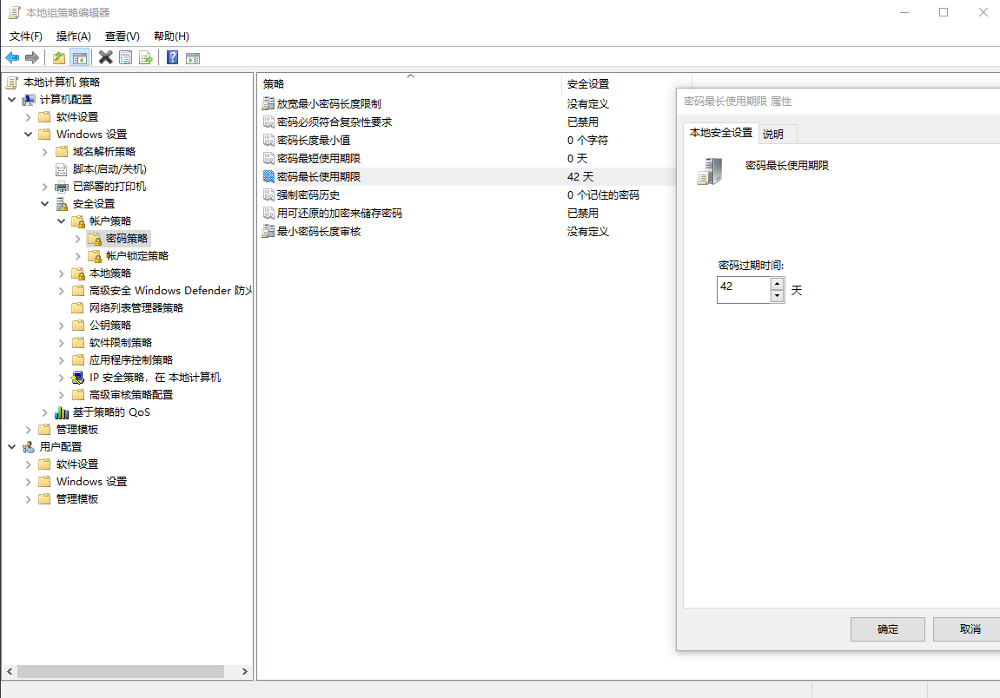

### 密码最短长度

通过限制密码的最短长度，可以极大提高密码爆破所需要的时间成本，从而大大提高系统安全性

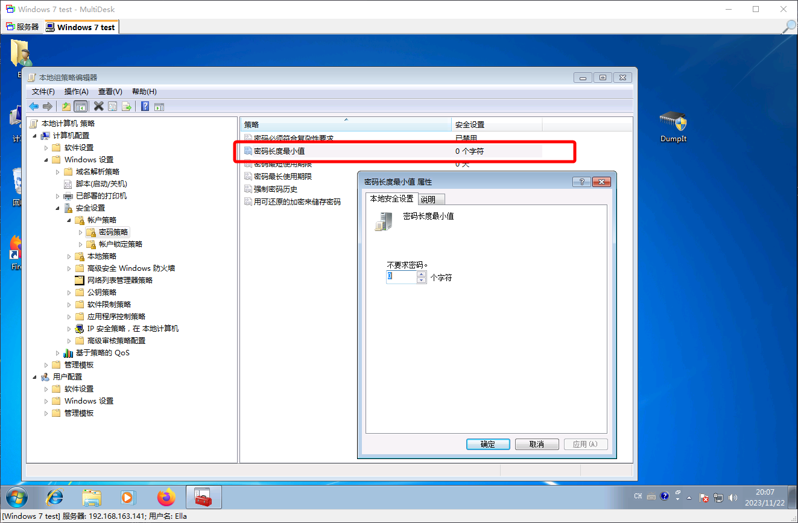

### 密码安全历史（密码复用要求）

通过限制新密码与旧密码之间的重复性，可以避免使用旧密码导致的不可预料的密码泄露威胁

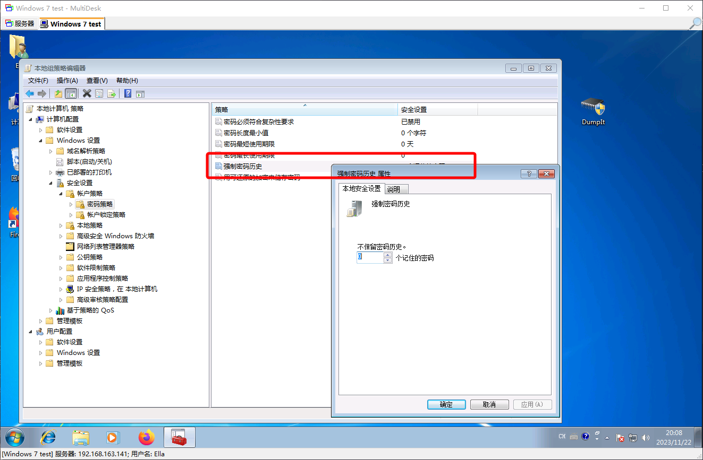

### 密码复杂度要求

通过启用密码的复杂性要求，可以强制要求用户的密码满足复杂度规则，从而极大程度上规避了密码爆破攻击

:::note Windows 默认的密码复杂性要求

不能包含用户的帐户名，不能包含用户姓名中超过两个连续字符的部分

至少有六个字符长

包含以下四类字符中的三类字符:

- 英文大写字母 (A 到 Z)
- 英文小写字母 (a 到 z)
- 10 个基本数字 (0 到 9)
- 非字母字符 (例如 !、$、#、%)

在更改或创建密码时执行复杂性要求。

:::

可以参考 Windows 官方的文档

[Password must meet complexity requirements - Microsoft Learn](https://learn.microsoft.com/en-us/windows/security/threat-protection/security-policy-settings/password-must-meet-complexity-requirements)

如果想要自定义密码复杂性要求的规则，Windows 原生并不自带相关的配置项，但是可以通过自行编译密码过滤器（`Password Filters`）来实现这种效果

关于自定义密码过滤器，可以参考官方文档：[Password Filters - Microsoft Learn](https://learn.microsoft.com/en-us/windows/win32/secmgmt/password-filters)

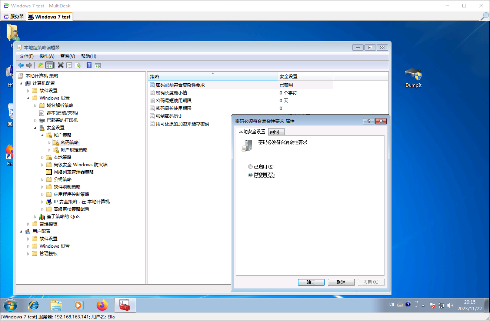

## 账户锁定策略

针对用户凭据被恶意爆破的场景下，对用户登陆失败多次后限制登录，可以有效地限制恶意爆破的时间成本

### 账户锁定时间

通过配置 ` 账户锁定时间 `，可以设定账户单次被锁定的时间

:::note 前提条件

启用此选项，需要配置 ` 账户锁定阈值 ` 项目

:::

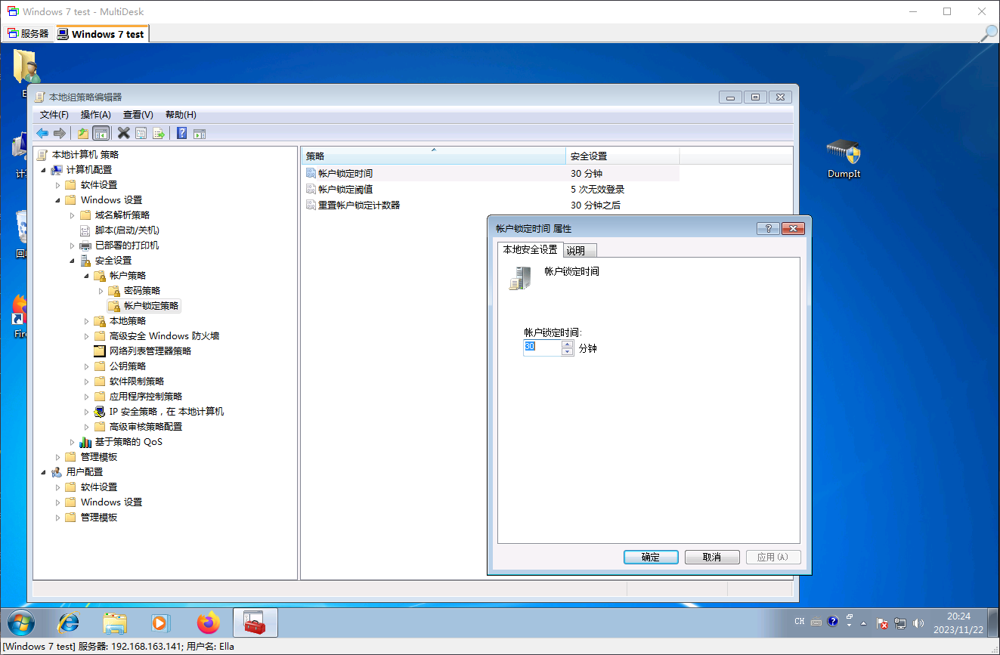

### 账户锁定阈值

通过配置 ` 账户锁定阈值 `，可以设定账户登录失败被锁定的失败次数阈值

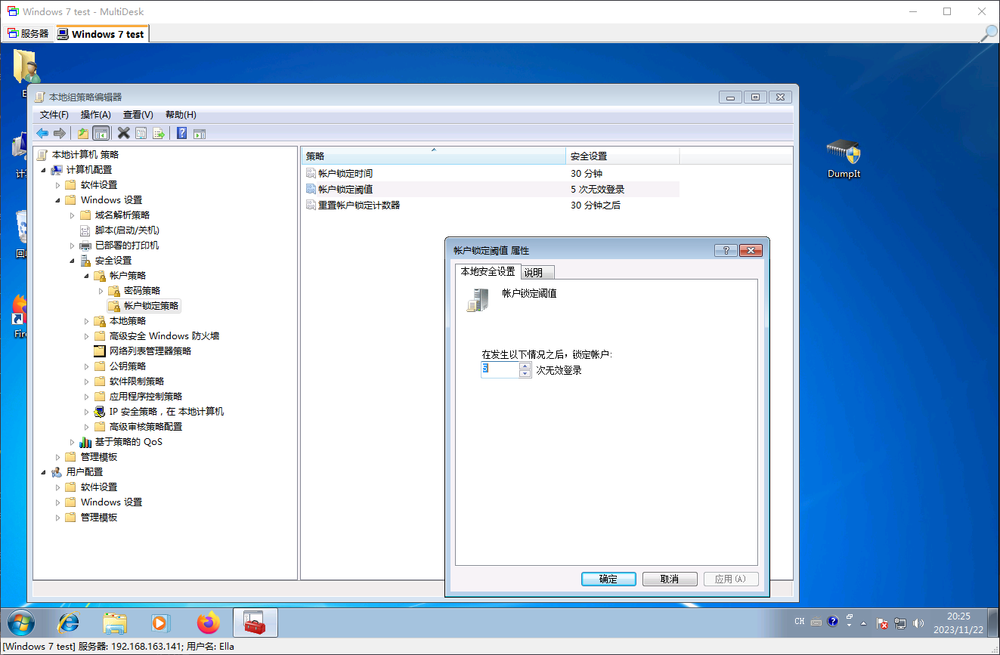

### 重置账户锁定计数器

通过配置 ` 重置账户锁定计数器 `，可以设定账户被锁定之后，经历多久时间才重置账户登陆失败的计数器

:::note 前提条件

启用此选项，需要配置 ` 账户锁定阈值 ` 项目

:::

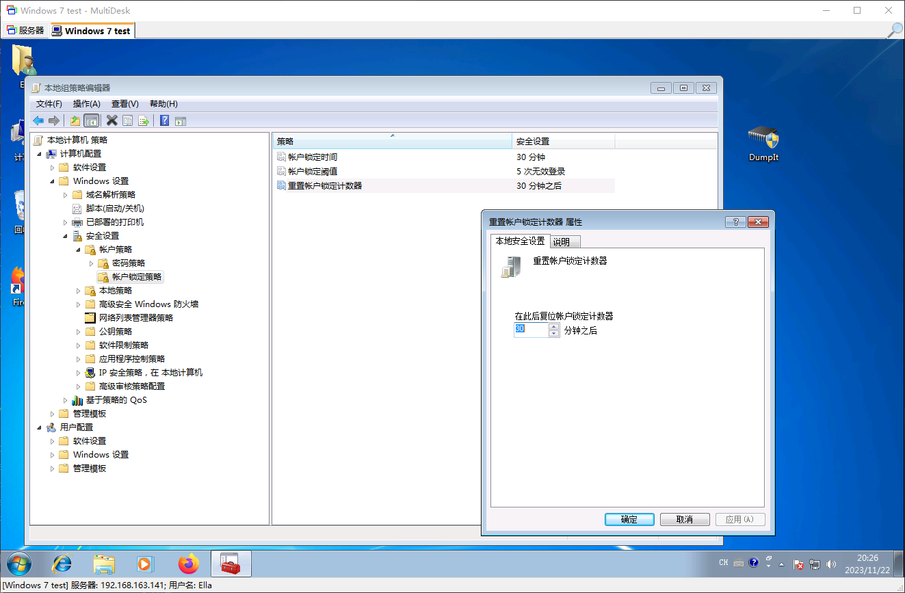

## 要求用户下次登陆更改密码

通过强制要求用户在下次登陆时修改密码，可以达到强制用户丢弃旧密码，从而规避一些密码泄露的场景

通过 `net user` 指令来进行配置

```powershell
net user  /LOGONPASSWORDCHG:YES
```