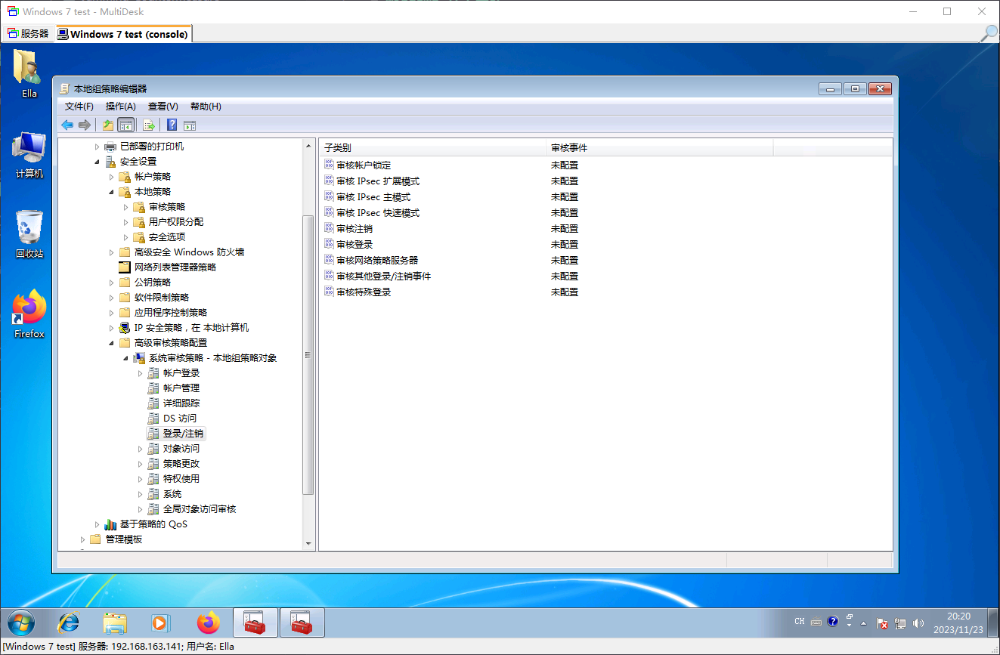
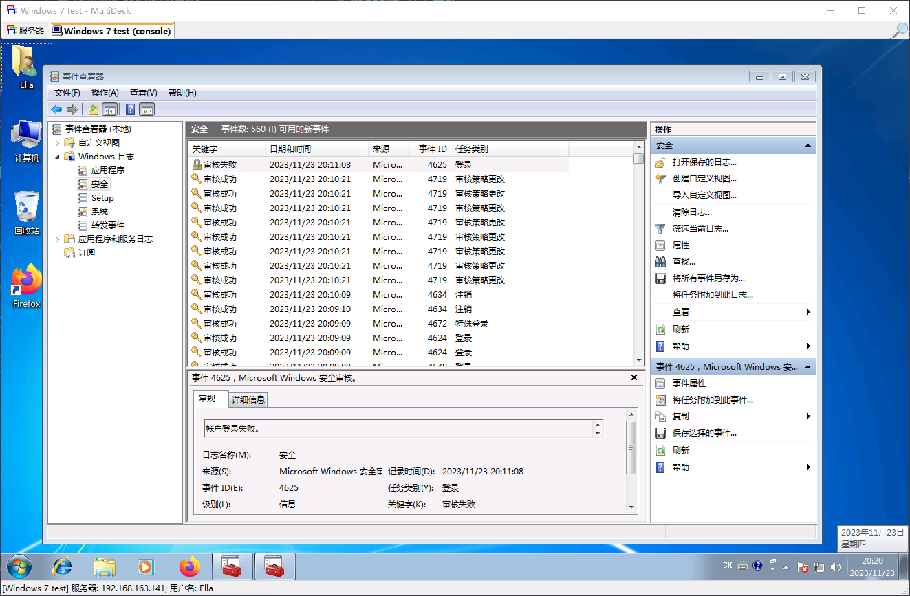

# Windows 日志策略

在 Windows 中，日志策略又称为：` 审核策略 `，当遇到目标事件（标名为需要审核的事件）时，Windows 会将具体的事件细节记录到 Windows 事件数据库中，查看相关记录可以使用 ` 事件查看器 `。如果需要配置哪些事件为需要审核的事件，可以通过 ` 组策略编辑器 ` 来配置

`Win`+`R`，`gpedit.msc`，可以启动 ` 组策略编辑器 `

`Win`+`R`，`eventvwr.msc`，可以启动 ` 事件查看器 `

## 审核策略更改

## 审核登陆事件

## 审核对象访问

## 审核进程跟踪

## 审核目录服务访问

## 审核特权使用

## 审核系统事件

## 审核账户登录事件

## 审核账户管理

