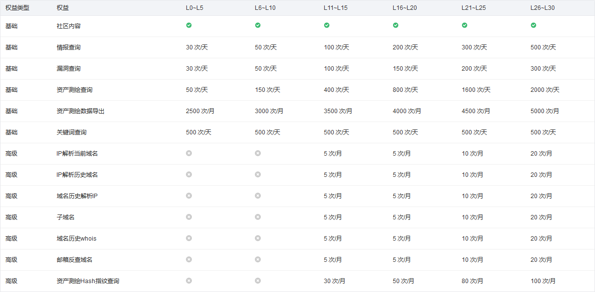

# 威胁情报

> 威胁情报是 为了解威胁行为者的动机、目标和攻击行为而收集、处理和分析的数据
>  
> 以下顺序根据我本人主观评价来排序

## [微步情报社区](https://x.threatbook.com/)

目前效果最好，微步社区的相关次数限制由用户账户等级来决定，具体的计算规则如下：

## [360 安全大脑](https://sc.360.net)

次数限制未知，缺点是每一次查询都需要来一次拼图验证码

## [奇安信 威胁情报分析](https://ti.qianxin.com/)

普通注册用户限制 100 次 / 天，15 次漏洞查询 / 天

## [深信服 威胁情报中心](https://ti.sangfor.com.cn)

注册后次数限制未知

## [腾讯安全 - 威胁情报中心](https://tix.qq.com/)

还行，数据量较少

## [启明星辰 - VenusEye威胁情报中心](https://www.venuseye.com.cn)

废物

## [天际友盟 - REDQUEEN威胁情报中心](https://redqueen.tj-un.com/IntelHome.html)

废物

## [安天 - 威胁情报中心](https://www.antiycloud.com/#/antiy/index)

废物

## [绿盟 威胁情报云](https://ti.nsfocus.com/)

废物
