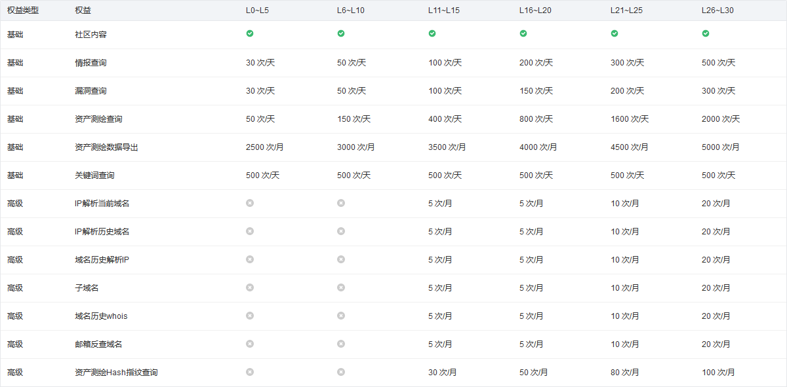

# 红蓝攻防

> ***The dynamics of offense and defense are fluid***

## 名词解释

- IOC Indicators of Compromise 威胁情报

## 研究判断

### IP 判断

[微步情报社区](https://x.threatbook.com/)

微步社区的相关次数限制由用户账户等级来决定，具体的计算规则如下：

[360 安全大脑](https://sc.360.net)

360 官方，次数限制未知，缺点是每一次查询都需要来一次拼图验证码

[深信服威胁情报中心](https://ti.sangfor.com.cn)

深信服官方，注册后次数限制未知

[奇安信威胁情报分析](https://ti.qianxin.com/)

奇安信官方，普通注册用户限制 100 次 / 天，15 次漏洞查询 / 天

### 样本判断

## 日志分析

### Java 相关流量

## 溯源分析

[ICP/IP 地址 / 域名信息备案管理系统](https://beian.miit.gov.cn)

## 干扰反制

### Cobalt Strike 干扰与反制
