# 压缩包相关

在 Misc 领域中，关于压缩包的知识是很基本的，近几年被考烂的；但同时也是每位 Misc 手，乃至每位 CTFer 都应该了解的重要知识点。在 Misc 领域，关于压缩包分析的知识可以说占了一大部分。而其中又包括了像文件数据结构的识别、 CRC 数据校验算法等等知识点。

## ZIP 文件

ZIP 文件格式是一种数据压缩和文档储存的文件格式，原名 Deflate，发明者为菲尔 · 卡茨（Phil Katz），他于 1989 年 1 月公布了该格式的资料。ZIP 通常使用后缀名 “.zip”，它的 MIME 格式为 `application/zip`。

### zip 文件结构

一个 ZIP 文件由三个部分组成：压缩源文件数据区 + 压缩源文件目录区 + 压缩源文件目录结束标志

这里拿一个小的测试用 zip 文件举例：

#### zip 文件源数据区

`struct ZIPFILERECORD record`

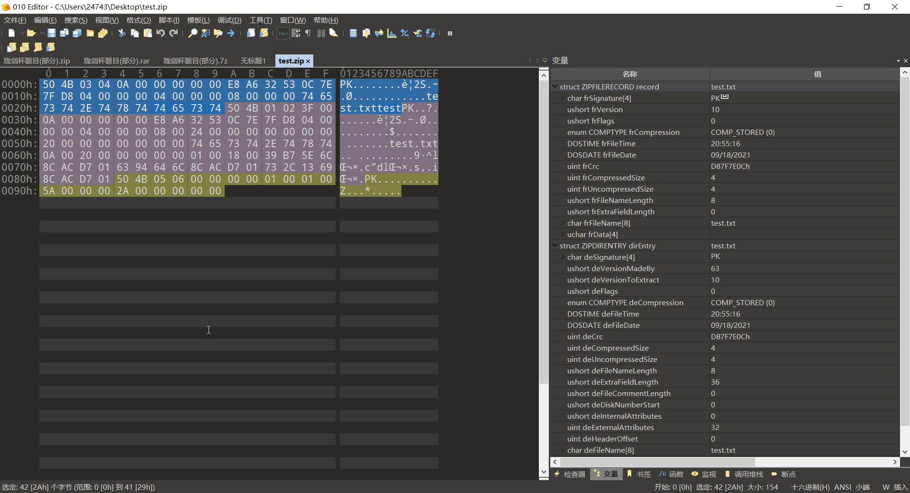

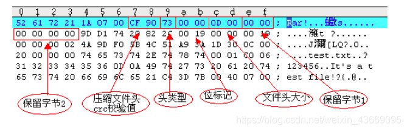

| HEX 数据    | 描述                                            | 010Editor 模板数据          |
| ----------- | ----------------------------------------------- | --------------------------- |
| 50 4B 03 04 | zip 文件头标记，看文本的话就是 PK 开头          | char frSignature[4]         |
| 0A 00       | 解压文件所需 pkware 版本                        | ushort frVersion            |
| 00 00       | 全局方式位标记（有无加密），头文件标记后 2bytes | ushort frFlags              |
| 00 00       | 压缩方式                                        | enum COMPTYPE frCompression |
| E8 A6       | 最后修改文件时间                                | DOSTIME frFileTime          |
| 32 53       | 最后修改文件日期                                | DOSDATE frFileDate          |
| 0C 7E 7F D8 | CRC-32 校验                                     | uint frCrc                  |

#### zip 文件源数据目录区

`struct ZIPDIRENTRY dirEntry`

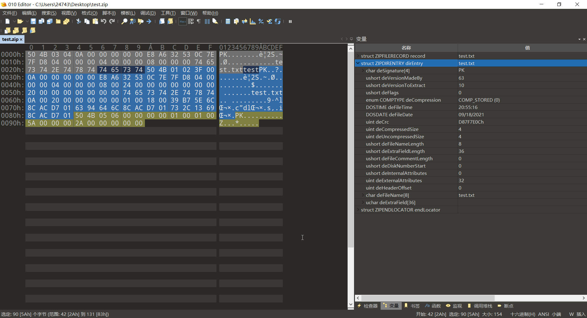

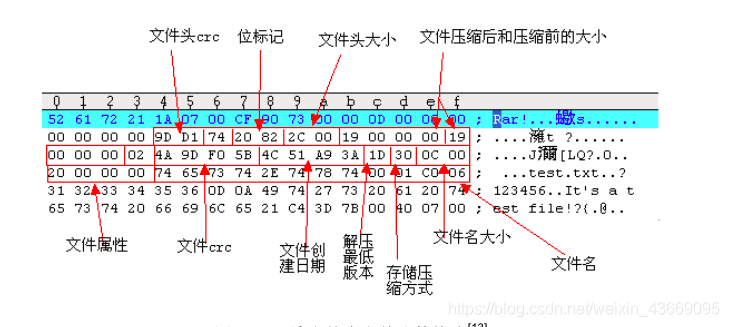

| HEX 数据    | 描述                                              | 010Editor 模板数据          |
| ----------- | ------------------------------------------------- | --------------------------- |
| 50 4B 01 02 | 目录中文件文件头标记                              | char deSignature[4]         |
| 3F 00       | 压缩使用的 pkware 版本                            | ushort deVersionMadeBy      |
| 0A 00       | 解压文件所需 pkware 版本                          | ushort deVersionToExtract   |
| 00 00       | 全局方式位标记（有无加密），目录文件标记后 4bytes | ushort frFlags              |
| 00 00       | 压缩方式                                          | enum COMPTYPE frCompression |
| E8 A6       | 最后修改文件时间                                  | DOSTIME frFileTime          |
| 32 53       | 最后修改文件日期                                  | DOSDATE frFileDate          |
| 0C 7E 7F D8 | CRC-32 校验                                       | uint frCrc                  |

#### zip 文件源数据目录结束区

`struct ZIPENDLOCATOR endLocator`

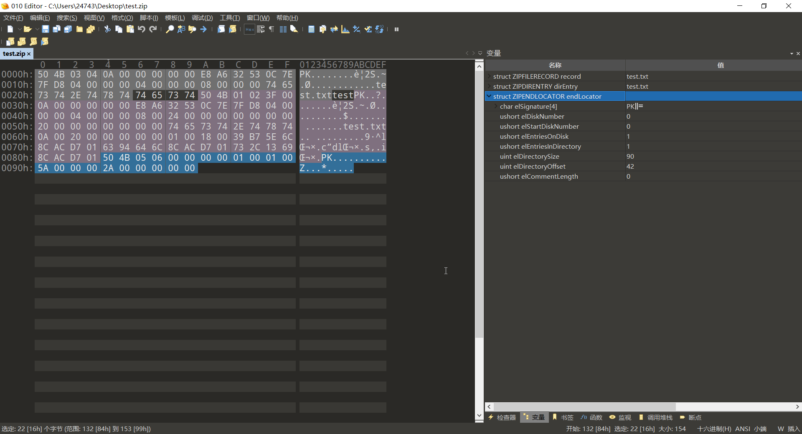

| HEX 数据    | 描述               | 010Editor 模板数据       |
| ----------- | ------------------ | ------------------------ |
| 50 4B 05 06 | 目录结束标记       | char elSignature[4]      |
| 00 00       | 当前磁盘编号       | ushort elDiskNumber      |
| 00 00       | 目录区开始磁盘编号 | ushort elStartDiskNumber |

对于多文件的压缩包，其结构不会如此简单，但按照格式依然可以对照得出：

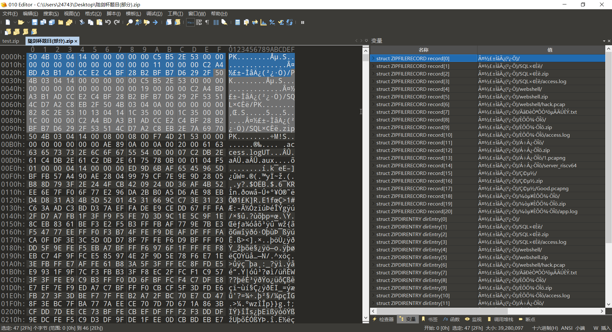

### zip 文件常见考点

#### 0x01 zip 伪加密

zip 文件的伪加密，正如他的名字，即虽然 zip 文件本身没有加密，但是通过修改 zip 文件中的标记数据，让解压软件认为文件存在加密，故达到了伪加密的效果。而标记 zip 文件是否加密的标记，则是上文中 zip 文件源数据区中的 `ushort frFlags`（全局标记文件是否加密）和 zip 文件源数据目录区中的 ushort frFlags（全局标记文件是否加密，伪加密的关键点）两个位置。

在正常加密的情况下，源数据区的加密标记和源文件目录区的加密标志点应当是同一个数据，然而在一般的 zip 伪加密中，往往 zip 文件源数据区中的 ushort frFlags 数据点为 0，偶数即标志着文件不存在加密，但是 zip 文件源数据目录区中的 ushort frFlags 数据点不为偶数，标志着文件存在加密。这样前后标志冲突，软件会认为 zip 文件存在加密，但是无论用什么密码都无法解压，因为文件数据根本没有加密。

在这种情况下，可以选择使用 16 进制编辑工具（推荐 010 Editor，用模板功能可以方便地定位标志数据的位置）来手动编辑文件数据，通过将 zip 文件源数据目录区中的 `ushort frFlags` 数据点中的数据全部改为 0，即可让文件认为文件不存在加密方式，就可以顺利解出数据。

##### zip 伪加密 - 例题

[BUUCTF-zip 伪加密](https://buuoj.cn/challenges#zip伪加密)

这道题的 zip 附件下载下来直接解压，会发现解压出的 flag.txt 文件为空白，并提示输入密码。用十六进制编辑器看一下 zip 文件的数据：

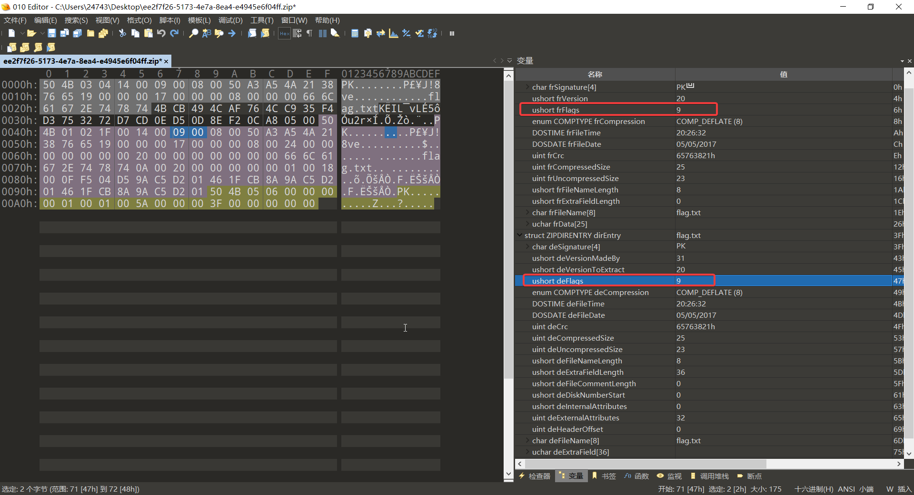

根据题目提示，尝试把所有加密标记点改为 0：

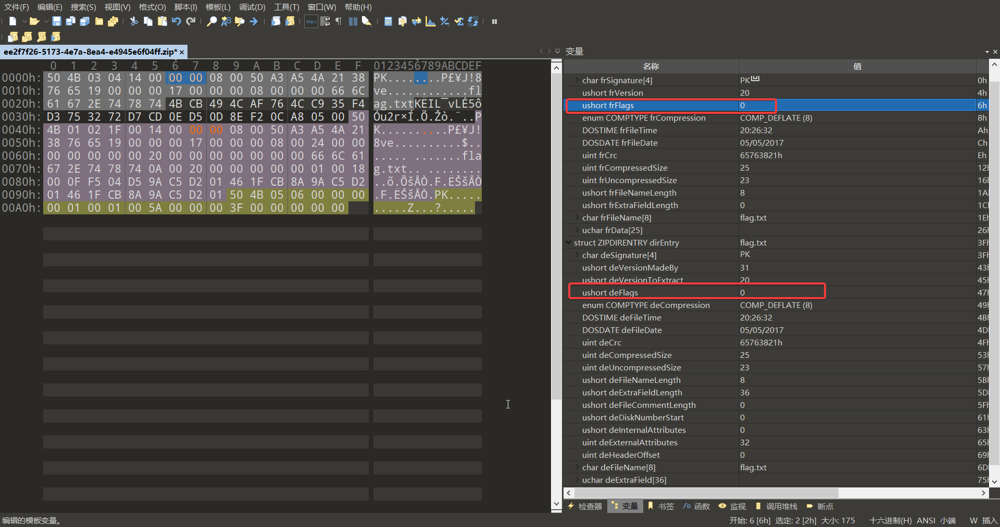

再尝试解压，便可以成功解压。

也可以尝试使用以下自动化脚本进行移除伪加密（原理是直接暴力修改加密标志位，并不会检测是否为真实的伪加密）

```python
import struct

out_HEX = []
head = [b'P', b'K']


def main():
    print("$ zip 伪加密自动解密脚本 $", end="\n\n")
    infile = open("D:\\Downloads\\test.zip", "rb")
    i: int = 0
    while i <= 1:
        c = infile.read(1)
        # print(c)
        if c == head[i]:
            out_HEX.append(ord(c))
        else:
            print("传入的非 zip 文件")
            exit()
        i += 1
    while 1:
        c = infile.read(1)
        if not c:
            break
        out_HEX.append(ord(c))
    infile.close()
    # print(out_HEX)
    len_out = len(out_HEX)
    i: int = 0
    while i < len_out:
        if out_HEX[i] == 80 and out_HEX[i + 1] == 75 and out_HEX[i + 2] == 3 and out_HEX[i + 3] == 4:  # zip 文件源数据区
            print("zip 文件源数据区：", end="")
            for letter in out_HEX[i:i + 4]:
                print(letter, end=" ")
            print("-->", end=" ")
            for letter in out_HEX[i:i + 4]:
                print(hex(letter), end=" ")
            print("")
            print("zip 文件源数据区加密状态：", end="")
            print(str(out_HEX[i + 6]) + " " + str(out_HEX[i + 7]))
            print("\n")
            out_HEX.pop(i + 6)
            out_HEX.insert(i + 6, 0)
            out_HEX.pop(i + 7)
            out_HEX.insert(i + 7, 0)
        elif out_HEX[i] == 80 and out_HEX[i + 1] == 75 and out_HEX[i + 2] == 1 and out_HEX[i + 3] == 2:  # zip 文件源数据目录区
            print("zip 文件源数据目录区", end="")
            for letter in out_HEX[i:i + 4]:
                print(letter, end=" ")
            print("-->", end=" ")
            for letter in out_HEX[i:i + 4]:
                print(hex(letter), end=" ")
            print("")
            print("zip 文件源数据目录区加密状态：", end="")
            print(str(out_HEX[i + 6]) + " " + str(out_HEX[i + 7]))
            print("\n")
            out_HEX.pop(i + 8)
            out_HEX.insert(i + 8, 0)
            out_HEX.pop(i + 9)
            out_HEX.insert(i + 9, 0)
        i += 1
    with open("D:\\Downloads\\out.zip", "wb") as outfile:
        for bytes_ in out_HEX:
            # print(bytes_)
            # print(struct.pack("B", bytes_))
            outfile.write(struct.pack("B", bytes_))
        print("文件已解密")


if __name__ == '__main__':
    main()
```

#### 0x02 爆破

直接爆破密码可能是最常见，也是最无脑的 zip 文件考点了，现在依靠 ARCHPR 和 fcrackzip 这类工具，已经完全不需要用户手动编写脚本，单单依靠工具便可以十分轻松地暴力破解脚本。

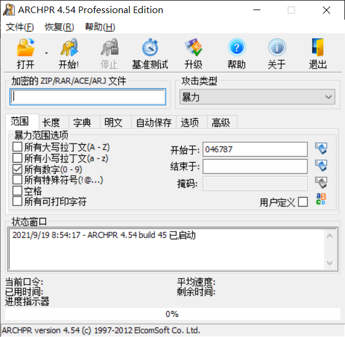

##### 1. 纯暴力

同字面意思，尝试所有可能选项来爆破压缩包密码，耗时随密码复杂度和密码长度而无限增长。一般纯暴力破解的题目，密码的长度一般不会超过 6 位纯数字。可以用 `fcrackzip`，也可以用 `ARCHPR`。

~~*我个人还是感觉 ARCHPR 好用*~~

##### 2. 掩码

原理其实和纯暴力大同小异，但是由于知道了部分密码，从而可以选择对密码的特定位置进行枚举爆破。

例如，对于密码：

this_it_a_password

题目可能只会提示：

this_??_a_pa?????d

那么问号中的字符就需要选手枚举破解。

#### 0x03 CRC32 爆破

CRC 本身是「冗余校验码」的意思，全称是循环冗余校验。CRC32 则表示会产生一个 32 bit (8 位十六进制数) 的校验值。由于 CRC32 产生校验值时源数据块的每一个 bit (位) 都参与了计算，所以数据块中即使只有一位发生了变化，也会得到不同的 CRC32 值，利用这个原理我们可以直接爆破出加密文件的内容。由于 CPU 能力，CRC 碰撞只能用于压缩文件较小的情况（≤7bytes）

常见的题型大致可分为两种：一是只给出含有一个文件的压缩包；二是给出多个含有一个文件的压缩包，或给出一个含有多个文件的压缩包

值得注意的是 ，zip 中的 CRC32 是未加密文件的校验值。也就意味着可以对小文件直接进行 CRC32 碰撞，从而得到文件的真实内容。这也就导致了基于 CRC32 爆破 的攻击手法。（也就是说 rar 和 7z 没有这种姿势）

以下为 CRC32 爆破的特征

- 文件内内容很少 (一般比赛中大多为 4 字节左右)
- 加密的密码很长，几乎不能直接暴力破解

##### CRC32 爆破 - 例题

[BUUCTF-zip](https://buuoj.cn/challenges#zip)

附件下载解压，得到了一堆压缩包：

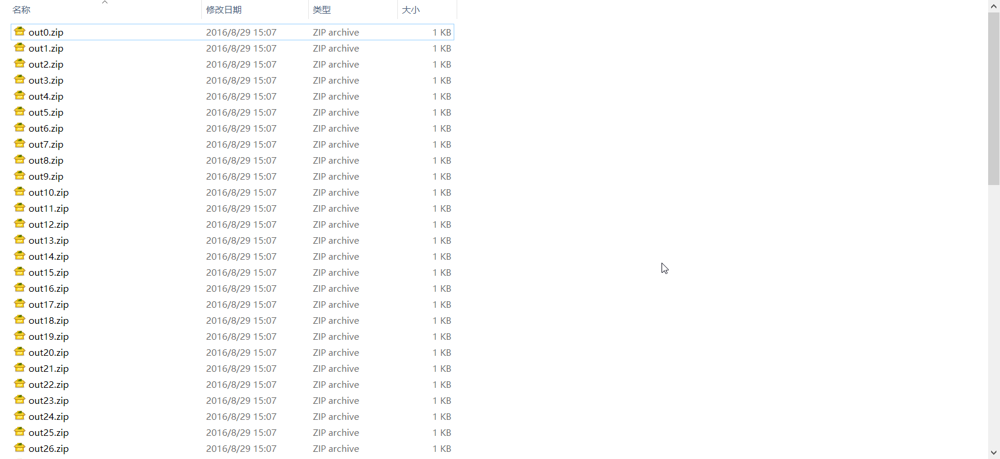

尝试纯暴力破解，发现不行，看一下文件大小，发现文件数据仅仅 4b，可以断定是 CRC32 爆破：

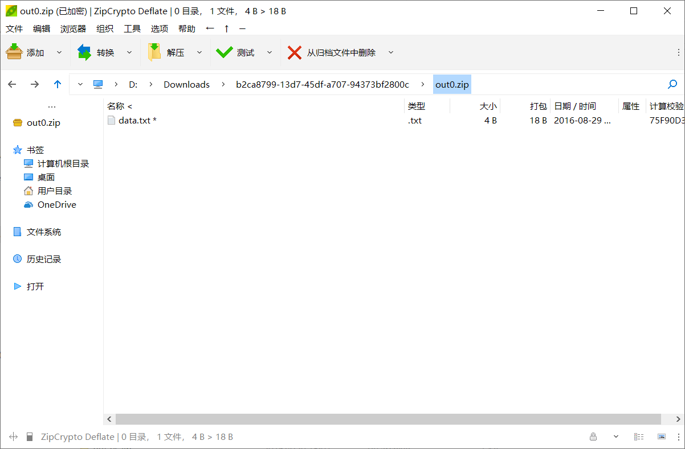

针对单个文件写个 CRC32 碰撞脚本：

```python
import zipfile
import string
import binascii


def CrackCrc(crc):
    for i in dic:
        for j in dic:
            for k in dic:
                for h in dic:  # 四个循环对应文件大小为 4b
                    s = i + j + k + h
                    if crc == (binascii.crc32(s.encode())):
                        f.write(s)
                        return


dic = string.ascii_letters + string.digits + '+/='
with open('D:\\Downloads\\b2ca8799-13d7-45df-a707-94373bf2800c\\out.txt', 'w') as f:
    print("CRC32begin")
    file = "D:\\Downloads\\b2ca8799-13d7-45df-a707-94373bf2800c\\" + 'out1.zip'
    crc = zipfile.ZipFile(file, 'r').getinfo('data.txt').CRC
    CrackCrc(crc)
    print("CRC32finished")
```

再写一个大循环把所有文件批量处理，并且加上进度条：

```python
import zipfile
import string
import binascii


def CrackCrc(crc):
    for i in dic:
        for j in dic:
            for k in dic:
                for h in dic:
                    s = i + j + k + h
                    if crc == (binascii.crc32(s.encode())):
                        f.write(s)
                        return


def CrackZip():
    for i in range(0, 68):
        file = "D:\\Downloads\\b2ca8799-13d7-45df-a707-94373bf2800c\\" + 'out' + str(i) + '.zip'
        crc = zipfile.ZipFile(file, 'r').getinfo('data.txt').CRC
        CrackCrc(crc)
        print('\r' + "loading：{:%}".format(float((i + 1) / 68)), end='')


dic = string.ascii_letters + string.digits + '+/='
with open('D:\\Downloads\\b2ca8799-13d7-45df-a707-94373bf2800c\\out.txt', 'w') as f:
    print("CRC32 begin")
    CrackZip()
    print("CRC32 finished")
    f.close()
```

运行脚本，便可以得到 zip 文件解密后的数据。

另外，也有现成的 Github 项目：[kmyk / zip-crc-cracker](https://github.com/kmyk/zip-crc-cracker)

##### 自动脚本

```python
import zipfile
import string
import binascii


def CrackCrc(crc):
    for i in dic:
        for j in dic:
            for k in dic:
                for h in dic:  # 循环个数取决于 CRC32 破解的目标文件大小
                    s = i + j + k + h
                    if crc == (binascii.crc32(s.encode())):
                        f.write(s)
                        return


dic = string.ascii_letters + string.digits + '+/='
with open('out.txt', 'w') as f:
    print("CRC32begin")
    file = "res.zip"
    crc = zipfile.ZipFile(file, 'r').getinfo('data.txt').CRC
    CrackCrc(crc)
    print("CRC32finished")
```

另外，还有针对多文件的 CRC32 碰撞脚本：

```python
import zipfile
import string
import binascii

dic = string.printable


def CrackCrc(crc, f):
    for i in dic:
        for j in dic:
            for p in dic:
                s = i + j + p  # 3bytesCRC32 碰撞
                if crc == (binascii.crc32(s.encode())):
                    f.write(s + "\n")
                    return


def CrackZip(f):
    for i in range(36):
        file = 'flag' + str(i) + '.zip'
        f = zipfile.ZipFile(file, 'r')  # 文件名
        GetCrc = f.getinfo('flag.txt')
        crc = GetCrc.CRC  # 提取文件 CRC 值
        CrackCrc(crc, f)


with open('out.txt', 'w') as f_:
    CrackZip(f_)
```

#### 0x04 明文攻击

明文攻击类似于 CRC32 破解，但是明文攻击针对的是较大的文件（至少不能 CRC32 碰撞），并且已知其中一个文件的真实内容。明文攻击是一种较为高效的攻击手段，当我们为 ZIP 压缩文件设定密码时，先被转换成了 3 个 4 字节 key，再使用这 3 个 key 加密所有文件。当能拿到加密压缩包的一个文件时，以同样的方式压缩（选择相同的压缩算法，确保压缩后明文文件的 CRC32 与加密文件中的一致），此时两个压缩包中明文压缩后的大小会相差 12 字节，使用 APCHPR 进行对比筛选后，就可以获得 key，继而解压加密压缩包。

- 一个加密的压缩文件
- 知道压缩文件的压缩工具，比如 2345 好压， WinRAR ， 7z，zip 等，可以通过文件属性了解。如果是 Linux 平台，用 zipinfo -v 可以查看一个 zip 包的详细信息，包括加密算法等

- 知道压缩包里某个文件的部分连续内容 (至少 12 字节)
- 明文对应文件的加密算法需要是 `ZipCrypto Store`

如果你已经知道加密文件的部分内容，比如在某个网站上发现了它的 readme.txt 文件，你就可以开始尝试破解了。

首先，将这个明文文件打包成与加密文件相同格式的包，比如将 readme.txt 打包成 readme.zip ，并且尽量用相同的软件（其实影响不大）。

打包完成后，需要确认二者采用的压缩算法相同。一个简单的判断方法是用 WinRAR 打开文件，同一个文件压缩后的体积是否相同。如果相同，基本可以说明你用的压缩算法是正确的。如果不同，就尝试另一种压缩算法。

然后使用 `ARCHPR` 或者 `PKCrack` 来进行明文破解

~~*我个人还是喜欢用 ARCHPR*~~

由于明文攻击的特性，当发现明文攻击预期剩余时间较长时，可尝试在进度条完成一定程度下结束攻击，因为此时可能在攻击过程中就已找到密钥，只是软件还在计算。

##### 例题

[[ACTF 新生赛 2020] 明文攻击](https://buuoj.cn/challenges#[ACTF新生赛2020]明文攻击)

题目附件打开，提取出两个压缩包，其中一个带有加密，并且其中存放着 flag，对比两个压缩包的文件信息：

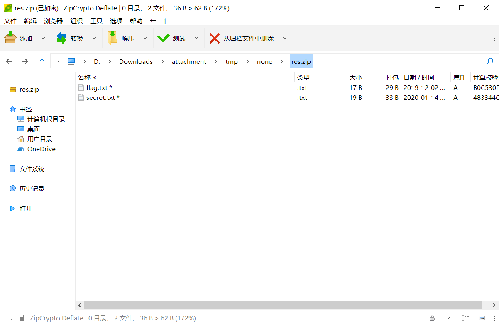

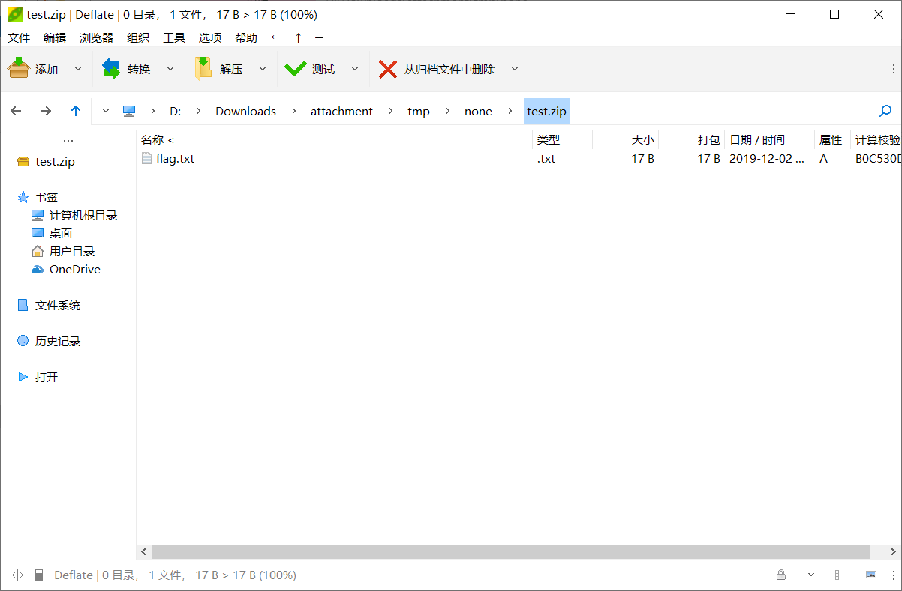

可以发现未加密的压缩包中的 flag.txt 文件的 CRC32 值与加密的压缩包中的相同，并且两个压缩包的格式相同，于是想到进行明文攻击：

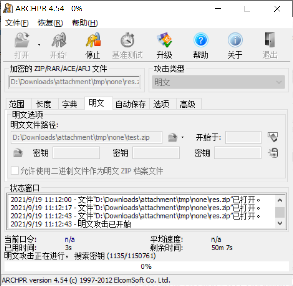

耐心等待执行完成，便可以得到其中的加密文件。

> 当时我就没有让它跑完所有计算过程，跑了大概 2 分钟左右就中止了，并且也成功解开了压缩包中的数据

#### 0x05 压缩包嵌套

这个就简单了，就是一个压缩包里面塞着另外一个压缩包，和俄罗斯套娃一样。可以手动解压，也可以用脚本。

##### 压缩包嵌套 例题

[[MRCTF2020] 千层套路](https://buuoj.cn/challenges#[MRCTF2020]千层套路)

```python
import zipfile

name = '0573'
while True:
    fz = zipfile.ZipFile(name + '.zip', 'r')
    fz.extractall(pwd=bytes(name, 'utf-8'))
    name = fz.filelist[0].filename[0:4]
    fz.close()
```

## RAR 文件

RAR 是一种专有的文件格式，用于文件的压缩、归档与打包。RAR 的全名是：Roshal Archive（即 “罗谢尔的归档” 之意），其开发者是尤金 · 罗谢尔（Eugene Roshal）。Eugene Roshal 后来公开了解码程序的源代码，但是编码程序仍然是私有的。RAR 因为其独特的压缩算法，基本可以做到无损压缩，而且还能够满足较高的压缩比，同时保证一定的压缩速度。RAR 拥有成熟的加密算法，2.0 版本以后使用 AES 算法来加密，AES 算法的破解难度比较大，在没有密码的情况下只能采取暴力破解的办法，对于数据的安全性有一定的保证。

### rar 文件结构

以常用的 WinRAR 制作，老版格式不予介绍。

~~*这本来就是商业机密好吧*~~

#### Rar

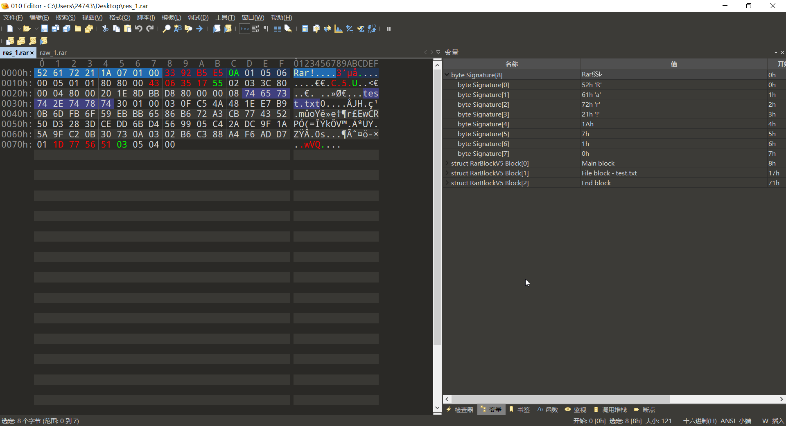

| HEX 数据              | 描述                      | 010Editor 模板数据 |
| -------------------- | ------------------------- | ----------------- |
| 52 61 72 21 1A 07 00 | rar 文件头标记，文本为 Rar! |                   |

#### Main block

| HEX 数据     | 描述            | 010Editor 模板数据       |
| ----------- | --------------- | ----------------------- |
| 33 92 B5 E5 | 全部块的 CRC32 值 | uint32 HEAD_CRC         |
| 0A          | 块大小          | struct uleb128 HeadSize |
| 01          | 块类型          | struct uleb128 HeadType |
| 05          | 阻止标志        | struct uleb128 HeadFlag |

#### File Header

| HEX 数据     | 描述            | 010Editor 模板数据       |
| ----------- | --------------- | ----------------------- |
| 43 06 35 17 | 单独块的 CRC32 值 | uint32 HEAD_CRC         |
| 55          | 块大小          | struct uleb128 HeadSize |
| 02          | 块类型          | struct uleb128 HeadType |
| 03          | 阻止标志        | struct uleb128 HeadFlag |

#### Terminator

| HEX 数据     | 描述          | 010Editor 模板数据       |
| ----------- | ------------- | ----------------------- |
| 1D 77 56 51 | 固定的 CRC32 值 | uint32 HEAD_CRC         |
| 03          | 块大小        | struct uleb128 HeadSize |
| 05          | 块类型        | struct uleb128 HeadType |
| 04 00       | 阻止标志      | struct uleb128 HeadFlag |

### rar 文件常见考点

#### 爆破

这个与 zip 相同，要么使用 `ARCHPR`（个人推荐），或者使用 `RarCrack`：

#### rar 伪加密

使用 010 Editor 运行模板查看加密的 rar 文件信息，可以在每个文件的文件块里面看到加密状态：

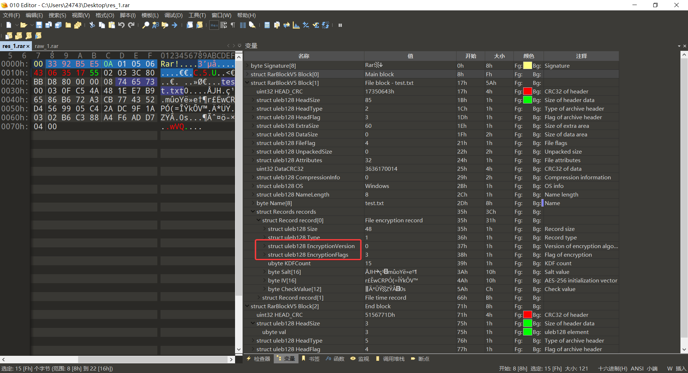

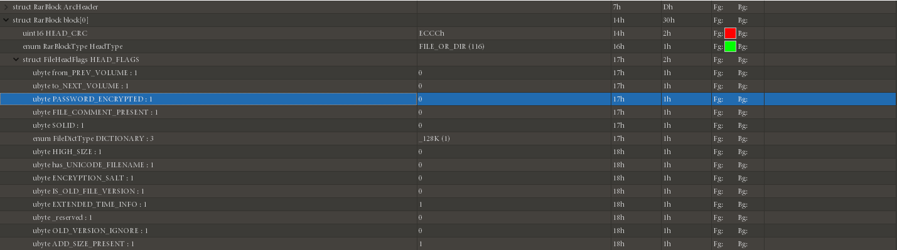

0 表示没有加密，并且由于 Rar 文件头部自带校验信息，所以伪加密文件在打开的时候会提示文件存在错误，可以尝试使用 Winrar 自带的文件修复来解开伪加密。

由于 rar 格式是一种商业格式，所以对于其数据结构只是一种合理猜测，对于不同版本的 rar，可能存在不同的数据结构。故届时如发现 rar 文件的数据结构不同于此文档的介绍，请合理使用 010 Editor 的模板功能。

## 特殊考点

### 连续解压

适用于一个目录下的连续文件名的压缩包的解压：

```python
import os
for i in range(519,0,-1):
    os.system('unzip -o {}.zip -d .'.format(str(i)))
```

另外，也可以将目录下所有的 zip 文件进行解压：

```python
import zipfile
import os

path = ""  # 压缩包所在位置
zip_list = []
folder_abs = ""  # 解压文件到指定目录
file_list = os.listdir(path)
for file_name in file_list:
    if file_name.find("zip") != -1:
        zip_list.append(file_name)
for zip_file_name in zip_list:
    zip_file = zipfile.ZipFile(path + "\\" + zip_file_name)
    zip_list = zip_file.namelist()
    for f in zip_list:
        zip_file.extract(f, folder_abs)
    zip_file.close()
```

### Zipbomb

压缩包炸弹，简单来说就是运用压缩算法的特性，做到仅仅几 kb 和仅 mb 的压缩包文件，解压出来 GB，甚至 PB 级的数据。这个时候，就不能简单使用传统方法，先解压再分析，而是直接对压缩包的数据进行分析。

#### Zipbomb 例题

##### [NSSCTF 新生赛 - Misc-zipbomb](https://www.ctfer.vip/#/contest/5/)

可以看到压缩包中全是炸弹：

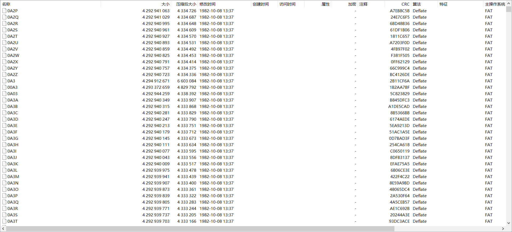

这个时候如果用`binwalk`进行分析，也是会触发压缩包炸弹，于是选择直接用010 Editor进行数据搜索：

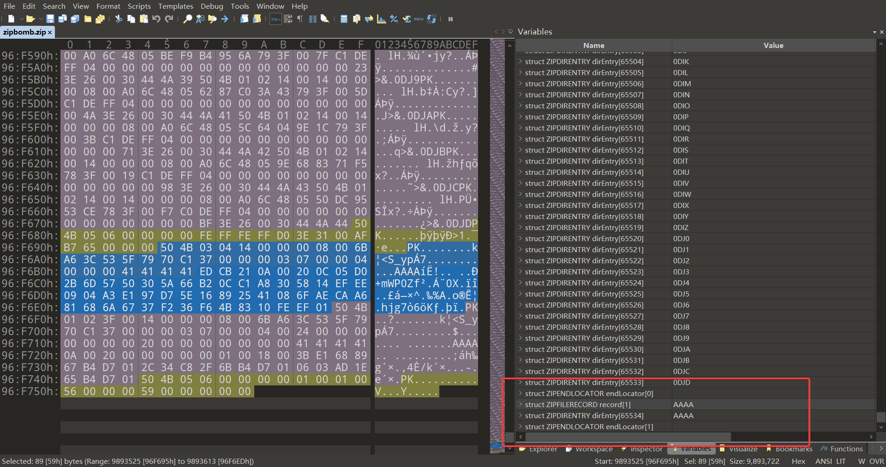

可以看到存在附加数据，手动对HEX数据进行分离，即可打开附加的压缩包：

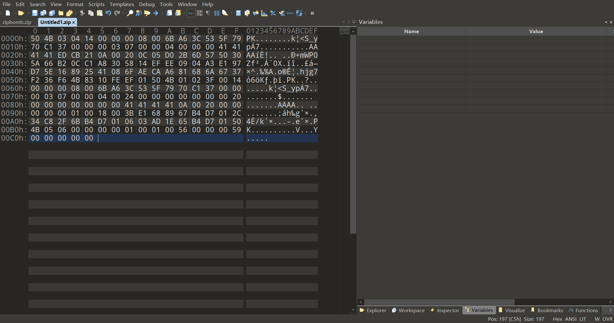

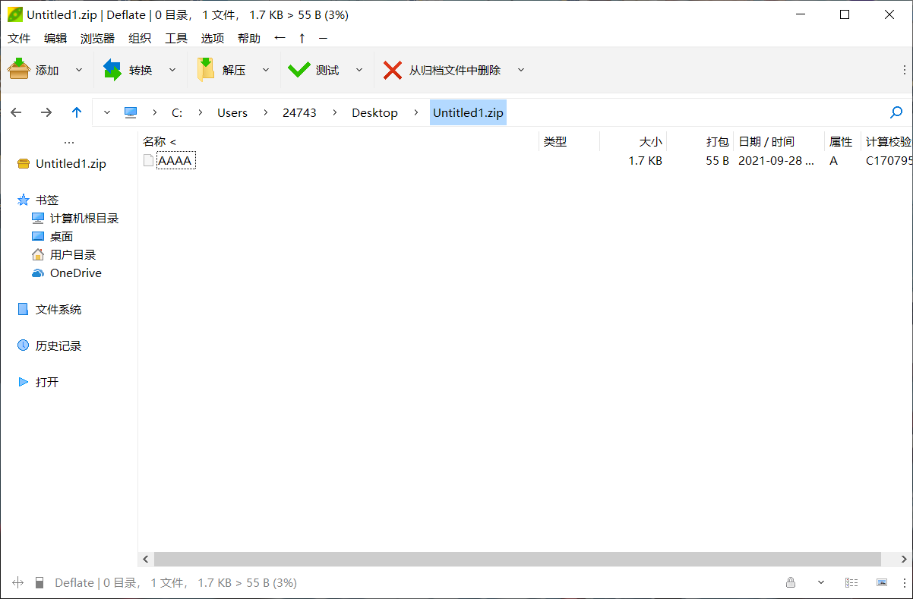

这时候即可放心解压，得到以下数据：


正则匹配，即可出来flag：

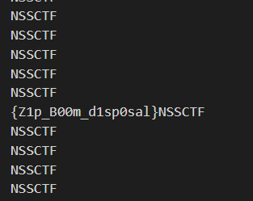

##### [DASCTF 九月赛-ZipBomb](https://buuoj.cn/match/matches/36/challenges#ZipBomb)

作为第一层压缩包，附件还是可以正常打开的：

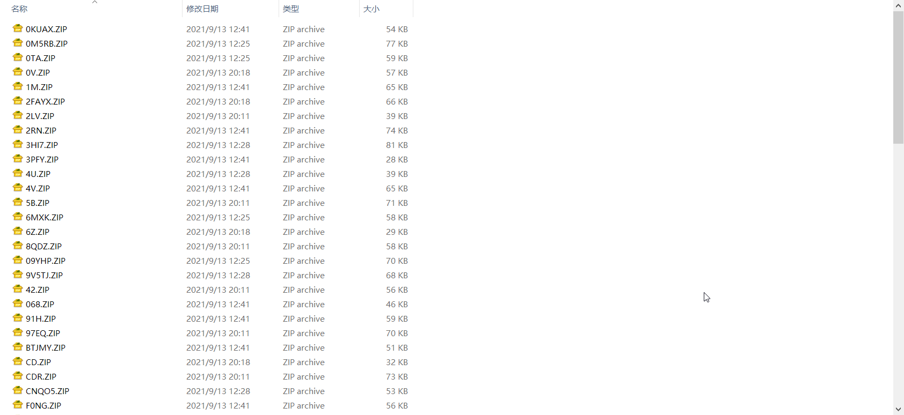

面对大量的压缩包炸弹，只能使用脚本分析文件特征：

```python
import os.path
import zipfile

dir_path = 'C:\\Users\\Snowywar\\Desktop\\zipBomb'
files = os.listdir(dir_path)
newfiles = files[::-1]
print(newfiles)
setee = []
for file in newfiles:  # 遍历文件夹
    position = dir_path + '\\' + file  # 构造绝对路径，"\\"，其中一个'\'为转义符
    print(position)
    z = zipfile.ZipFile(position, 'r')
    for filename in z.namelist():
        bytes = z.read(filename)
        if b'Zmxh' in bytes or b'flag' in bytes:
            print(filename)
```

在这里，`Zmxh`是flag的Base64编码后的结果，针对flagBase64编码后的数据做特征识别，而flag则是直接识别flag。运行后即可找到flag存在于哪个压缩包和压缩包中的哪个文件。打开文件：

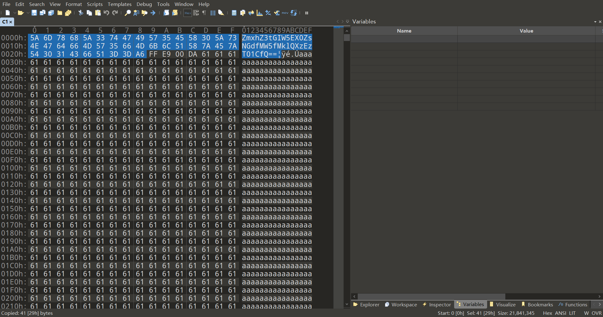

Base64解码，即可得到flag：

```python
import base64

print(base64.b64decode(b"ZmxhZ3tGIW5EX0ZsNGdfMW5fMklQXzEzT01CfQ==").decode())

>>> flag{F!nD_Fl4g_1n_2IP_13OMB}
```

### 扩展型ZIP明文攻击

> 这一块详情请见：[ZIP已知明文攻击深入利用](https://blog.csdn.net/q851579181q/article/details/109767425)
>
> 这种攻击太暴力了，怀疑实战中成功的概率太小了

此攻击方法并不需要知道压缩文件中完整的明文，只需在已知加密压缩包中的少部分明文字节时即可进行攻击破解。而各类文件都有其自身固定的文件格式，结合这类格式，极大扩展了ZIP明文攻击的攻击面。

具体要求如下：

- 至少已知明文的12个字节及偏移，其中至少8字节需要连续。
- 明文文件需要被相同的压缩算法标准压缩（也可理解为被相同压缩工具压缩）
- 明文对应的文件加密方式为`ZipCrypto Store`

可以说此方法大大提高了Zip明文攻击的适用范围，同时也是一种**全新的非预期解的实现方式**

#### 涉及到的工具

[**bkcrack：**](https://github.com/kimci86/bkcrack)

> **bkcrack常用参数：**
>
> - -c 提取的密文部分
> - -p 提取的明文部分
> - -x 压缩包内目标文件的偏移地址  部分已知明文值
> - -C 加密压缩包
> - -o offset  -p参数指定的明文在压缩包内目标文件的偏移量

基本可以说，只要满足了已知文件头和文件名，以及内部的少量数据，就可以以此为数据进行明文攻击

~~仅适用于小的Zip文件~~
