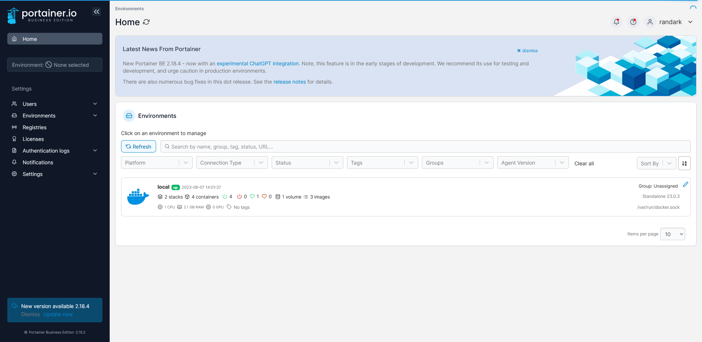
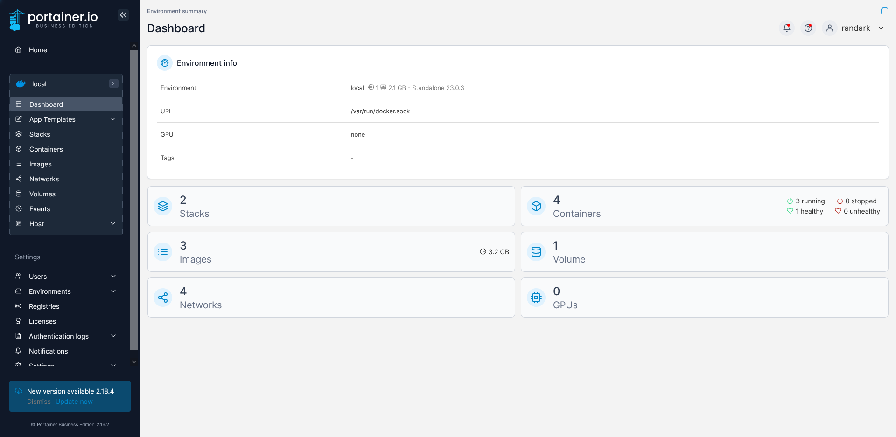

# Portainer

> 以下相关操作都基于 Portainer Community 社区版本，Docker 单机部署环境进行介绍与操作
>
> Business 商业版本可以免费申请，但是界面与基本功能是与 Community 社区版本一致的

## 安装

官方已经提供了一份安装引导说明：[Portainer - Install Portainer CE](https://docs.portainer.io/start/install-ce)

对于单机部署的 Docker 环境（即没有开启 Docker 集群），可以直接使用以下指令进行 Portainer 的部署

```bash
# 创建数据卷，以便于设置 Portainer
docker volume create portainer_data
# 常规部署，需要使用 https 协议通过 9443 端口访问 Portainer
docker run -d -p 8000:8000 -p 9443:9443 --name portainer --restart=always -v /var/run/docker.sock:/var/run/docker.sock -v portainer_data:/data portainer/portainer-ce:latest
# 非常规部署，可以使用 http 协议通过 9000 端口直接访问 Portainer，但是流量数据不保证安全性
docker run -d -p 8000:8000 -p 9000:9000 --name portainer --restart=always -v /var/run/docker.sock:/var/run/docker.sock -v portainer_data:/data portainer/portainer-ce:latest
```

如果 Docker 环境没有问题的话，等以上语句执行结束之后就可以通过以下链接访问 Portainer

```bash
# By HTTPS
https://localhost:9443
# By HTTP
http://localhost:9000
```

如果需要更改 Portainer 开放的端口，则只需要修改相关部署指令即可

```bash
docker run -d -p 8000:8000 -p <HTTP port>:9000 -p <HTTPS port>:9443 --name portainer --restart=always -v /var/run/docker.sock:/var/run/docker.sock -v portainer_data:/data portainer/portainer-ce:latest
```

## 使用

在遵循指示初始化 Portainer 之后，登录 Portainer 之后，应该能看到以下界面



其中的 `local` 就是本机节点，点击进去



即可看到本节点的 Docker 运行信息，其中就包括了最常用的 Docker container 和 Docker Image，点击进去即可直接操作

## Docker Swarm

[Install Portainer CE with Docker Swarm on Linux | 2.19 | Portainer Documentation](https://docs.portainer.io/start/install/server/swarm/linux)