# 安装部署

## 获取 Photon OS

安装文件的下载链接可以在 [Downloading Photon OS - vmware/photon](https://github.com/vmware/photon/wiki/Downloading-Photon-OS) 中得到

以下教程中使用的是

- [Photon OS 5.0 GA OVA with virtual hardware v15 (Supports both BIOS and UEFI boot, default is UEFI)](https://packages.vmware.com/photon/5.0/GA/ova/photon-hw15-5.0-dde71ec57.x86_64.ova)

各个不同的版本含义

|        形式        |                                                                                                                                                          描述                                                                                                                                                          |
| :----------------: | :--------------------------------------------------------------------------------------------------------------------------------------------------------------------------------------------------------------------------------------------------------------------------------------------------------------------: |
|      ISO 镜像      |                                                                                         包含安装 Photon OS 的最小安装或完整安装所需的一切。可引导 ISO 具有手动安装程序，或者可以与 PXE/kickstart 环境配合使用以进行自动安装。                                                                                          |
|        OVA         | 预装的最小环境，针对 VMware 管理程序环境进行了定制。这些定制包括一个经过高度清理和优化的内核，以提供更好的容器和 Linux 应用程序的启动和运行时性能。由于 OVA 是一个完整的虚拟机定义，因此我们提供了具有虚拟硬件版本 11 的 Photon OS OVA；这将允许与多个版本的 VMware 平台兼容，或允许使用最新且最棒的虚拟硬件增强功能。 |
|     Amazon AMI     |                                                                             Photon OS 的预打包和测试版本已准备好在您的 Amazon EC2 云环境中部署。以前，我们发布了有关如何创建与 Amazon 兼容的实例的文档，但现在我们已经为您完成了这项工作。                                                                             |
|  Google GCE Image  |                                                                                   预先打包并测试过的 Google GCE 映像，已准备好部署在您的 Google Compute Engine 环境中，其中包含在 GCE 中运行 Photon OS 所需的所有修改和软件包要求。                                                                                    |
|     Azure VHD      |                                                                                       预先打包并测试过的 Azure HD 映像，已准备好部署在您的 Microsoft Azure 云中，其中包含在 Azure 中运行 Photon OS 所需的所有修改和软件包要求。                                                                                        |
| Raspberry Pi Image |                                                                                                                       预先打包并测试过的 Raspberry Pi 映像（3.0 版及更高版本）基于 ARM64 架构。                                                                                                                        |

## 在 VMware Workstation 中基于 OVA 部署 Photon OS

对下载得到的 `photon-hw15-5.0-dde71ec57.x86_64.ova`OVA 包双击打开，将虚拟机加载到 Vmware Workstation

接受用户许可协议

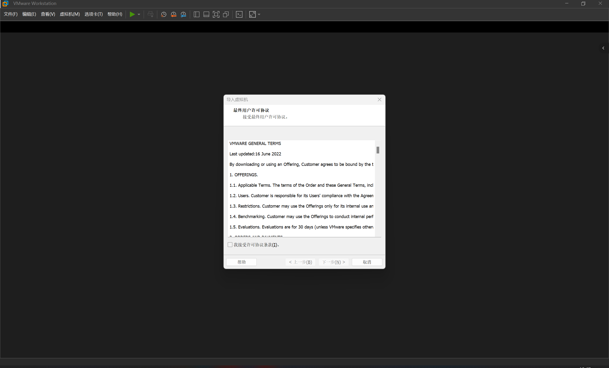

然后填写虚拟机的相关参数，如虚拟机名称，虚拟机目录等等

即可成功导入

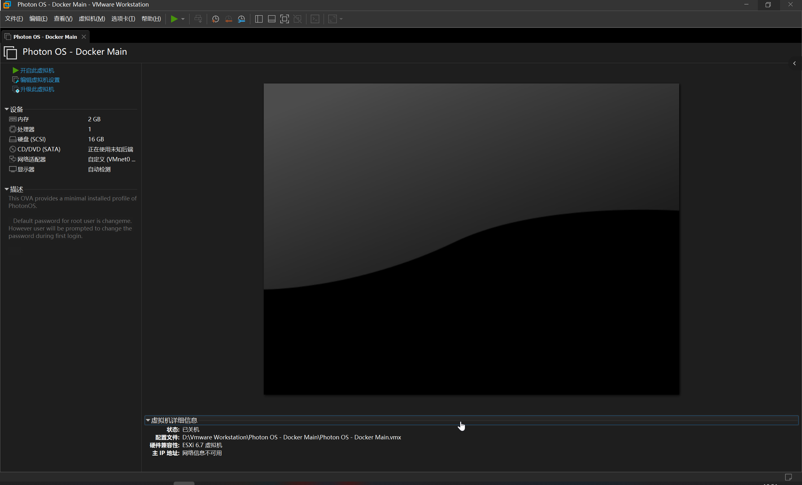

启动虚拟机

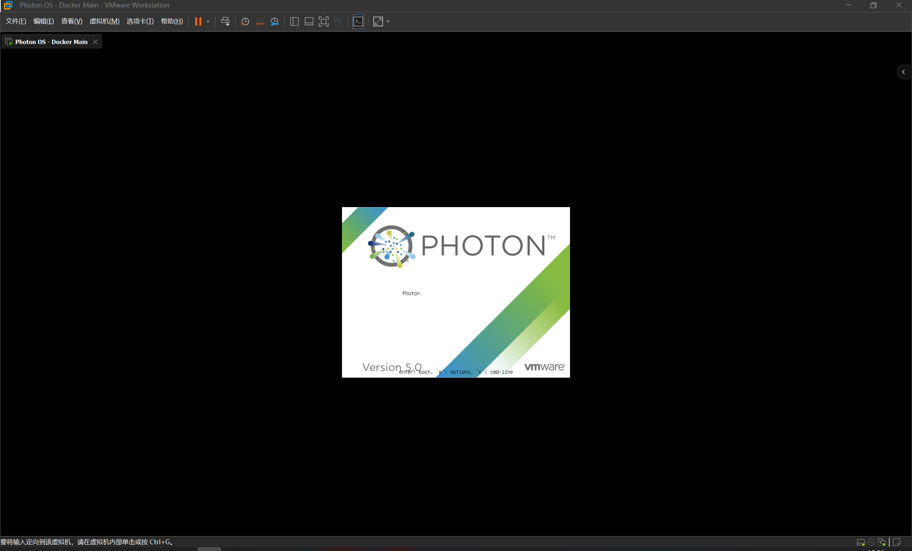

正常回车，启动 Photon OS

默认的凭据为

```plaintext
root:changeme
```

首次登陆的时候，会提示更改 root 密码，按照个人习惯与安全性原则进行密码修改即可

即可成功部署

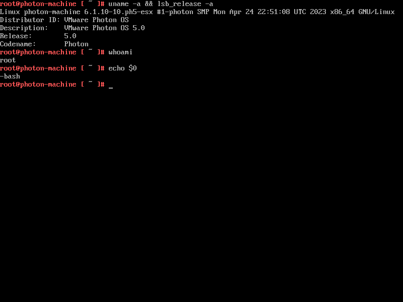

### 更改主机名

在多 Photon OS 部署 Docker/Kubernetes 集群的时候，清晰明了的主机名是很重要的

查看当前状态

```shell
root@photon-machine [~]# hostnamectl
 Static hostname: photon-machine
       Icon name: computer-vm
         Chassis: vm 🖴
      Machine ID: 1e1a1b6b3b5c4c13ae00ee429d4ef137
         Boot ID: 82d24006e8384362aa820a653ef9a2cb
  Virtualization: vmware
Operating System: VMware Photon OS/Linux
          Kernel: Linux 6.1.10-10.ph5-esx
    Architecture: x86-64
 Hardware Vendor: VMware, Inc.
  Hardware Model: VMware7,1
Firmware Version: VMW71.00V.21805430.B64.2305221826
   Firmware Date: Mon 2023-05-22
```

对 hostname 进行设置

```shell
root@photon-machine [~]# hostnamectl set-hostname docker-main
```

然后重新登陆会话，以便于刷新 Terminal 信息，再查看状态

```shell
root@docker-main [~]# hostnamectl
 Static hostname: docker-main
       Icon name: computer-vm
         Chassis: vm 🖴
      Machine ID: 1e1a1b6b3b5c4c13ae00ee429d4ef137
         Boot ID: 82d24006e8384362aa820a653ef9a2cb
  Virtualization: vmware
Operating System: VMware Photon OS/Linux
          Kernel: Linux 6.1.10-10.ph5-esx
    Architecture: x86-64
 Hardware Vendor: VMware, Inc.
  Hardware Model: VMware7,1
Firmware Version: VMW71.00V.21805430.B64.2305221826
   Firmware Date: Mon 2023-05-22
```

### 更新软件包

直接使用 `tdnf` 进行软件包更新即可

```shell
root@docker-main [ ~ ]# tdnf update
```

## 在 Vmware Workstation 安装 Photon OS

按照常规流程，使用 新建虚拟机 -> 自定义（高级） ，并使用下载好的 ISO 作为安装映像

<div style={{textAlign:'center'}}>

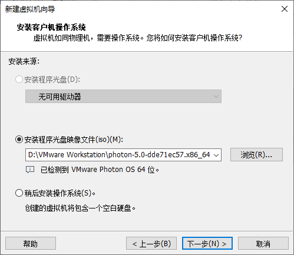

</div>

然后常规流程，然后开始配置虚拟机硬件参数

<div style={{textAlign:'center'}}>

设置处理器为 2x1

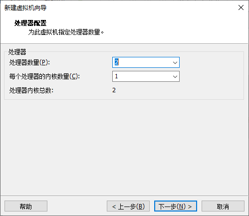

设置内存为 2048MB

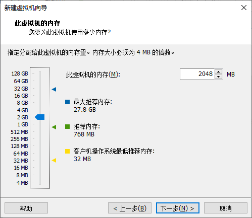

</div>

:::warning 资源警告

Vmware 默认给的资源，是内存仅 768MB ，是完全不够 Photon OS 正常加载的，需要手动配置为更大的内存

并且在 USB 控制器部分，将 共享蓝牙设备 关闭

:::

接下来按照自己的需求按需配置即可，在最后的配置确认阶段，点击 自定义硬件 ，配置 CD/DVD 硬件的参数

<div style={{textAlign:'center'}}>

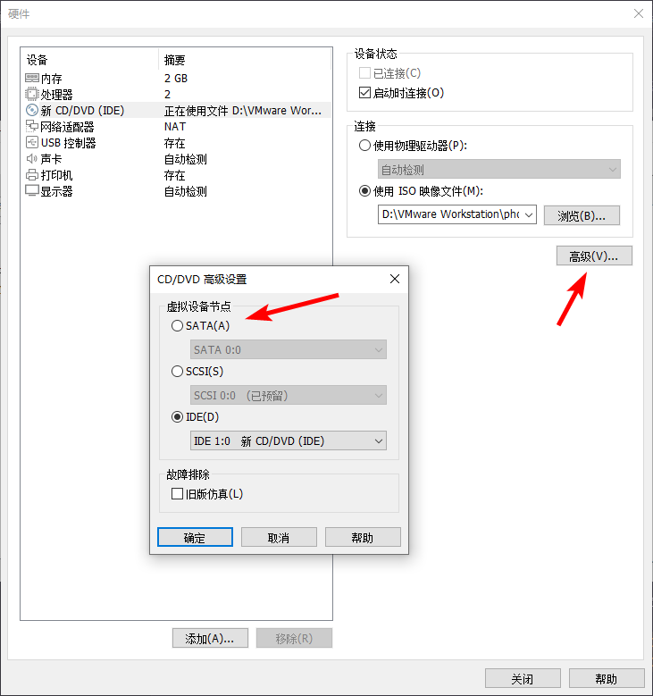

</div>

:::warning CD/DVD 参数警告

必须！！！将 CD/DVD 的工作模式从默认的 `IDE` 改为 `SATA`，否则无法正常启动 Photon OS 的安装向导

:::

选择 `Install` ，进入到安装流程，根据需求按照安装向导进行安装流程即可

启动时，你将大概率遇到以下问题：

<div style={{textAlign:'center'}}>

SMBus Host Controller not enabled!

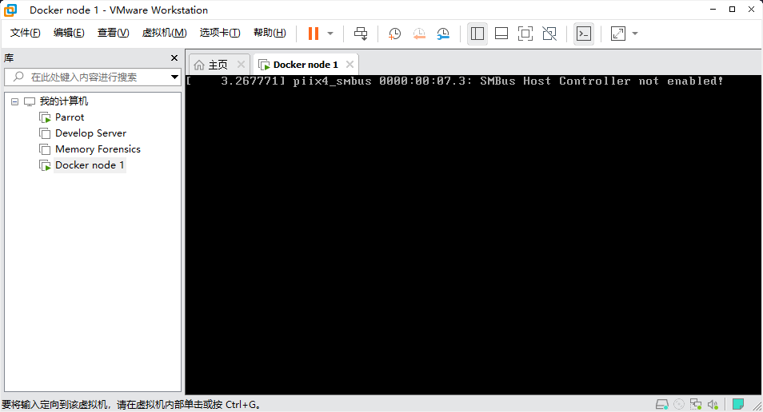

</div>

之所以会出现这个错误，是因为 VMware 实际上并没有为 CPU 访问提供这种级别的接口，但 Photon OS 还是尝试加载内核模块。

解决方案是，当 Photon OS 处于引导选项界面时，按下 `e` 进入引导参数配置界面

<div style={{textAlign:'center'}}>


按下 `e` ，进入引导参数配置

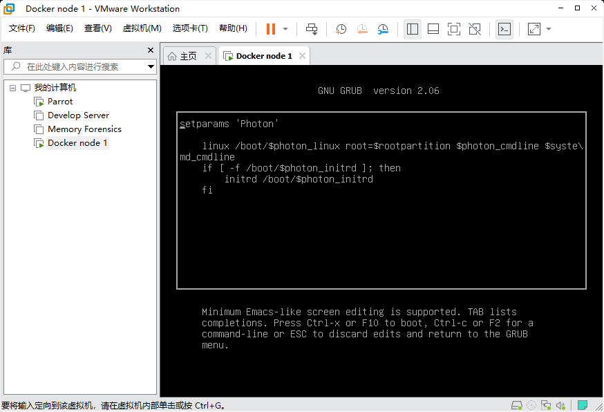

在启动参数的末尾加上 `emergency` ，以便于引导时进入应急模式

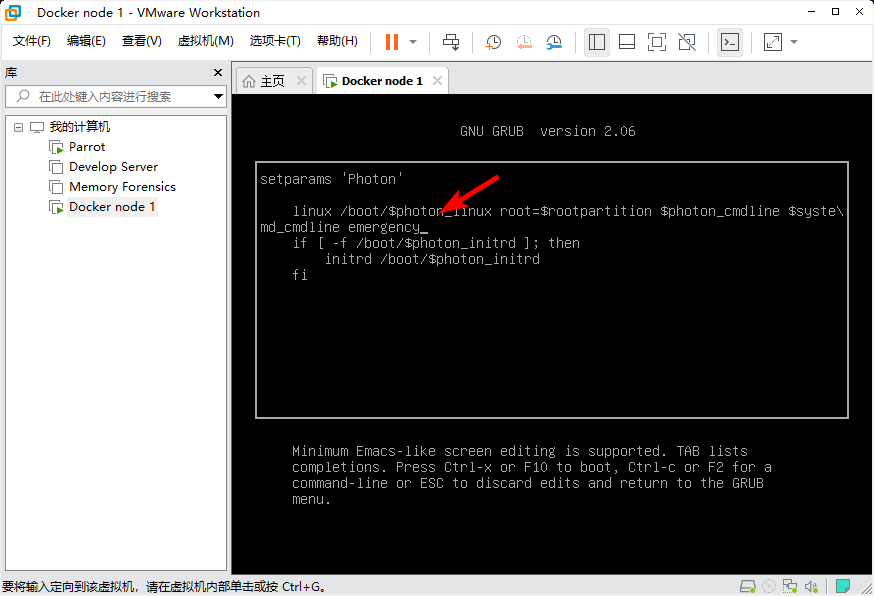

按下 `F10` 继续引导，即可进入应急模式，成功登录后开始编辑 `/etc/modprobe.d/blacklist.conf` 文件

:::warning "Fuck Vmware!"

没有这个文件啊，怎么控制引导？？？？

:::

</div>
