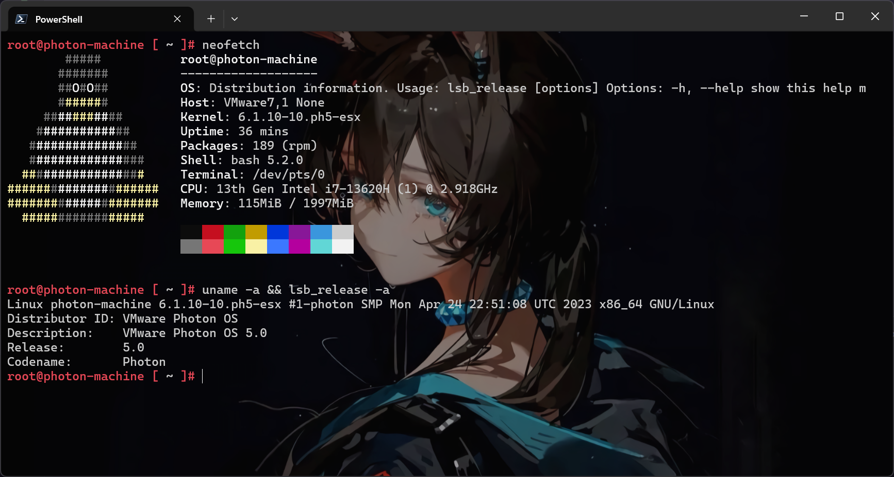

# 软件包管理

不同于常见的 `apt` or `yum`or 其他包管理器，Photon OS 采用的是 `tndf` 作为包管理器

这里仅对 Photon OS 常用场景的软件包部署需求进行说明

## neofetch

neofetch 并没有在官方的仓库中，所以需要添加第三方源以安装 neofetch

```plaintext title="https://copr.fedorainfracloud.org/coprs/konimex/neofetch/repo/epel-7/konimex-neofetch-epel-7.repo"
[copr:copr.fedorainfracloud.org:konimex:neofetch]
name=Copr repo for neofetch owned by konimex
baseurl=https://download.copr.fedorainfracloud.org/results/konimex/neofetch/epel-7-$basearch/
type=rpm-md
skip_if_unavailable=True
gpgcheck=1
gpgkey=https://download.copr.fedorainfracloud.org/results/konimex/neofetch/pubkey.gpg
repo_gpgcheck=0
enabled=1
enabled_metadata=1
```

将以上内容写入 `/etc/yum.repos.d/konimex-neofetch-epel-7.repo` 中，也就是这一条命令的效果

```shell
curl -o /etc/yum.repos.d/konimex-neofetch-epel-7.repo https://copr.fedorainfracloud.org/coprs/konimex/neofetch/repo/epel-7/konimex-neofetch-epel-7.repo
```

:::note

大陆网络内没办法直接访问 `https://copr.fedorainfracloud.org` 内容，故出此下策

:::

然后执行安装

```shell
root@photon-machine [~]# tdnf install neofetch
Refreshing metadata for: 'Copr repo for neofetch owned by konimex'
copr:copr.fedorainfracloud.org:konimex:neofetch        501 100%
Installing:
neofetch                 noarch             6.1.0-1.el7              copr:copr.fedorainfracloud.org:konimex:neofetch 408.08k           110.15k

Total installed size: 408.08k
Total download size: 110.15k
Is this ok [y/N]: y
neofetch                                112796 100%
importing key from https://download.copr.fedorainfracloud.org/results/konimex/neofetch/pubkey.gpg
Is this ok [y/N]: y
Testing transaction                        973 100%
Running transaction
Installing/Updating: neofetch-6.1.0-1.el7.noarch
```

即可使用 neofetch



## docker

官方文档中关于 Docker 的部分 - [Docker Containers · VMware Photon OS 3.0 Documentation](https://vmware.github.io/photon/assets/files/html/3.0/photon_admin/docker-containers.html)

Docker engine 以及 Docker cli 和 Containerd 均已经内置于 Photon OS 中，只是服务是否自动启动的区别

## kubernetes