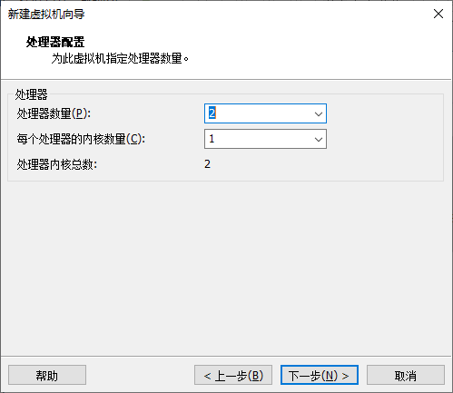
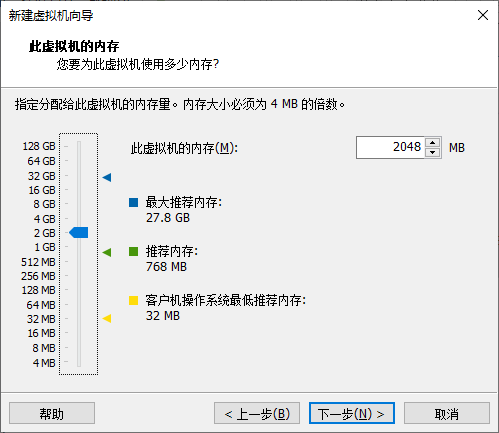
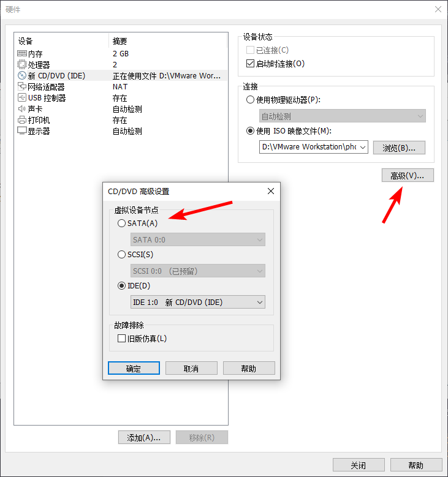
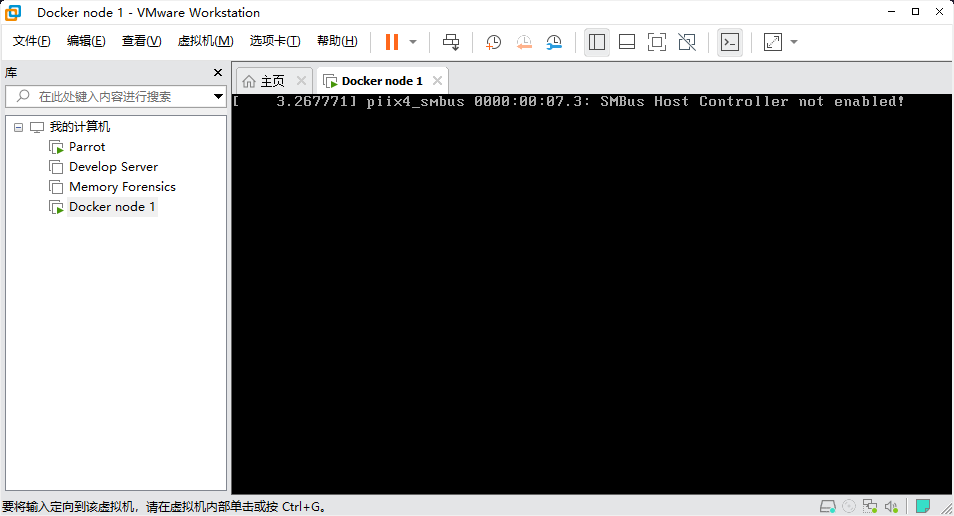
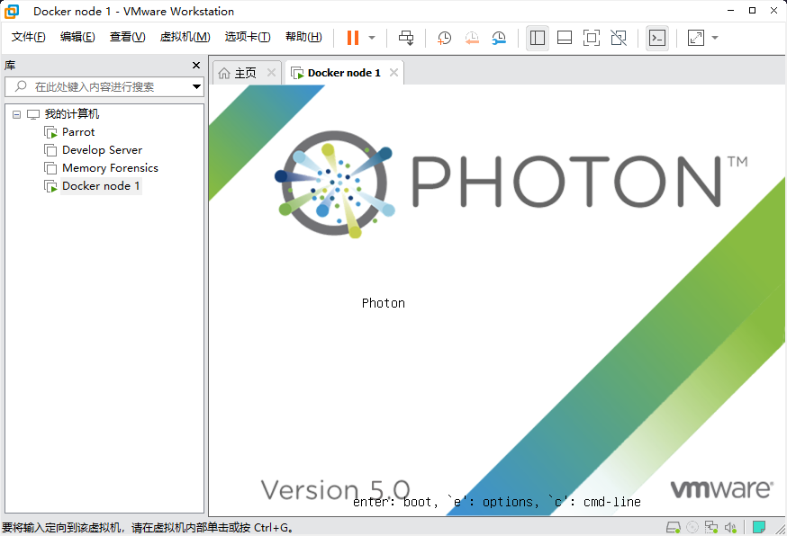
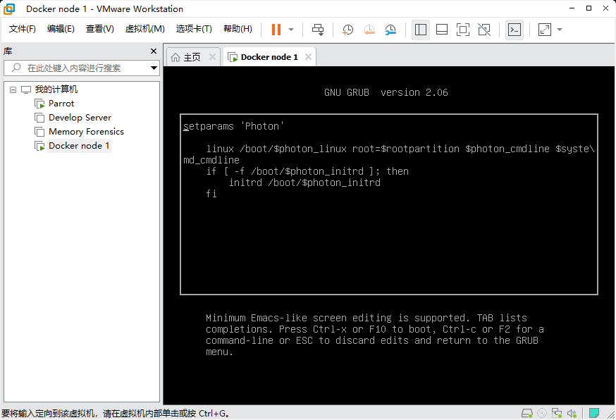
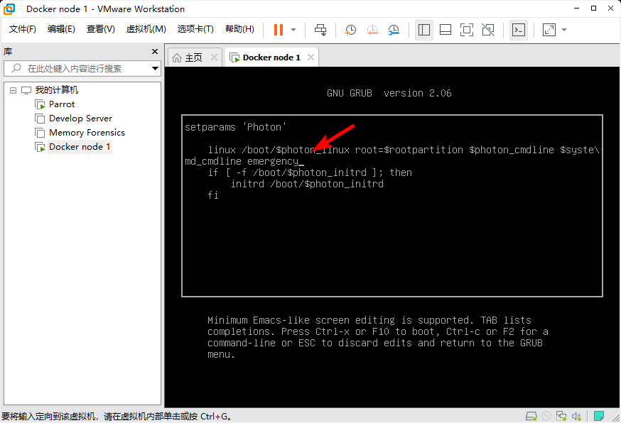

# Photon OS

Photon OS 是一个基于 Linux 的、开源的、经过安全强化的企业级设备操作系统，由 Vmware 进行支持，专为云端和边缘应用而设计。

:::warning 别尝试

现阶段 Photon OS 极其难用，别试了

:::

## 安装 Photon OS

安装文件的下载链接可以在 [Downloading Photon OS - vmware/photon](https://github.com/vmware/photon/wiki/Downloading-Photon-OS) 中得到，这里使用的是 [Photon OS 5.0 GA Full ISO x86_64](https://packages.vmware.com/photon/5.0/GA/iso/photon-5.0-dde71ec57.x86_64.iso)

### 在 Vmware Workstation 安装 Photon OS

按照常规流程，使用 新建虚拟机 -> 自定义（高级） ，并使用下载好的 ISO 作为安装映像

然后常规流程，然后开始配置虚拟机硬件参数

设置处理器为 2x1

设置内存为 2048MB

:::warning 资源警告

Vmware 默认给的资源，是内存仅 768MB ，是完全不够 Photon OS 正常加载的，需要手动配置为更大的内存

并且在 USB 控制器部分，将 共享蓝牙设备 关闭

:::

接下来按照自己的需求按需配置即可，在最后的配置确认阶段，点击 自定义硬件 ，配置 CD/DVD 硬件的参数

:::warning CD/DVD 参数警告

必须！！！将 CD/DVD 的工作模式从默认的 `IDE` 改为 `SATA`，否则无法正常启动 Photon OS 的安装向导

:::

选择 `Install` ，进入到安装流程，根据需求按照安装向导进行安装流程即可

启动时，你将大概率遇到以下问题：

SMBus Host Controller not enabled!

之所以会出现这个错误，是因为 VMware 实际上并没有为 CPU 访问提供这种级别的接口，但 Photon OS 还是尝试加载内核模块。

解决方案是，当 Photon OS 处于引导选项界面时，按下 `e` 进入引导参数配置界面

按下 `e` ，进入引导参数配置

在启动参数的末尾加上 `emergency` ，以便于引导时进入应急模式

按下 `F10` 继续引导，即可进入应急模式，成功登录后开始编辑 `/etc/modprobe.d/blacklist.conf` 文件

:::warning "Fuck Vmware!"

没有这个文件啊，怎么控制引导？？？？

:::

