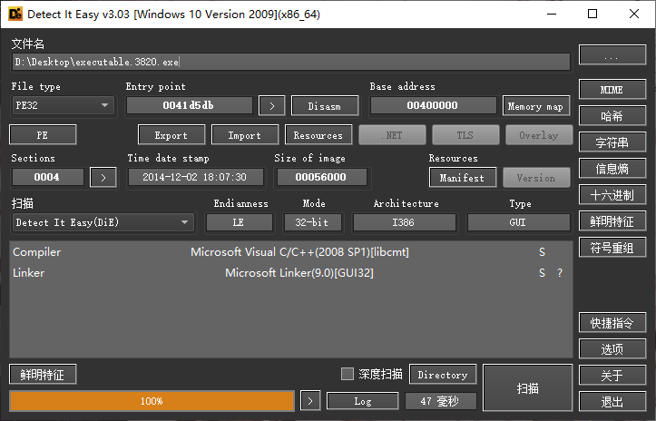
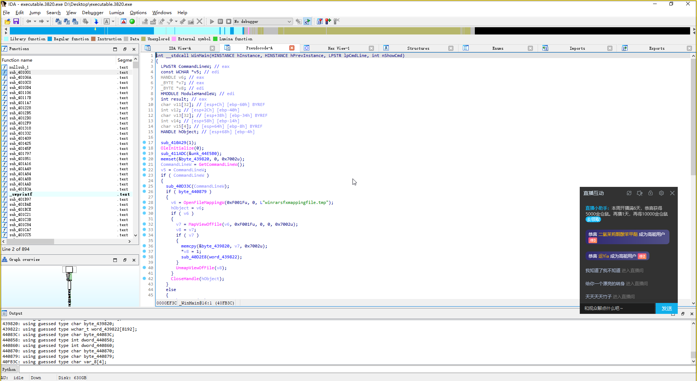

# Volatility 使用入门

:::info
本篇展示操作时所用的检材来自于 OtterCTF 2018 比赛的附件：[[OtterCTF 2018]What the password?](https://www.ctfer.vip/problem/2458)

所使用的 Volatility 2 环境是直接由源码运行，Volatility 3 环境由 pip 安装得来
:::

## Volatility 2 工作流

简单来讲，就是需要先识别出是何种内存镜像，取自何种系统，然后指定符号表并加载模块进行数据分析

:::info
Volatility 在使用模块的时候（非 imageinfo 这类通用型），需要指定符号表（`--profile` 参数）才可以正常工作
:::

### 分析检材类型

拿到检材后的第一件事，便是识别出检材的类型，已经提取自何种设备，所使用的模块是 `imageinfo`

```shell
randark@randark-virtual-machine:~$ python2 ./volatility2/vol.py -f ./OtterCTF.vmem imageinfo
Volatility Foundation Volatility Framework 2.6.1
INFO    : volatility.debug    : Determining profile based on KDBG search...
          Suggested Profile(s) : Win7SP1x64, Win7SP0x64, Win2008R2SP0x64, Win2008R2SP1x64_24000, Win2008R2SP1x64_23418, Win2008R2SP1x64, Win7SP1x64_24000, Win7SP1x64_23418
                     AS Layer1 : WindowsAMD64PagedMemory (Kernel AS)
                     AS Layer2 : FileAddressSpace (/home/randark/OtterCTF.vmem)
                      PAE type : No PAE
                           DTB : 0x187000L
                          KDBG : 0xf80002c430a0L
          Number of Processors : 2
     Image Type (Service Pack) : 1
                KPCR for CPU 0 : 0xfffff80002c44d00L
                KPCR for CPU 1 : 0xfffff880009ef000L
             KUSER_SHARED_DATA : 0xfffff78000000000L
           Image date and time : 2018-08-04 19:34:22 UTC+0000
     Image local date and time : 2018-08-04 22:34:22 +0300
```

这里就可以看到，Volatility 成功识别出了目标设备的内存数据类型（提取自 Windows 系统），并且给出了系统版本的建议：`Win7SP1x64`

:::info
对于非 WIndows 系统的设备提取出来的内存镜像，Volatility 无法正确识别出设备的内存情况，这个时候需要使用 strings+grep 直接对内存镜像中的数据进行筛选，通过关键字判断内存提取自何种设备
:::

### 查看进程列表

接下来就可通过 `pslist` 模块来查看目标设备在提取内存镜像的时候，都运行哪些进程：

```shell
randark@randark-virtual-machine:~$ python2 ./volatility2/vol.py -f OtterCTF.vmem --profile=Win7SP1x64 pslist
Volatility Foundation Volatility Framework 2.6.1
Offset(V)          Name                    PID   PPID   Thds     Hnds   Sess  Wow64 Start                          Exit
------------------ -------------------- ------ ------ ------ -------- ------ ------ ------------------------------ ------------------------------
0xfffffa8018d44740 System                    4      0     95      411 ------      0 2018-08-04 19:26:03 UTC+0000
0xfffffa801947e4d0 smss.exe                260      4      2       30 ------      0 2018-08-04 19:26:03 UTC+0000
0xfffffa801a0c8380 csrss.exe               348    336      9      563      0      0 2018-08-04 19:26:10 UTC+0000
0xfffffa80198d3b30 csrss.exe               388    380     11      460      1      0 2018-08-04 19:26:11 UTC+0000
0xfffffa801a2ed060 wininit.exe             396    336      3       78      0      0 2018-08-04 19:26:11 UTC+0000
0xfffffa801aaf4060 winlogon.exe            432    380      3      113      1      0 2018-08-04 19:26:11 UTC+0000
0xfffffa801ab377c0 services.exe            492    396     11      242      0      0 2018-08-04 19:26:12 UTC+0000
0xfffffa801ab3f060 lsass.exe               500    396      7      610      0      0 2018-08-04 19:26:12 UTC+0000
0xfffffa801ab461a0 lsm.exe                 508    396     10      148      0      0 2018-08-04 19:26:12 UTC+0000
0xfffffa8018e3c890 svchost.exe             604    492     11      376      0      0 2018-08-04 19:26:16 UTC+0000
0xfffffa801abbdb30 vmacthlp.exe            668    492      3       56      0      0 2018-08-04 19:26:16 UTC+0000
0xfffffa801abebb30 svchost.exe             712    492      8      301      0      0 2018-08-04 19:26:17 UTC+0000
......
```

### 查看内存中加载了哪些文件

在系统打开文件的时候，文件数据就会被从磁盘中加载到内存中，这便在便在内存中留下了文件数据。所使用的模块是 `filescan`

```shell
randark@randark-virtual-machine:~$ python2 ./volatility2/vol.py -f OtterCTF.vmem --profile=Win7SP1x64 filescan
Volatility Foundation Volatility Framework 2.6.1
Offset(P)            #Ptr   #Hnd Access Name
------------------ ------ ------ ------ ----
0x0000000005def290      6      0 RW-rwd \Device\HarddiskVolume1\$Directory
0x0000000005df67f0      1      1 R--rw- \Device\HarddiskVolume1\Windows\System32
0x000000007d402680     14      0 R--r-d \Device\HarddiskVolume1\Nexon\MapleStory\l3codeca.acm
0x000000007d405270      1      1 R--r-- \Device\HarddiskVolume1\Users\Rick\AppData\Roaming\BitTorrent\dlimagecache\165F6EF40A81DD175FFAEA69E77ABFD30B27E71C
0x000000007d405d20      1      0 R--r-- \Device\HarddiskVolume1\Windows\System32\config\systemprofile\AppData\LocalLow\Microsoft\CryptnetUrlCache\MetaData\DDA81A73291E20E6ACF6CACA76D5C942_4D9486FF3A1DA70CF6B67432FCEC9330
0x000000007d406510     16      0 R--r-d \Device\HarddiskVolume1\Windows\assembly\NativeImages_v2.0.50727_32\SMDiagnostics\8218dc4808b77f3585fb048c61597af1\SMDiagnostics.ni.dll
0x000000007d413930      1      0 R--r-- \Device\HarddiskVolume1\Windows\Microsoft.NET\Framework64\v2.0.50727\CONFIG\machine.config
0x000000007d414dc0      1      1 R--r-d \Device\HarddiskVolume1\Windows\System32\en-US\setupapi.dll.mui
0x000000007d418290     16      0 RWDr-- \Device\HarddiskVolume1\Windows\System32\Tasks\Microsoft\Windows Defender\MP Scheduled Scan
0x000000007d418f20      9      0 R--r-d \Device\HarddiskVolume1\Windows\SysWOW64\dinput8.dll
0x000000007d42b7b0      1      1 ------ \Device\Afd\Endpoint
......
```

:::tip
filescan 所输出的数据量是十分庞大的，所以想要增加效率的话，可以使用 grep + 关键词来对数据进行筛选。关键词可以使用例如 Desktop，桌面（中文用户的桌面路径），secret，hint，flag 等等。

同时需要注意的是，使用 grep 对结果进行筛选的时候，关键词是有大小写敏感的

filescan 输出的结果中，传统的盘符（如 C 盘，D 盘）并不能正确显示，取而代之的则是如 `Device\HarddiskVolume1\` 这类的表示方法
:::

使用 grep + 关键词的效果如下：

```shell
randark@randark-virtual-machine:~$ python2 ./volatility2/vol.py -f OtterCTF.vmem --profile=Win7SP1x64 filescan | grep Desktop
Volatility Foundation Volatility Framework 2.6.1
0x000000007d660500      2      0 -W-r-- \Device\HarddiskVolume1\Users\Rick\Desktop\READ_IT.txt
0x000000007d74c2d0      2      1 R--rwd \Device\HarddiskVolume1\Users\Rick\Desktop
0x000000007d7f98c0      2      1 R--rwd \Device\HarddiskVolume1\Users\Rick\Desktop
0x000000007d864250     16      0 R--rwd \Device\HarddiskVolume1\Users\Public\Desktop\desktop.ini
0x000000007d8a9070     16      0 R--rwd \Device\HarddiskVolume1\Users\Rick\Desktop\desktop.ini
0x000000007d8ac800      2      1 R--rwd \Device\HarddiskVolume1\Users\Public\Desktop
0x000000007d8ac950      2      1 R--rwd \Device\HarddiskVolume1\Users\Public\Desktop
0x000000007e410890     16      0 R--r-- \Device\HarddiskVolume1\Users\Rick\Desktop\Flag.txt
0x000000007e5c52d0      3      0 R--rwd \Device\HarddiskVolume1\Users\Rick\AppData\Roaming\Microsoft\Windows\SendTo\Desktop.ini
0x000000007e77fb60      1      1 R--rw- \Device\HarddiskVolume1\Users\Rick\Desktop
```

### 根据 filescan 的结果提取内存中的文件

如上文，在内存数据中发现了一个明显可疑的文件：

```shell
0x000000007d660500      2      0 -W-r-- \Device\HarddiskVolume1\Users\Rick\Desktop\READ_IT.txt
```

那么就可以使用 `dumpfiles` 模块将其的数据提取出来：

```shell
randark@randark-virtual-machine:~$ python2 ./volatility2/vol.py -f OtterCTF.vmem --profile=Win7SP1x64 dumpfiles -Q 0x000000007d660500 -D ./
Volatility Foundation Volatility Framework 2.6.1
DataSectionObject 0x7d660500   None   \Device\HarddiskVolume1\Users\Rick\Desktop\READ_IT.txt
```

提取出来的文件名为：`file.None.<PHYSOFFSET>.dat`

那么就可以浏览目标文件的数据了：

```shell
randark@randark-virtual-machine:~$ cat file.None.0xfffffa801b2def10.dat
Your files have been encrypted.
Read the Program for more information
read program for more information.
```

### 根据 pslist 的结果提取程序其可寻址的内存数据

在上文的 pslist 结果中，可以发现一个可疑程序：

```shell
0xfffffa801b486b30 Rick And Morty         3820   2728      4      185      1      1 2018-08-04 19:32:55 UTC+0000
```

那么就可以使用 memdump 模块将程序的可寻址的内存数据提取出来，并对数据进行分析，查看程序都加载并操作了哪些数据：

```shell
randark@randark-virtual-machine:~$ python2 ./volatility2/vol.py -f OtterCTF.vmem --profile=Win7SP1x64 memdump -p 3820 -D ./
Volatility Foundation Volatility Framework 2.6.1
************************************************************************
Writing Rick And Morty [3820] to 3820.dmp
```

输出的文件名格式为：`<pid of process>.dmp`

然后就可以利用 `strings` 对提取出来的数据进行分析：

```shell
randark@randark-virtual-machine:~$ strings 3820.dmp
vn*u
=Atw
Temp
X=!u
~M!u
=Atw
Wow64ApcRoutine
......
```

### 根据 pslist 的结果提取程序本体

在一些情况下，我们还需要对程序本体进行逆向分析，但是 memdump 模块输出的数据量太大了，对于仅仅只需要提取程序本体的需求显然不符合，那么就需要用到 procdump 模块。如上文，还是对

```shell
0xfffffa801b486b30 Rick And Morty         3820   2728      4      185      1      1 2018-08-04 19:32:55 UTC+0000
```

这个进程进行操作：

```shell
randark@randark-virtual-machine:~$ python2 ./volatility2/vol.py -f OtterCTF.vmem --profile=Win7SP1x64 procdump -p 3820 -D ./
Volatility Foundation Volatility Framework 2.6.1
Process(V)         ImageBase          Name                 Result
------------------ ------------------ -------------------- ------
0xfffffa801b486b30 0x0000000000400000 Rick And Morty       OK: executable.3820.exe
```

提取出来的文件名格式为：`executable.<pid of process>.<exe/elf>`

然后便可以对目标进程的程序本体进行逆向分析：





## Volatility 3 工作流

:::info

Volatility 3 改进了模块的工作方式，在相较与 Volatility 2 大大增加了分析速度的同时，也支持自动识别内存镜像的系统版本的特性，也就意味着再也不需要手动指定符号表了

虽然 Volatility 3 支持自动选择符号表来进行分析工作，但是对于系统种类（Windows，Mac OS，Linux）还是需要自行识别并指定。
:::

### 识别系统信息

首先还是识别一下内存数据的情况：

```shell
randark@randark-virtual-machine:~$ vol -f OtterCTF.vmem windows.info
Volatility 3 Framework 2.0.1
Progress:  100.00               PDB scanning finished
Variable        Value

Kernel Base     0xf80002a52000
DTB     0x187000
Symbols file:///usr/local/lib/python3.10/dist-packages/volatility3/symbols/windows/ntkrnlmp.pdb/3844DBB920174967BE7AA4A2C20430FA-2.json.xz
Is64Bit True
IsPAE   False
layer_name      0 WindowsIntel32e
memory_layer    1 FileLayer
KdDebuggerDataBlock     0xf80002c430a0
NTBuildLab      7601.17514.amd64fre.win7sp1_rtm.
CSDVersion      1
KdVersionBlock  0xf80002c43068
Major/Minor     15.7601
MachineType     34404
KeNumberProcessors      2
SystemTime      2018-08-04 19:34:22
NtSystemRoot    C:\Windows
NtProductType   NtProductWinNt
NtMajorVersion  6
NtMinorVersion  1
PE MajorOperatingSystemVersion  6
PE MinorOperatingSystemVersion  1
PE Machine      34404
PE TimeDateStamp        Sat Nov 20 09:30:02 2010
```

:::tip
以下的操作同 Volatility 2
:::

### Volatility 3 查看进程列表

同样使用的是 `pslist` 模块，只不过不需要指定系统信息（符号表）

```shell
randark@randark-virtual-machine:~$ vol -f OtterCTF.vmem windows.pslist
Volatility 3 Framework 2.0.1
Progress:  100.00               PDB scanning finished
PID     PPID    ImageFileName   Offset(V)       Threads Handles SessionId       Wow64   CreateTime      ExitTime        File output

4       0       System  0xfa8018d44740  95      411     N/A     False   2018-08-04 19:26:03.000000      N/A     Disabled
260     4       smss.exe        0xfa801947e4d0  2       30      N/A     False   2018-08-04 19:26:03.000000      N/A     Disabled
348     336     csrss.exe       0xfa801a0c8380  9       563     0       False   2018-08-04 19:26:10.000000      N/A     Disabled
388     380     csrss.exe       0xfa80198d3b30  11      460     1       False   2018-08-04 19:26:11.000000      N/A     Disabled
396     336     wininit.exe     0xfa801a2ed060  3       78      0       False   2018-08-04 19:26:11.000000      N/A     Disabled
432     380     winlogon.exe    0xfa801aaf4060  3       113     1       False   2018-08-04 19:26:11.000000      N/A     Disabled
492     396     services.exe    0xfa801ab377c0  11      242     0       False   2018-08-04 19:26:12.000000      N/A     Disabled
500     396     lsass.exe       0xfa801ab3f060  7       610     0       False   2018-08-04 19:26:12.000000      N/A     Disabled
508     396     lsm.exe 0xfa801ab461a0  10      148     0       False   2018-08-04 19:26:12.000000      N/A     Disabled
604     492     svchost.exe     0xfa8018e3c890  11      376     0       False   2018-08-04 19:26:16.000000      N/A     Disabled
668     492     vmacthlp.exe    0xfa801abbdb30  3       56      0       False   2018-08-04 19:26:16.000000      N/A     Disabled
712     492     svchost.exe     0xfa801abebb30  8       301     0       False   2018-08-04 19:26:17.000000      N/A     Disabled
808     492     svchost.exe     0xfa801ac2e9e0  22      508     0       False   2018-08-04 19:26:18.000000      N/A     Disabled
844     492     svchost.exe     0xfa801ac31b30  17      396     0       False   2018-08-04 19:26:18.000000      N/A     Disabled
868     492     svchost.exe     0xfa801ac4db30  45      1114    0       False   2018-08-04 19:26:18.000000      N/A     Disabled
......
```

### Volatility 3 查看内存中加载了哪些文件

```shell
randark@randark-virtual-machine:~$ vol -f OtterCTF.vmem windows.filescan
Volatility 3 Framework 2.0.1
Progress:  100.00               PDB scanning finished
Offset  Name    Size

0x5def290       \$Directory     216
0x5df67f0       \Windows\System32       216
0x7d402680      \Nexon\MapleStory\l3codeca.acm  216
0x7d405270      \Users\Rick\AppData\Roaming\BitTorrent\dlimagecache\165F6EF40A81DD175FFAEA69E77ABFD30B27E71C    216
0x7d405d20      \Windows\System32\config\systemprofile\AppData\LocalLow\Microsoft\CryptnetUrlCache\MetaData\DDA81A73291E20E6ACF6CACA76D5C942_4D9486FF3A1DA70CF6B67432FCEC9330   216
0x7d406510      \Windows\assembly\NativeImages_v2.0.50727_32\SMDiagnostics\8218dc4808b77f3585fb048c61597af1\SMDiagnostics.ni.dll        216
0x7d413930      \Windows\Microsoft.NET\Framework64\v2.0.50727\CONFIG\machine.config     216
0x7d414dc0      \Windows\System32\en-US\setupapi.dll.mui        216
```

### Volatility 3 根据 filescan 的结果提取内存中的文件

```shell
randark@randark-virtual-machine:~$ vol -f OtterCTF.vmem windows.filescan | grep READ_IT
0x7d660500 100.0\Users\Rick\Desktop\READ_IT.txt 216
randark@randark-virtual-machine:~$ vol -f OtterCTF.vmem windows.dumpfiles --physaddr 0x7d660500
Volatility 3 Framework 2.0.1
Progress:  100.00               PDB scanning finished
Cache   FileObject      FileName        Result

DataSectionObject       0x7d660500      READ_IT.txt     file.0x7d660500.0xfa801b2def10.DataSectionObject.READ_IT.txt.dat
randark@randark-virtual-machine:~$ cat file.0x7d660500.0xfa801b2def10.DataSectionObject.READ_IT.txt.dat
Your files have been encrypted.
Read the Program for more information
read program for more information.
```

## Volatility 2 Windows 相关模块

TODO Volatility 2 Windows 相关模块

## Volatility 3 Windows 相关模块

TODO Volatility 3 Windows 相关模块

## Volatility 2 Linux 相关模块

TODO Volatility 2 Linux 相关模块

## Volatility 3 Linux 相关模块

TODO Volatility 3 Linux 相关模块
