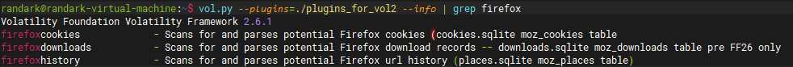

# Volatility 插件指南

## 在 Volatility 2 中使用插件

对于`Volatility 2`中加载插件，有两种方式：一种是直接将插件文件放入`Volatility`的插件目录；另外一种是在启动`Volatility`的时候手动指定插件目录。第一种虽然是一劳永逸的，但是由于第一种方案会导致`Volatility`在每次启动的时候，都会加载一次所有的插件，会增加启动用时，并且部分情况下还会导致不同的插件之间发生冲突；而第二种只需要将插件整理在一个文件夹内，需要的时候再加载即可。

:::info
本文展示所用的环境为 [如何安装 Volatility](./如何安装 Volatility.md) 所搭建的环境，若使用其他的环境，则需要自行判断环境的异同点（理论上若是正确安装，则是不会有差异的）
:::

:::info
若需要查看目前`Volatility`已经加载的所有插件，则需要执行`vol.py —info`指令，在指令输出中就可以看到所有已加载的插件。
:::

若选择直接将插件文件放入`Volatility`的插件目录，首先就是需要找到`Volatility`的主目录（对于二进制版本的`Volatility`，则没有主目录，需要使用上文的第二种方式）。

```shell
randark@randark-virtual-machine:~$ pip list | grep vol
DEPRECATION: Python 2.7 reached the end of its life on January 1st, 2020. Please upgrade your Python as Python 2.7 is no longer maintained. pip 21.0 will drop support for Python 2.7 in January 2021. More details about Python 2 support in pip can be found at https://pip.pypa.io/en/latest/development/release-process/#python-2-support pip 21.0 will remove support for this functionality.
volatility   2.6.1

randark@randark-virtual-machine:~$ pip show volatility
DEPRECATION: Python 2.7 reached the end of its life on January 1st, 2020. Please upgrade your Python as Python 2.7 is no longer maintained. pip 21.0 will drop support for Python 2.7 in January 2021. More details about Python 2 support in pip can be found at https://pip.pypa.io/en/latest/development/release-process/#python-2-support pip 21.0 will remove support for this functionality.
Name: volatility
Version: 2.6.1
Summary: Volatility -- Volatile memory framework
Home-page: http://www.volatilityfoundation.org
Author: AAron Walters
Author-email: awalters@4tphi.net
License: GPL
Location: /usr/local/lib/python2.7/dist-packages/volatility-2.6.1-py2.7.egg
Requires: 
Required-by:
```

从`pip list | grep vol`和`pip show volatility`两个指令的输出，就可以看到`Volatility`在环境中的具体信息，并得知`Volatility`的所在位置为`/usr/local/lib/python2.7/dist-packages/volatility-2.6.1-py2.7.egg/`。

进入对应的目录：

```shell
randark@randark-virtual-machine:~$ cd /usr/local/lib/python2.7/dist-packages/volatility-2.6.1-py2.7.egg/
randark@randark-virtual-machine:/usr/local/lib/python2.7/dist-packages/volatility-2.6.1-py2.7.egg$ ls -lh
total 16K
drwxr-sr-x 4 root staff 4.0K 11 月 16 13:08 contrib
drwxr-sr-x 3 root staff 4.0K 11 月 16 13:08 EGG-INFO
drwxr-sr-x 6 root staff 4.0K 11 月 16 13:08 tools
drwxr-sr-x 5 root staff 4.0K 11 月 16 13:08 volatility

randark@randark-virtual-machine:/usr/local/lib/python2.7/dist-packages/volatility-2.6.1-py2.7.egg$ cd volatility/
randark@randark-virtual-machine:/usr/local/lib/python2.7/dist-packages/volatility-2.6.1-py2.7.egg/volatility$ ls -lh
total 452K
......
drwxr-sr-x 9 root staff 4.0K 11 月 16 13:08 plugins
......
-rw-r--r-- 1 root staff 1.6K 11 月 16 13:08 validity.py
-rw-r--r-- 1 root staff 2.3K 11 月 16 13:08 validity.pyc
```

可以在其中发现一个文件夹：`plugins`，其就是`Volatility`插件的存放存径。在`plugins`文件夹中还有`linux`和`mac`两个文件夹，`plugins`文件夹和其子文件夹共同组成`Volatility`启动时会自动加载的插件所存放的目录，存放在其中的插件都会在`Volatility`启动的时候自动加载。需要使用第一种方式添加插件的话，只需要将插件文件直接添加进`plugins`文件夹或其子文件夹即可。

:::warning

需要注意的是，`plugins`文件夹位于`/usr/local/lib/`文件夹内，修改其中的数据需要最高权限（`root`），在操作的时候需要切换到`root`账户（`sudo su`），或者使用`sudo`命令进行短暂提权（`sudo <your command>`）如：

```shell
sudo cp mimikatz.py /usr/local/lib/python2.7/dist-packages/volatility-2.6.1-py2.7.egg/volatility/plugins/
```

:::

将插件添加进`plugins`文件夹内之后，再次执行`vol.py —info`，即可查看插件的加载情况，并查看添加的插件是否被正确加载（只要在`vol.py —info`输出中看到添加的插件名称，并且没有报错，就是插件已被成功添加）

若使用第二种方式，即在启动`Volatility`的时候手动指定插件目录，则需要自行确定一个路径存放插件文件，然后在启动`Volatility`的时候加上`--plugins=PLUGINS`参数。相关参数可以在`Volatility`的帮助信息中查阅：

```shell
randark@randark-virtual-machine:~$ vol.py -h
......
--plugins=PLUGINS     Additional plugin directories to use (colon separated)
```

例如想要加载分析内存中 firefox 中缓存数据的插件——firefoxhistory.py，将 community/DaveLasalle/下的插件文件保存在一个自定目录，然后如以下指令将插件加载进 Volatility：

```shell
vol.py --plugins=./plugins_for_vol2 <your commmand>
```

加载成功的话，应该在—info 的输出中看到插件的信息，如：



## 在 Volatility 3 中使用插件

如上文，也是通过 pip3 show volatility3 来查看 Volatility3 的所在位置：

```shell
randark@randark-virtual-machine:~$ pip3 show volatility3
Name: volatility3
Version: 2.0.1
Summary: Memory forensics framework
Home-page: https://github.com/volatilityfoundation/volatility3/
Author: Volatility Foundation
Author-email: volatility@volatilityfoundation.org
License: VSL
Location: /usr/local/lib/python3.10/dist-packages
Requires: pefile
Required-by:
```

进入到`Volatility 3`所在的目录，可以发现存在两个`plugins`目录，分别是

- `/usr/local/lib/python3.10/dist-packages/volatility3/plugins`和
- `/usr/local/lib/python3.10/dist-packages/volatility3/framework/plugins`，

剩下的步骤与 Volatility 2 相同，故不多做阐述。

## 插件列表

搜索插件最好的办法，便是 Volatility Foundation 官方的插件库：

[plugins for Volatility2](https://github.com/volatilityfoundation/community)

[plugins for Volatility3](https://github.com/volatilityfoundation/community3)

绝大多数插件都可以在上面的仓库中找到，其中`community`中的插件适用于`Volatility 2`，而`community`3 中的插件适用于`Volatility 3`。

如果有开发`Volatility`插件的需求，可以参考官方文档

- [Volatility 3 - Writing Plugins](https://volatility3.readthedocs.io/en/latest/development.html)
- [Volatility 2 - Style Guide](https://github.com/volatilityfoundation/volatility/wiki/Style-Guide)

## 常用插件

### [mimikatz for volatility](https://github.com/volatilityfoundation/community/blob/master/FrancescoPicasso/mimikatz.py)

Volatility 2 中可能最为人知的插件-`mimikatz for volatility`

作者的插件原理分析文章：[offline mimikatz](https://blog.digital-forensics.it/2014/03/et-voila-le-mimikatz-offline.html)

通过使用`mimikatz for volatility`，取证分析人员可以直接从内存镜像中获取 Windows 的开机密码（仅限于提取内存时已经登录的用户），从而避免直接对着 NTLM 哈希进行爆破，从而大大减少提取开机密码的时间。

:::info
`mimikatz for volatility`仅适用于`Volatility 2`，并且根据其源代码，仅支持`Windows 7`版本及以下的`Windows`系统所提取的内存镜像。
:::

因为`mimikatz for volatility`在针对`Windows`的内存取证分析中非常常用，故直接使用上文的第一种方式，直接添加`mimikatz for volatility`到`Volatility`主文件夹的`plugins`文件夹内。

```shell
randark@randark-virtual-machine:~$ cd /usr/local/lib/python2.7/dist-packages/volatility-2.6.1-py2.7.egg/volatility/plugins/
randark@randark-virtual-machine:/usr/local/lib/python2.7/dist-packages/volatility-2.6.1-py2.7.egg/volatility/plugins$ ls -lh | grep mimikatz
-rw-r--r-- 1 randark randark  21K 11 月 18 22:23 mimikatz.py
randark@randark-virtual-machine:/usr/local/lib/python2.7/dist-packages/volatility-2.6.1-py2.7.egg/volatility/plugins$
```

然后在执行`vol.py —info`的时候，就可以发现有报错信息，并且`mimikatz for volatility`并没有被成功加载：

```shell
randark@randark-virtual-machine:~$ vol.py --info
Volatility Foundation Volatility Framework 2.6.1
*** Failed to import volatility.plugins.mimikatz (ImportError: No module named construct)
.......
```

通过报错信息，可以得知是`Python 2`中缺少一个第三方库：`construct`。通过一般思路，直接通过 pip 安装 construct 库，然后再次执行`vol.py —info`，可以发现仍然存在报错信息，并且发生了变化：

```shell
randark@randark-virtual-machine:~$ vol.py --info 
Volatility Foundation Volatility Framework 2.6.1
*** Failed to import volatility.plugins.mimikatz (AttributeError: 'module' object has no attribute 'ULInt32')
```

在查阅相关材料之后，可以得知这个问题出在不同版本的`construct`库上。在卸载掉原先安装的`construct`库之后（`pip uninstall construct`），执行`pip install pip install construct==2.5.5-reupload -i https://pypi.tuna.tsinghua.edu.cn/simple`，即可。

在进行相关修复之后，再次执行`vol.py —info`，即可发现没有了报错信息，并且`mimikatz for volatility`已经可以被成功加载：

```shell
randark@randark-virtual-machine:~$ vol.py --info
Volatility Foundation Volatility Framework 2.6.1

......
mimikatz                   - mimikatz offline
```

那么`mimikatz for volatility`插件就已经被成功安装进了`Volatility 2`

### [volatility-docker](https://github.com/volatilityfoundation/community3/tree/master/Sheffer_Shaked_Docker)

基于 Volatility 3 的一个用于分析 Docker 环境的插件，能够识别 Docker 的容器列表、网络信息等等
