# 如何安装 Volatility

!!! info 基础环境
    这里用作演示的系统为`Ubuntu-22.04-desktop-amd64` ，安装参数为选择了最小安装。其它系统也可以，但是还是建议新版本 Ubuntu，毕竟出了问题修起来也容易
    对于虚拟机而言，建议 CPU 开到 2 核左右，内存在 2G 左右，而硬盘建议开到 40G 动态磁盘（一般情况下足够容纳 Ubuntu 主体+2~3 个内存镜像）

    需要注意的是，`Volatility`受限于 Python 架构，实际上无论镜像文件有多大有多难分析，`Volatility`都是单核应用，所以不需要启用过多的虚拟化核心

!!! caution Windows - cmd 可能会出现问题

    本人建议这类环境是基于 Linux（本人推荐 Ubuntu），使用 Windows 来开展工作也可以
    另外需要注意的是，`Volatility 3`在 Windows 的 cmd 中无法执行，因为`Volatility 3`所绑定的指令是 vol，这与 cmd 中自带的指令发生冲突（vol in cmd：显示磁盘卷标和序列号（如果存在）），故如果要在 Windows 环境中使用`Volatility 3`，需要使用非 cmd 终端（例如 Powershell）

## 关于网络问题

由于大陆内对于 Github 直连已经不存在希望，所以相关源码建议在有网络代理的环境下先下载好，在直接传进 Ubuntu 内，以方便操作

在进行相关操作之前，建议先执行`sudo apt update` 更新 apt 仓库的软件包信息

在使用 pip 安装第三方包的时候，为了加快速度，使用了清华大学镜像源，可以自行决定是否修改相关指令

## 安装 Volatility 2

!!! info 使用提示

    可以从 `Volatility 2` 的官方仓库中发现，其实官方的用法就是直接`python2 vol.py` 所以对于 `Volatility 2` 而言，是可以直接从原始的 Python 代码直接运行的，但是如果想要安装的话，也是可以的。

### 获取 Volatility 2 源码

首先，先从官方的 Github 仓库获取下来`Volatility 2`的完整源码，直接`Download ZIP`即可：

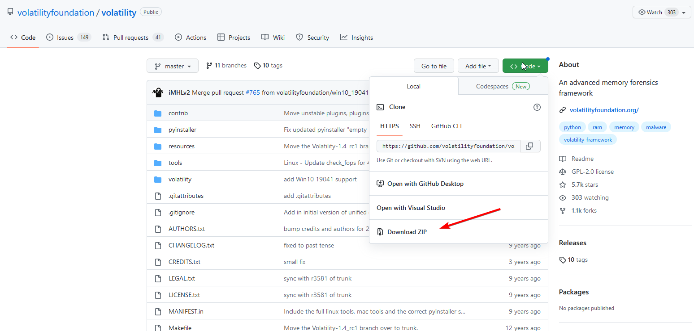

将下载下来的 zip 文件解压，应该得到类似于下面的文件

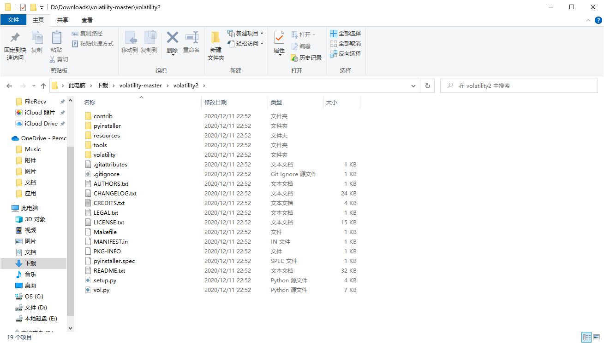

将这些文件拷贝至 Ubuntu 中

### 配置 Python2 环境

!!! info 请注意

    新版本 Ubuntu 中已经不再预装 Python2 环境，需要手动安装

```shell
sudo apt install python2
```

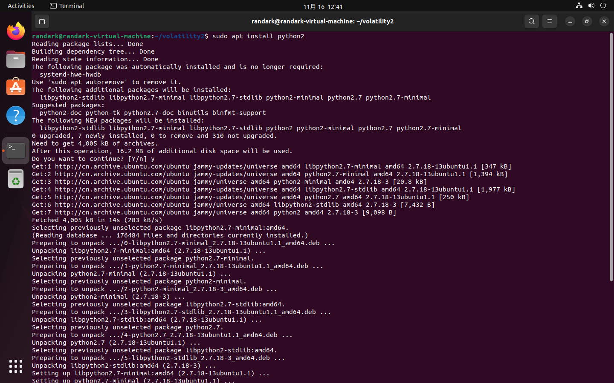

接下来进入存放 `Volatility 2` 源码的文件夹内，并执行`python2 vol.py` ，观察是否可以被执行

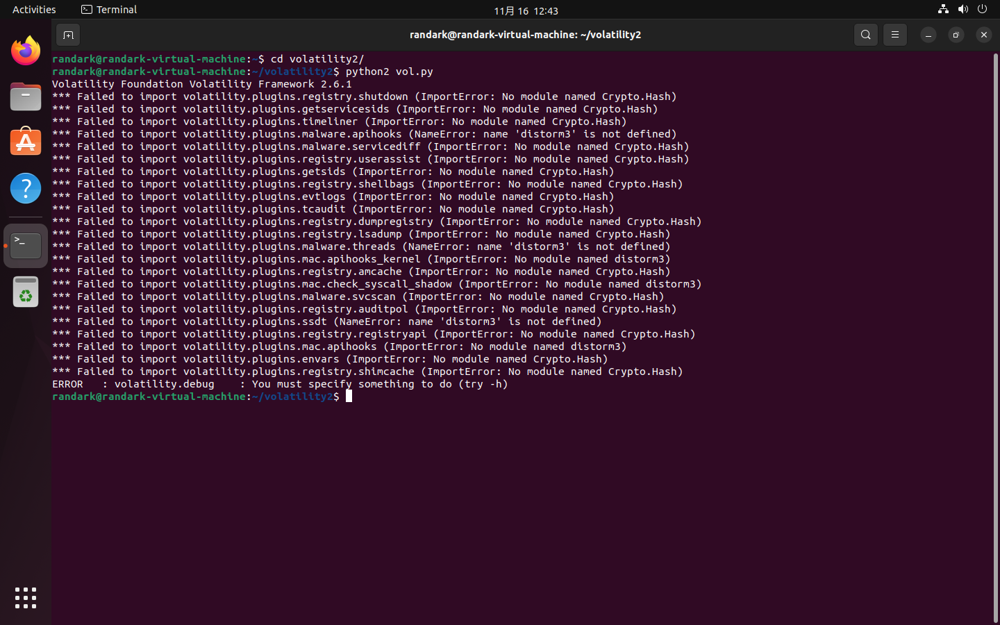

!!! info 请注意

    即使有报错，也说明可以运行，因为额外的第三方库还没有安装，所以出现报错是正常的

接下来，就是需要处理运行时所体现的报错信息。第一步，便是安装 python2 的包管理器 pip，执行以下命令

```shell
sudo apt install python-pip
```

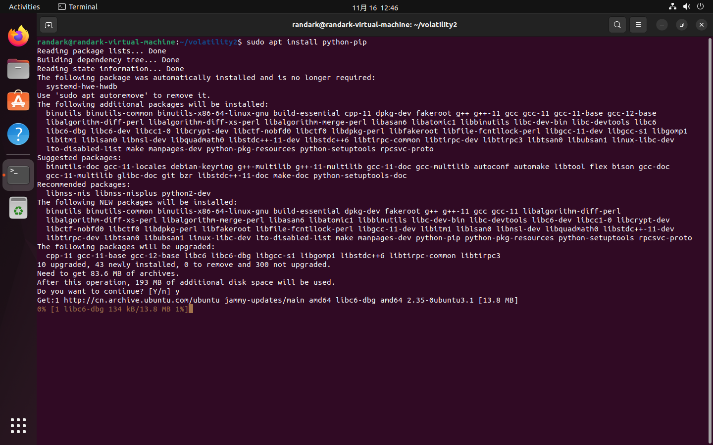

在 pip 安装成功之后，安装 Volatility 所需的第三方包

```shell
sudo pip2 install distorm3 pycrtptodome -i https://pypi.tuna.tsinghua.edu.cn/simple
```

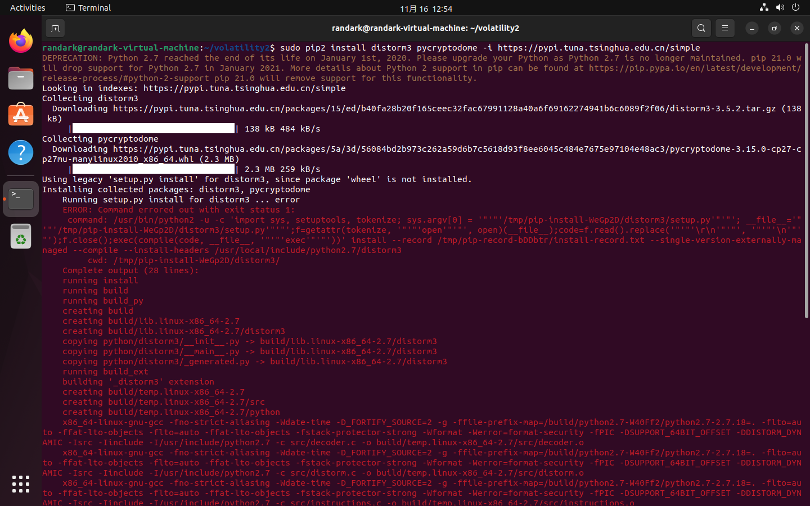

可以看到，在安装过程中出现了大片的红色报错，但是不要慌张，看向最底下的报错信息：

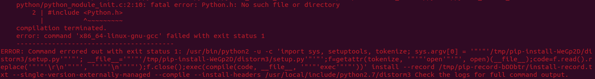

可以发现，在 python 安装软件包的过程中，在编译阶段，出现了 include 不存在的头文件，所以才导致了报错。在查阅了相关资料后，得知问题出在没有安装 python2 的编译依赖头文件库导致的，安装上即可

```shell
sudo apt install python2-dev
```

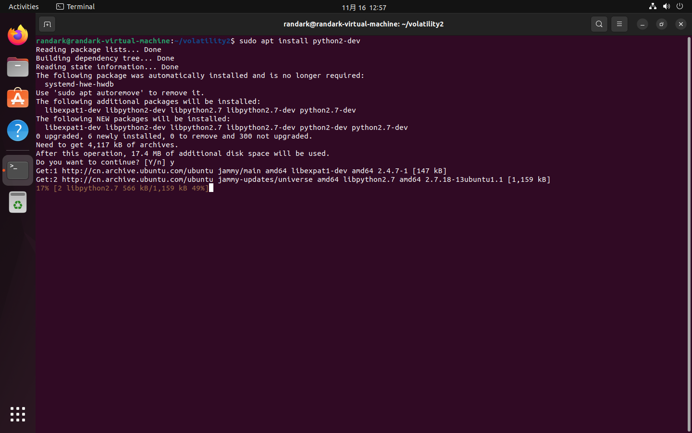

安装好 python2-dev 软件包之后，就可以继续之前操作

```shell
sudo pip2 install distorm3 pycrtptodome -i https://pypi.tuna.tsinghua.edu.cn/simple
```

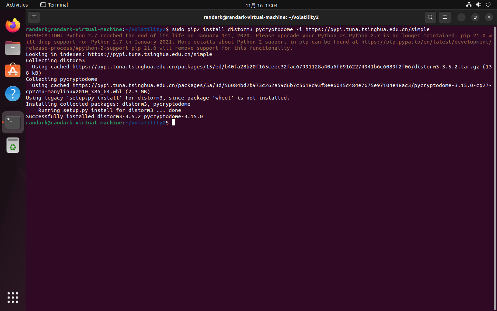

让我们继续运行`Volatility 2`看看效果

```shell
python2 vol.py 
```


可以看到之前的大量报错信息已经不见了，取而代之的仅有一行信息，提示我们输入参数进行操作。至此，`Volatility 2`已经可以直接从源码运行，并开展相关取证分析工作。

### 安装 Volatility2

上面步骤只是配置了`Volatility2`的运行环境，对于进一步安装需求，则需要使用`setup.py`文件进行安装操作

```shell
sudo python2 setup.py install
```

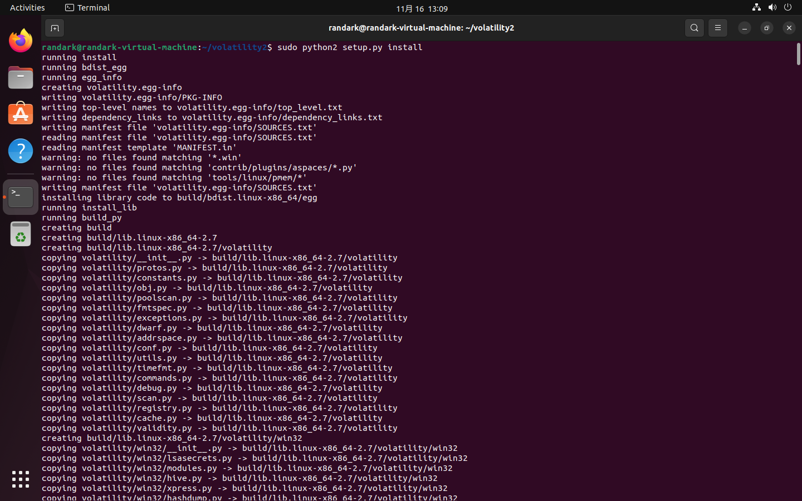

在大量的信息滚屏之后，应该可以看到最终操作成功的信息：

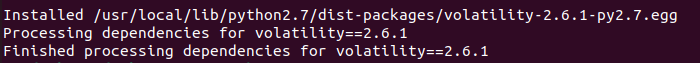

此时，要使用 Vol2 的话，就不必再从源码运行了，而是直接在终端执行 vol.py 指令，就可以运行`Volatility 2`：

```shell
vol.py
```

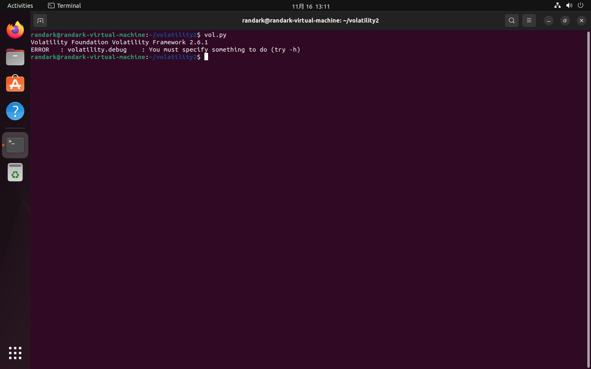

## 安装 Volatility 3

相较于`Volatility 2`要通过源码来编译安装，`Volatility 3`的安装则更为人性化：直接通过`pip3`来安装

[Python3 - volatility3 in Pypi](https://pypi.org/project/volatility3/)

!!! caution python 2 & 3 环境冲突问题

    需要注意的是，Linux 系统中，允许 Python2 与 Python3 环境并存，但是二者的依赖库（python-dev）和第三方包（通过 pip 包管理器安装的第三方包）并不会共享，也就意味着如果如上文安装好 Vol 2 之后，相关操作也要再重复一遍

    另外需要注意的是，python-pip 和 python3-pip 两个包管理器无法通过 apt 来同时存在，如果需要两个版本的 pip 共存的话，请考虑一个手动安装一个用 apt 安装，或者直接两个都手动安装
    相关操作可以参考：[使用 get-pip.py 安装 python2 的 pip](https://blog.csdn.net/qq_42533216/article/details/120672856)

### 配置 Python3 环境

`Ubuntu 22.04` 已经预装了 `Python 3` 环境，但是没有附带面对 Python3 的 pip 包管理器，所以先安装 pip

```shell
sudo apt install python3-pip
```

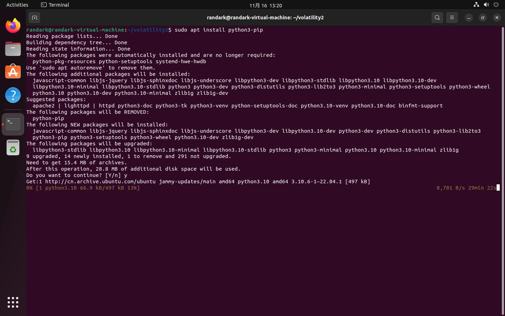

!!! info 环境冲突

    这里就可以看到，在已经通过 apt 安装 python-pip 的情况下，再通过 apt 安装 python3-pip，apt 就会检测到软件的版本迭代，从而自动移除 python-pip 的安装

### 安装 Volatility3

安装好后，直接通过 pip 安装 Vol 3 和相关依赖的第三方库即可

```shell
sudo pip3 install volatility3 pycryptodome -i https://pypi.tuna.tsinghua.edu.cn/simple
```

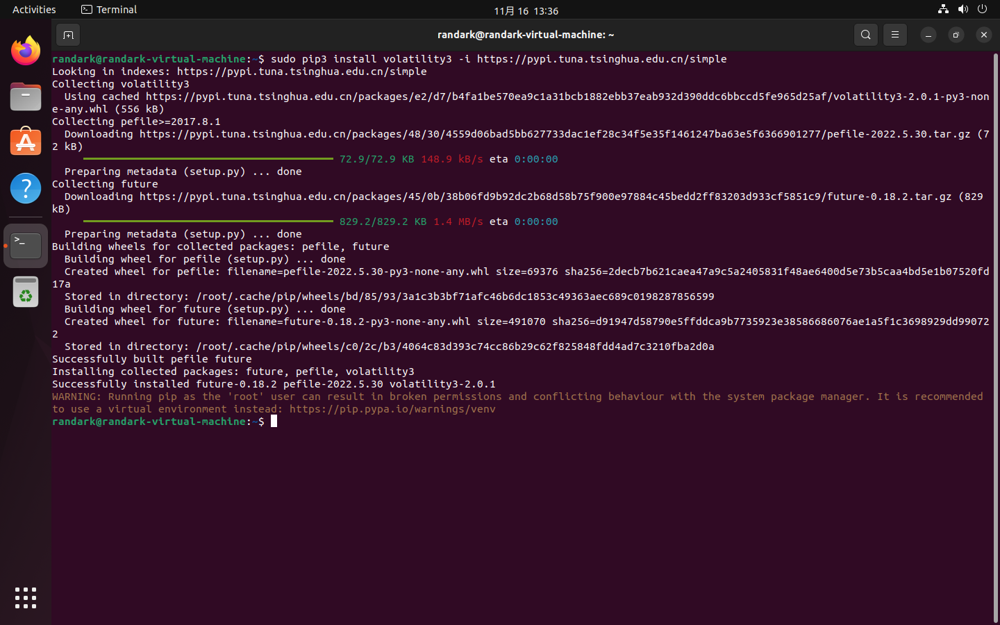

安装成功之后，执行 vol 指令，即可运行 `Volatility 3`

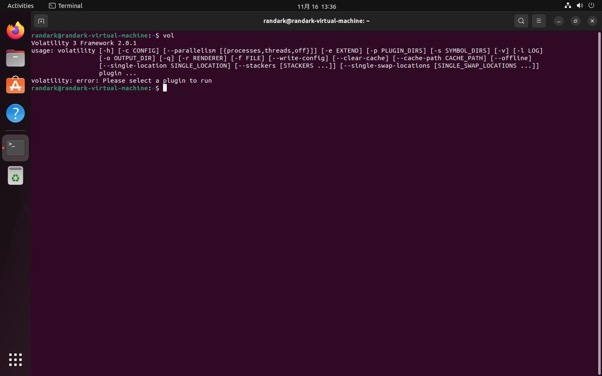

!!! info 额外配置

    在 Vol 3 中，加入了输出信息级别的指定：-vv 参数，通过改变 v 的数量来指定输出的日志信息的级别（Info，Debug，Error 等等），通过加上-v 参数，可以发现目前还缺少 yara 相关依赖，但是由于 yara 配置的操作相对繁琐，并且不影响 Vol 3 的正常使用，故在此不做相关处理。  
