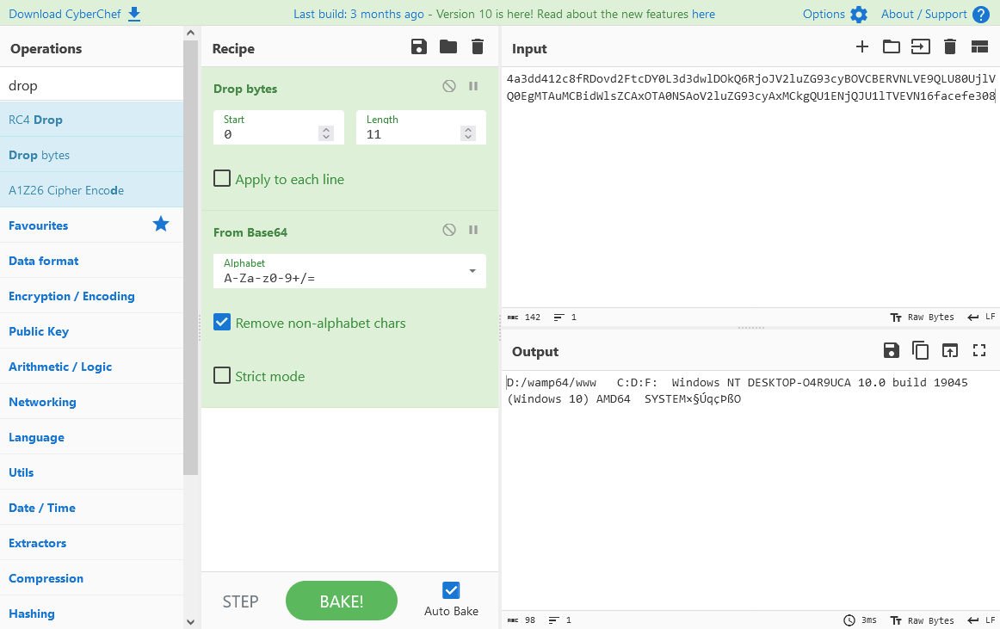

# antSword 蚁剑 解码器 流量解析

:::info 说明
下述的流量数据，默认均已进行过一次 URL Decode 处理，并加以 php format 格式化处理，以便于排除掉 URL Encode 对流量可读性的影响

以下的流量数据，皆产生自蚁剑的 “测试连接” 功能
::: 流量解析

## 解码器：default

default 模式下的解码器，将导致 webshell 直接回复明文形式的执行结果

```plaintext
D:/wamp64/www	C:D:F:	Windows NT DESKTOP-O4R9UCA 10.0 build 19045 (Windows 10) AMD64	SYSTEM
```

## 解码器：base64

webshell 会将执行结果做一次 base64 编码之后，回复给蚁剑

:::info base64 混淆
此模式下的 webshell 回复的数据，可能会在头部随机加入噪音，使得回复的 webshell 执行结果没有办法直接 base64 解码成明文，需要试探性地丢弃回复流量数据的头部几个字节
:::

```plaintext
4a3dd412c8fRDovd2FtcDY0L3d3dwlDOkQ6RjoJV2luZG93cyBOVCBERVNLVE9QLU80UjlVQ0EgMTAuMCBidWlsZCAxOTA0NSAoV2luZG93cyAxMCkgQU1ENjQJU1lTVEVN16facefe308
```

解码后得到：

```plaintext
D:/wamp64/www	C:D:F:	Windows NT DESKTOP-O4R9UCA 10.0 build 19045 (Windows 10) AMD64	SYSTEM
```



## 解码器：rot13

类似于 rot13 模式的编码器，也是对 webshell 的执行结果做了一次 rot13 编码，然后回复给蚁剑

```plaintext
fd0a5Q:/jnzc64/jjj	P:Q:S:	Jvaqbjf AG QRFXGBC-B4E9HPN 10.0 ohvyq 19045 (Jvaqbjf 10) NZQ64	FLFGRZ1d2c5
```

rot13 解码后得到：

```plaintext
D:/wamp64/www	C:D:F:	Windows NT DESKTOP-O4R9UCA 10.0 build 19045 (Windows 10) AMD64	SYSTEM
```