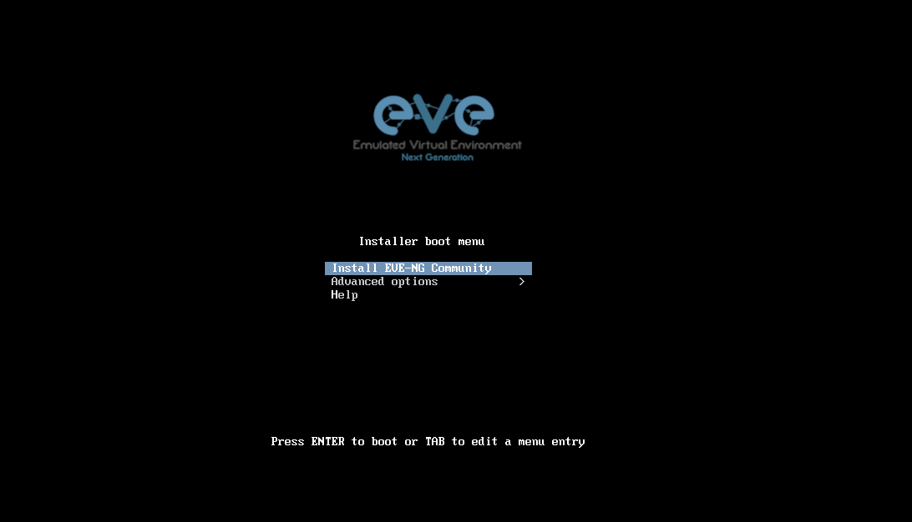
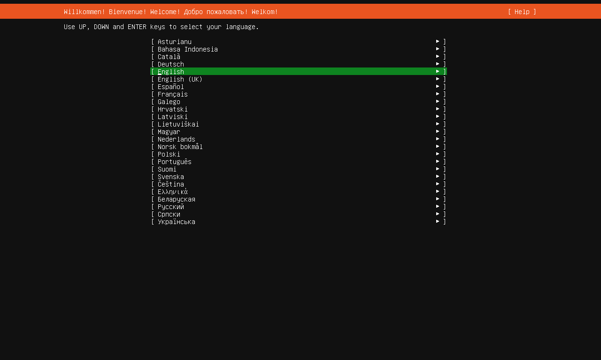

# EVE-ng Installation

访问：[Free EVE Community Edition Version](https://www.eve-ng.net/index.php/download/#DL-COMM)， 下载社区版本的 Installation Live ISO 文件，直接新建一个虚拟机，并挂载进去，启动虚拟机（需要注意的是，不要启用简易安装模式，不然会破坏安装行为）

按照 Ubuntu Server 的正常安装流程即可

安装结束后启动虚拟机：
