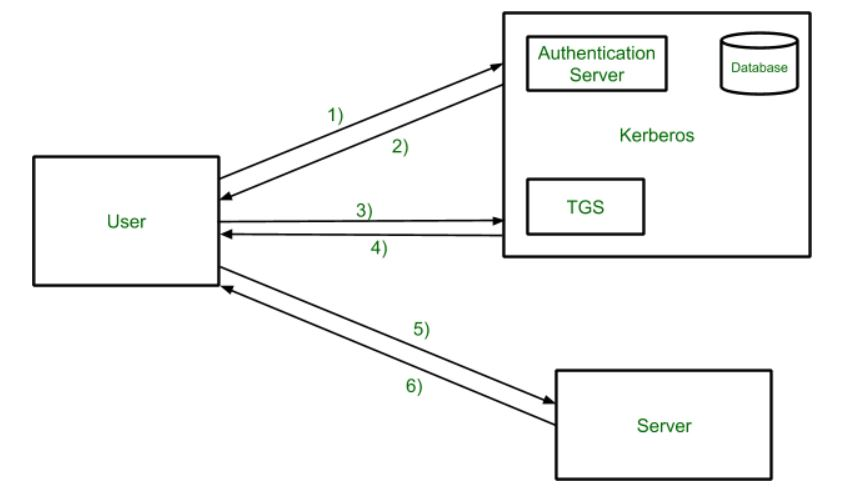

# Kerberos

## 什么是 Kerberos

`Kerberos` 是一种网络认证协议，其设计目标是通过密钥系统为客户机 / 服务器应用程序提供强大的认证服务。该认证过程的实现不依赖于主机操作系统的认证，无需基于主机地址的信任，不要求网络上所有主机的物理安全，并假定网络上传送的数据包可以被任意地读取、修改和插入数据。在以上情况下， `Kerberos` 作为一种可信任的第三方认证服务，是通过传统的密码技术（如：共享密钥）执行认证服务的。

## 名词解释

| 简写 | 全拼 |
| --- | --- |
| DC | Domain Controller 域控 |
| KDC | Key Distribution Center 密钥分发中心 |
| AD | Account Database 账户数据库 |
| AS | Authentication Service 身份验证服务 |
| TGS | Ticket Granting Service 票据授与服务 |
| TGT | Ticket Granting Ticket 票据中心授予的票据 |

## Kerberos 会使用的端口

TCP 和 UDP 的 88 端口：身份验证和票证授予

TCP 和 UDP 的 464 端口：经典 Kerberos Kpaswd（密码重设）协议

## krbtgt 账户

每个域控制器 DC 都有一个 kebtgt 的用户账户，此账户是 KDC 的服务账户用来创建票据授予服务 (TGS) 加密的密钥

## Kerberos 工作流程概述

1. 用户登录并请求主机上的服务。 因此，用户请求票证授予服务。

   `Client` (客户端) 会向 `Kerberos` 服务发起请求 与 `Kerberos` 服务进行对接 告知 `Client` 需要获取访问 `server` 的权限

2. 认证服务器使用数据库验证用户的访问权限，然后给出票据授予票据和会话密钥。  结果使用用户的密码进行加密。

    `kerberos` 收到了 `client` 的请求之后，会对 `client` 进行校验，判断 `client` 是否是可信任的，如果是可信任的 `client` ，则 `kerberos` （由 `AS - Authentication Service` 身份验证服务）来完成 返回一张 `TGT` 给 `client` 。其中对 `client` 的校验使用的是白名单的方式

3. 使用密码完成消息的解密，然后将票证发送到票证授予服务器。 票证包含用户名和网络地址等身份验证符。

    `client` 带着获得的 `TGT` ，再次向 `kerberos` 发起请求，告诉 `kerberos` 想要哪个 `server` 的访问权限。

4. 票证授予服务器解密用户发送的票证，身份验证器验证请求，然后创建票证以向服务器请求服务。

    `kerberos` 接收到 `client` 的请求之后，`client` 请求中带有 `TGT` 且校验无误，`kerberos` 会授予 `client` 访问 `server` 的权限，返回 `ticket` （票据）
5. 用户将票证和验证器发送到服务器。

    `client` 带着 `ticket` 向 `server` 发起请求，`server` 接收到 `client` 的请求之后，验证成功后即可

6. 服务器验证票证和身份验证器，然后生成对服务的访问权限。 此后用户即可访问服务。

## Kerberos 工作 详细过程

### 1. Client → KDC - AS

- `KRB_AS_REQ` （Kerberos Authentication Service Request）- 客户端执行散列运算加密一个时间戳, 然后发送给身份验证服务（KDC-AS）
- `client` 先向 `KDC` 的 `AS` 发送 `Authenticator1`，内容为通过 `Client` 密码 Hash 加密的时间戳、`Client ID`、网络地址、加密类型等内容。
- a. 客户端 `Client` 对用户口令执行散列运算转换为 `NTLM` 散列。此散列值（即用户密钥）成为客户端和 KDC 共享的长期密钥（long term key）。
- b. `KRB_AS_REQ`（Kerberos Authentication Service Request）- 客户端执行散列运算加密一个时间戳, 然后发送给身份验证服务（KDC-AS）。

啥意思呢？

在第一步 `client` 对 `KDC` 的请求中包含了 `username` 等身份信息，`KDC` 确认 `username` 均存在域中则校验成功，`KDC` 使用 `client` 请求的 `username` 在域控中查找对应用户的 `NTLM`，然后使用 `NTLM` 哈希加密一串 `KDC` 随机生成的字符。如果 `client` 身份伪造，那么 `client` 在得到 `Session Key` 之后用自己的 `NTLM` 无法解密出正确的随机字符，这一步也就确保了身份的真实性。

- `NTLM` 即加密过的 `windows` 用户密码

### 2. KDC - AS → Client

`KRB_AS_REP` (Kerberos Authentication Service Response) - 身份验证服务 (KDC-AS) 会解密时间戳，若解密成功 (KDC-AS 检查用户的信息(登录限制. 组成员身份等) 并创建票据授予票据（`Ticket-Granting Ticket`,`TGT`），并向本地 LSA (Local Security Authority)请求生成一个特殊的数据 PAC，表明了客户端获得某个特定用户的口令(即验证了用户的身份)。
身份验证服务 (KDC-AS) 向客户端回复两条信息:

- a. 短期会话密钥 `SessionKey`（`A-KDC`），用于客户端向 KDC 发起后续的请求 , 该消息经客户端的长期密钥（`long term key）` 加密。（此短期会话密钥仅适用于该客户端和 KDC 之间）
- b. 票据授予票据（`Ticket Granting Ticket`, 简称 `TGT`），包含有关用户名. 域名. 时间和组成员资格等信息。

TGT 票据使用 `KDC` 的 `krbtgt 密钥` 进行加密,`PAC` 使用 `krbtgt 密钥` 进行进行签名, 并且系统很少会验证 `PAC` 数据（在 Windows 环境中为 `krbtgt` 账户的 `NT-Hash）`。

### 3. Client → KDC-TGS

`KRB_TGS_REQ` （Kerberos Ticket Granting Service Request） - Client 使用 AS 返回的”短期会话密钥”构建访问特定服务的请求, 再把 AS 返回的”票据授予票据 (TGT)” 连同请求一起发送到票据授予服务 TGS) 此过程叫 KRB_TGS_REQ

`Client-A` 使用 AS 返回的会话密钥 `SessionKey`（`A-KDC`）构建访问特定服务的请求。客户端 Client 再把请求连同 TGT 一起发送到票据授予服务 TGS。
（TGT 是被 KDC 的 krbtgt 密钥加密的，所以 Client 无法解密）

黄金票据 - 此过程 3 可以伪造 TGT(前提是获取 krbtgt 账号的口令散列值)，宣称自己是域内任何账号，包括域管或者不存在的用户，这是黄金票据的原理。

### 4. KDC-TGS → Client

`KRB_TGS_REP` （Kerberos Ticket Granting Service Response） - 票据授予服务 `TGS` 解密 `TGT` 和服务请求，然后如果请求被允许（`KDC` 会打开票据, 进行校验和检查。如果 `DC` 能够打开票据，并能通过校验和检查, 那么会认为 TGT 为有效票据。此时 TGT 中的数据会被复制，以创建 TGS 票据 ST），Server 密码 HASH 加密 `SessionKey-TGS`

票据授予服务 TGS 向客户端 Client 发送一个服务票据（Service Ticket，简称 ST）, 包括两个部分:

- a. 远程服务器的部分 - 包含请求用户的组成员资格、时间戳、用于客户端和远程服务器之间通信的会话密钥。使用远程服务器 Server-B 和 KDC 共享的长期密钥 (long term key) 加密这部分消息。
- b. 客户端的部分 - 包含用于客户端和远程服务器之间通信的会话密钥 SessionKeya-b。（使用步骤 2 中 AS 回复的短期会话密钥 (SessionKeya-kdc) 加密这部分消息生成的会话密钥 SessionKeya-b。）

### 5. Client → Server

`RB_AP_REQ`（Kerberos Application Request）- Client 把服务票据（Service Ticket）中的服务器部分和请求一起发送到 Server-B（用户要访问活动目录中的主机）。

远程服务器将直接接受该服务器票据, 并不需要和 KDC 直接通信, 因为该票据是用远程服务器和 KDC 共享的长期密钥加密过的。

解密成功（目标服务会使用自己的 NTLM 密码散列打开 TGS 票据, 并提取用户的授权数据和会话密钥 SessionKeya-b。）即表明 KDC 已经允许了此次通信。

白银票据 - 此过程 5 可以伪造 TGS（前提是获取服务账号的口令散列值），宣称自己是域内任何账号，例如域管，这是白银票据的原理。
